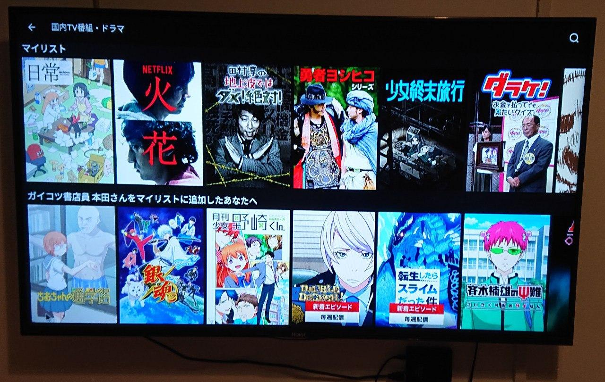
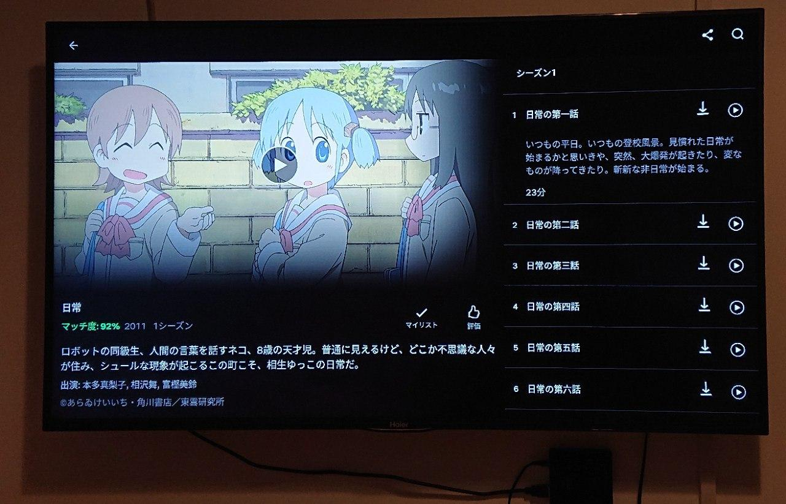

说来惭愧，最近沉迷看电视已经小半年没更新日记了，嘛，那就说说看电视好了。

<!--more-->

起因是自从学习了日语，想了各种方法接触日文、日语资源。文字方面通过[使用 Kindle 可以下载各种日文原版书]()，也一直使用至今，很满意。但是影视资源方面一直没有太大进展。查看自己的搜索记录事实上去年 10 月份我试用过 Netflix 和亚马逊的 Prime Video，当时的印象是各种海外映画，番组确实是有日语字幕，而邦画（日影、日剧、动漫等）的部分似乎基本不提供字幕，很沮丧，就作罢了。

今年因为有了电视机、并且五月份看了一篇 Netflix 技术博客介绍他们为了登陆日本市场[对字幕做的各种努力](https://medium.com/netflix-techblog/netflixにおける日本語字幕の導入-b8c8c4fa299e)，发现日语字幕确实有别于英文字幕难度会高很多（主要是ルビ、傍点、縦書き、斜体、縦中横等）。于是再一次使用了 Netflix，惊讶的发现几乎所有的日剧、日影都有了日文字幕（而且感觉应该只会有日文字幕，突然有种日语没白学的感觉）以及很多美剧、纪录片等甚至有日语配音（Netflix 自家出的居多）虽然听起来怪怪的，就当是おまけ了（最新一季的 Better Call Saul 就是听着日语吹替看着日文字幕看完的，谜）。另外好多欧美电影、纪录片都有中文字幕，所以其实不是奔着日语资源也是很值的。（感觉已经看了好多纪录片了）

其实到现在能流畅的使用还是废了点儿力，说到底最关键的还是需要比较好的网络环境。托最近搬家的福，终于用上了几百兆的宽带，也让我的路由器终于发挥了点作用。

其次需要一个能用的日本代理，Netflix 是根据 IP 来判断用户地域，进而提供不同的影视资源。另外要注意的是一些 IDC 或者云服务厂商的 IP 可能被 Netflix 屏蔽。有了好用的代理之后最好是能把代理安装在路由器上，这样比如使用电视观看 Netflix 会方便很多。我这里使用代理之后的带宽大概跑到 50 兆左右，流畅看 Netflix 1080P 足够了（因为电视机是 1080P 的，4K 的情况怎么样不太清楚）

至于 Netflix 帐号的问题，简单的使用可以去万能的淘宝，当然也可以自己用信用卡支付，不同的地域资费不太一样，据说土耳其还是哪能很便宜，当然了和几个人长久合租可能是最划算的一种方式了。

到此为止基本就能使用 Netflix 了，不过需要在电视上使用可能还得动点脑子，如果是比较新的安卓电视可以试着安装 Netflix 的 App（如果安装的是手机版 App 操作稍微有点儿蛋疼，实在不行可以插个鼠标），可以使用 [APKMirror](https://www.apkmirror.com/) 或者 [APKPure](https://apkpure.com/) 搜索直接下载 apk。至于像我一样用着比较老的电视不太能安装 App 的情况可以买个电视盒子，比如说淘宝上的外贸盒子，大概几百块钱，大体上都差不多是基于 RK3328 系列芯片组装的。


- [RK3328、4GBメモリ搭載のAndroid TV box「A5X Max Plus」実機レビュー](https://obakasanyo.net/review-a5x-max-plus/)
- [Even Cheaper Android KODI BOX - H96 Max Plus 4GB RAM 64 GB ROM](https://www.youtube.com/watch?v=5s_o2HjPIRE)



最后为了能及时收到 Netflix 上架了哪些作品，找到一个日本网站 [Netflix 日本非公認ファンブログ](http://netflix-fan.jp/new-arrival/)每天都有更新，今天上架了啥，下架了啥等等。用 [Inoreader](https://www.inoreader.com/) 订阅一下，看到感兴趣的标记一下挺方便的，比如前几天上架了魔戒、黑客帝国啥的。





Special thanks to @[qinhuai](https://www.douban.com/people/qinhuai/).

以上です。