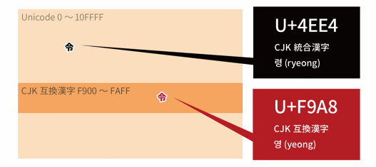

原文来自：[Unicodeの基本から解説。新元号「令和」の「令」がUnicodeに2つある理由 – cod-log](https://cod-sushi.com/unicode-rei/)

## 开端

### 新年号发表

今天（4/1）中午的时候，日本发表了新年号「**令和**」。

话说新年号里包含的这个「令」字，存在于被称为「**中日韩兼容表意文字**[^中日韩兼容表意文字]」这一特殊的 Unicode 区段中，也就是说在 **Unicode 中「令」字有两个**。

[^中日韩兼容表意文字]: 日文是「CJK 互換漢字」，「互換」对应中文就是「兼容」的意思。

本文就

- 关于 Unicode 的基础知识
- 「中日韩兼容表意文字」是什么？
- 「令」为什么被包含在「中日韩兼容表意文字」区段中？
- 对于应用开发的影响

这些话题展开了调查，再次总结一下。

## 关于 Unicode

为了理解「中日韩兼容表意文字」，首先需要理解 **Unicode 的理念**和**字源分离原则**[^字源分离原则]。

[^字源分离原则]: 日文是「ラウンドトリップ変換互換性の原則」，这个说法感觉和中文、英文维基百科里的说法有一些微妙的出入。但在其[他日文资料](http://www8.plala.or.jp/tkubota1/unicode-symbols-unihan.ja.html)里查到这个原则也称「ソース分離原則」，这里就照搬中文维基百科的译名叫「字源分离原则」

### Unicode 是什么？

Unicode 是采用 **16 位整数[^16 位整数]表达的码位[^码位]与文字相对应的一套规格**。

[^16 位整数]: 译者注：2^16 = 65536，实际上 Unicode 能容纳的字符远不止这么多。当前的 Unicode 字符分为 17 组编排，每组称为[平面](https://zh.wikipedia.org/wiki/Unicode%E5%AD%97%E7%AC%A6%E5%B9%B3%E9%9D%A2%E6%98%A0%E5%B0%84)（Plane），而每平面拥有 65536（即 2^16 ）个码位。
[^码位]: 日文是「符号位置」，英文是 code point，中文世界似乎习惯翻译成码位。

「码位」的意思就是把文字一一排列，每个文字所在位置的那个号码。比如说「魚」这个字，号码就是 `9B5A` 。为了表明这个号码所代表的是一个 Unicode，多数情况下会像 `U+9B5A` 这样，在前面加上「U+」来表记。

Unicode 的既定目标就是「把全世界使用的**所有**文字放在一个共同的文字集合里」。「所有」当然也意味着绘文字（emoji）、古代文字等等都包含其中。

### 字源分离原则

Unicode 里码位的决定会遵循「**字源分离原则**」来实施。「字源分离原则」简单来说就是「在原字符编码中**拥有不同码位的汉字**，在 Unicode 中应当作为不同的汉字对待，必须分别给予不同的码位」这个意思。

这一原则的目的是为了从原有字符编码向 Unicode 转换时，**防止丢失转换的可逆性**[^转换的可逆性]。

[^转换的可逆性]: 译者注：即应保证能够从 Unicode 转成原字符编码

### 补充：那，UTF-8、UTF-16 又是什么呢？

UTF(Unicode Transformation Format)-8、UTF-16 等字符编码是把 Unicode 里决定好的码位，**按照何种字节排列实现符号化的方式**。

可以这样理解，Unicode 是用来规定**信息的内容**（码位），而 UTF-8 等则是**规定如何把这些信息（码位）表现出来的方法**。

参考：[知っておきたい！ 文字コードの基礎知識 ……ASCII，シフトJIS，Unicode etc.：新刊ピックアップ｜技術評論社](https://gihyo.jp/book/pickup/2019/0006)

## 关于中日韩兼容表意文字

### 中日韩兼容表意文字

中日韩兼容表意文字是包含在 **Unicode 之中的一个区段（文字块或者文字码范围）**。

占据 Unicode 中 512 个码位空间，划分范围是 `U+F900`～`U+FAFF`。

下面就来说明，为什么需要这个区段的原因。

### 中日韩统一表意文字

在 Unicode 里，对于日本、中国、韩国所使用的汉字，如果**由来一致**、**字形一致或者相似**的会被当作是「同一个汉字」，而这些汉字组合而成的区段在 Unicode 里就叫作「**中日韩统一表意文字**」区段。

CJK 是 Chinese Japanese Korea 的首字母缩写。

顺便一提，上述这些统一标准正如我们所见非常暧昧不清，似乎还存在不符合这些规定的汉字却也被统一成一个汉字的情况存在。

### 不能仅有中日韩统一表意文字的理由

正如上面所说，中日韩统一表意文字是「字形相同的汉字被统一成一个汉字」。因此，比如 KS X 1001 这种「相同的字形的文字，但**拥有多个码位**与之对应的字符编码格式」，如果只存在中日韩统一表意文字区段的话，就会**打破字源分离原则**。

而中日韩兼容表意文字区段的存在，正是为了解决这个问题。

## 「令」为什么是中日韩兼容表意文字？

啊，话题终于可以回到「令」字上了。

接下来，延续上面的基础知识，我们来说明为什么「令」是**中日韩兼容表意文字**中包含的文字。

### KS X 1001

[KS X 1001](http://www.asahi-net.or.jp/~ax2s-kmtn/ref/ksx1001.html) 是按照汉字读音的顺序来排列的字符编码格式。举个例子，它的一大特征就是如果**一个汉字有多个读音就会多次被收录**。 

和日语不同，韩语里的汉字的读法，通常只有一种。但是，**还是有那么几个汉字有不止一个读法**。

### KS X 1001、Unicode 里的「令」

#### KS X 1001 里的「令」

「令」在韩语里面，是拥有 **령(ryeong)** 、 **영 (yeong)** 这两种读音的汉字。

所以在 KS X 1001 里、「令」占据了 5635 号的 **령(ryeong)** 和 6729 号的 **영 (yeong)** 这两个码位。

#### Unicode 里的「令」

在 Unicode 里，韩语读音是**령(ryeong)的「令」**被作为中日韩统一表意文字采用，码位是 `U+4EE4`。

一般的日语输入系统通过「レイ（rei）」「リョウ（ryou）」等变换得到的「令」是中日韩统一表意文字的 `U+4EE4`

而考虑到字源分离原则，韩语读音是**영(yeong)的「令」**也被 Unicode 作为中日韩兼容表意文字而采用。

关于 Unicode 里的这两个「令」，简单地画个图来看一下。

## 对于应用开发的影响

如果使用一般的日语输入系统，基本上应该只会输入输出 `U+4EE4` 的「令」。再者，像「索」「立」这些日常中频繁使用的汉字也包含在中日韩兼容表意文字中。所以，就算「令」是中日韩兼容表意文字，也**没必要太过于神经质**。

但是，如果**严格地判断字符串是否一致的时候**，还是有必要注意一下。

是否将中日韩统一表意文字和中日韩兼容表意文字中的（字形相同的）汉字视为同一个汉字，取决于与之关联的框架和代码库。

比如说，虽然 Chrome 浏览器页面内搜索的时候会把中日韩统一表意文字和中日韩兼容表意文字中的（字形相同的）汉字视为同一个汉字，但那些根据 Unicode 码位作为判断依据的应用肯定会当作是不同的文字处理吧。

是否把这些汉字作为相同的文字处理，不能是开发阶段简单地下决定的。我认为**根据功能、应用的用途、目的，在设计的时候就认真开始考虑很重要**。

## 总结

可以预测，「令」字今后将比以前更多地出现在人们眼前，就这个「令」字简单地调查了为何我们需要以及如何对此多加注意。

Unicode 里存在两个「令」是因为韩语里「令」有两种不同的读法以及 Unicode 实现标准共同决定的。

对于应用开发的影响分情况而异，不过还是在开始的阶段就好好调查为好。

如果有错误和不足，欢迎联系[作者 Twitter](https://twitter.com/cod_sushi) 或者在本文下方留言。

{}
之前豆瓣上如果把昵称改成「管理员」，会被系统自动改成「江湖骗子」。而「理」是个中日韩兼容表意文字，有人通过这个手法可以绕过这个系统限制。（当然被发现后不久就被修正）
{}
