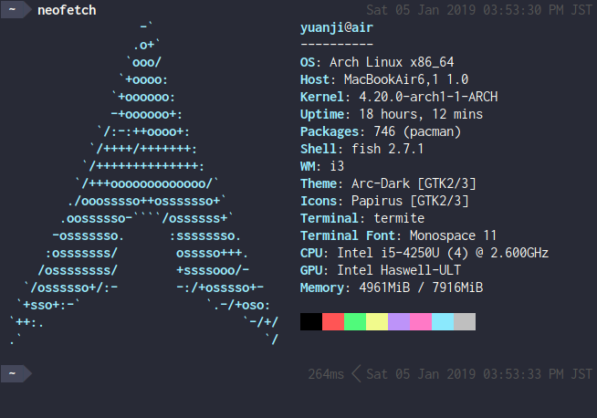

去年夏天开始，日常使用的桌面操作系统从苹果的 macOS 逐渐转移到了 Arch Linux 上。到现在基本完全过渡到 Arch Linux 上来了。

## 为什么要从 macOS 转到 Linux

- 用了好几年苹果的系统逐渐有些审美疲劳
- 苹果系统更新很多用不上的功能
- 好奇心驱使，想再尝试下现在的 Linux
- 把 MacBook Pro 让给了女朋友，正好可以换个新电脑

<!--more-->

## 为什么选择 Arch Linux 系统

首先想选择的就是滚动更新的发行版，系统常新感觉长期来看也会更稳定一些，假如有问题及时解决而避免一些非滚动升级的发行版大版本升级时导致系统可能很难恢复。

其实过渡阶段用了一段时间 Manjaro 和 Antergos，因为日常还要工作所以决定尽快得先让系统能用起来，之后再进行配置。不过也从这两个系统中获取了不少有帮助的东西，主要是参考了一些 dotfiles 配置和软件的选择方面。

不过最终还是换到 Arch Linux 上来了，Antergos 其实无非是个安装器加上一些官方源没有的软件而已，Manjaro 虽然对新手友好，但和 Arch 不同源这一点我觉得日后可能会造成不必要的麻烦。对我而言日常安装、使用熟练之后使用 Arch Linux 应该会减少更多出问题的风险。毕竟 Arch 丰富的 wiki 资源肯定和 Arch 系统自己最般配不是吗？包管理也非常好用，常用的软件官方几乎都有二进制包，另外还有 Arch Linux CN 的仓库可以用。没有二进制包的可以找或者自己写 PKGBUILD[^PKGBUILD] 自己编译，AUR[^AUR] 本身是 Arch 社区的产物，对 Arch 的支援应该是最好的，这也是我选择 Arch 而不是 Arch 派生的发行版的原因（其实主要还是觉得 Arch 的 LOGO 形状和颜色我很喜欢）。其实安装 Arch 一点儿也不麻烦，感觉经常被认为的麻烦不是说安装过程有多么复杂，而是选择困难带来的障碍。而 Antergos 也好、Manjaro 也好，不过是为用户做了这些选择而觉得方便而已。如果我们不直接用它们安装系统，而参考他们的配置和选择不就可以同时获得两方的好处了嘛。事实上，我现在用的 `i3-gaps` 的配置就是基于 Manjaro 社区的 i3 版本的配置修改的。

基本上，从引导程序开始，到窗口管理，再到日常用的编辑器、浏览器等等每一样几乎都有好多种选择，从中选择自己喜欢的软件可以形成自己独一无二的风格，而这一点也是吸引我转向 Linux 的一个因素。当然啦，好奇心强的话一开始每种都试试会占用好多时间就是了。

[^AUR]: [Arch User Repository](https://wiki.archlinux.org/index.php/Arch_User_Repository)
[^PKGBUILD]: [PKGBUILD](https://wiki.archlinux.org/index.php/PKGBUILD)

## 配置系统

接下来就具体罗列下我自己的配置情况。我目前有两台电脑安装了 Arch Linux，配置几乎相同。一台是几年前买的 MacBook Air 11 放在家里。下班和假期使用，现在写这篇文章在用这台。另一台是今年夏天买的 XPS 13 9370 放在职场（因为工作中长时间盯着屏幕，比较依赖两块 4K 屏幕）。一般家里的电脑每天会升级，没啥问题就到职场升级，两台电脑安装的系统、软件几乎相同，所以目前用得很舒服，没有啥问题。

先上一张 `neofetch` 输出的图好了。

{}



{}

### 引导程序

因为我只装 Arch Linux 系统也只需要支持启动 EFI 可执行程序。调查了一番，发现 systemd 自带一个，就毫不犹豫选择 `systemd-boot`。

### DM[^DM]

选择了 `lightDM`。 倒也没有其他特别的原因，单纯感觉名字看起来的平衡感不错，也几乎是 0 配置的，搭配 Antergos 社区开发的那个主题 `lightdm-webkit-theme-archlinux` 就看起来还挺顺眼的。

[^DM]: [Display manager](https://wiki.archlinux.org/index.php/display_manager)

### WM[^WM]

选择了 `i3-gaps`，之前也考虑过 KDE 或者 GNOME 等 DE，但感觉还是太重了，有很多自己不需要的功能。然后试了下 Manjaro 社区的 i3 版本，就感觉平铺的窗口管理还挺习惯，一方面可能也是我这个 11 寸的笔记本屏幕用平铺式的窗口管理比较合适。调整下快捷键的绑定搞成类 Vim 那一套就很符合直觉了，几天下来马上就接受了这个设定。刚上手时那种开个 terminal 只要 <kbd>Mod</kbd> + <kbd>Enter</kbd> 的感觉很不错。

[^WM]: [Window manager](https://wiki.archlinux.org/index.php/Window_manager)

### 状态栏

选择了 `i3blocks-gaps` ，最早使用了 `polybar` 虽然比较开箱即用，不需要怎么配置也比较美观。但是它的托盘图标显示有问题，图标经常会变花。于是转投 `i3blocks-gaps` ，这个是 `i3-gaps` 的作者基于 `i3blocks` 修改的版本，配置更丰富一些，与 `i3-gaps` 的配合更好。总之之前 `polybar` 能实现的功能，这个也基本能做到。现在想在状态栏上监控的点什么自己随便写个脚本就成，可以说非常方便。比如我把买的基金的涨跌情况，以及手机是不是有新版本升级了都可以放在上面。不用自己单独去检查了。

基本上上面几个配置完，系统的雏形基本出来了。接下来要做的无非是选择一下主题和配色，让整体的风格看起来比较统一就行了。

### 主题、配色和字体

安装了一个叫 `lxappearance-gtk3` 的包方便应用主题和图标等，主题使用了 `arc-gtk-theme` ，图标使用了 `papirus-icon-theme` 。至于配色基本是用了 [Dracula](https://draculatheme.com/) 的方案，因为看到 GitHub 上有个专门的仓库收集各种软件等的 Dracula 配置文件，本身这个暗色的配色也比较酷，就直接拿来用了。

字体基本就是和 fontconfig 打交道，当时配置也是花了老长时间，把 [manpage](http://fontconfig.org/fontconfig-user.html) 基本读了一遍，另外推荐一篇讲配置字体非常好的文章，叫《[我凝视 fontconfig，fontconfig 回以凝视](https://eev.ee/blog/2015/05/20/i-stared-into-the-fontconfig-and-the-fontconfig-stared-back-at-me/)》。我个人而言的话，基本的配置就是西文字体 => emoji => 汉字这么个 fallback 顺序。然后分为 `serif` 、`sans-serif` 、`monospace` 三种分别配下优先级就行。然后其他软件里设置字体，只要指定一个大的字体族的名字就行了，比如我在 terminal 里的字体直接指定 `monospace` 就行。感觉花点儿时间读一读系统预设的配置文件对于自己写配置是一个不错的选择。

{}

```shell
$ fc-match -s serif | head -n 5
SourceSerifPro-Regular.otf: "Source Serif Pro" "Regular"
NotoColorEmoji.ttf: "Noto Color Emoji" "Regular"
NotoSerifCJK-Regular.ttc: "Noto Serif CJK JP" "Regular"
NotoSerif-Regular.ttf: "Noto Serif" "Regular"
SourceSansPro-Regular.otf: "Source Sans Pro" "Regular"
$ fc-match -s sans-serif | head -n 5
SourceSansPro-Regular.otf: "Source Sans Pro" "Regular"
NotoColorEmoji.ttf: "Noto Color Emoji" "Regular"
SomcUDGothic-Regular.ttf: "ソニーモバイルUDゴシック Regular" "Regular"
NotoSansCJK-Regular.ttc: "Noto Sans CJK JP" "Regular"
NotoSans-Regular.ttf: "Noto Sans" "Regular"
$ fc-match -s monospace | head -n 5
InconsolataGo Nerd Font Complete Mono.ttf: "InconsolataGo Nerd Font Mono" "Regular"
SomcUDGothic-Regular.ttf: "ソニーモバイルUDゴシック Regular" "Regular"
NotoSansCJK-Regular.ttc: "Noto Sans Mono CJK JP" "Regular"
NotoColorEmoji.ttf: "Noto Color Emoji" "Regular"
NotoSansMono-Regular.ttf: "Noto Sans Mono" "Regular"
```

{}

### 其他软件

{}

- 浏览器： `chromium`
- 写代码： `neovim` & `visual-studio-code-bin`
- 写文章： `typora ` & `hugo`
- 即时通讯： `slack-desktop` & `telegram-desktop`
- 文件管理：`pcmanfm` &  `dropbox` & `insync`
- 密码管理： `enpass-bin`
- 启动器： `rofi`
- 终端： `termite`
- 通知：`dunst`

{}

职场基本使用 G Suite，所以没有安装办公软件。不过避免不了要使用微信和企业微信，索性用 `virtualbox` 装了个 Windows 7。

### 配置文件管理

之前在 Arch Linux CN 的讨论群里看到 farseerfc 桑翻译的《[使用 GNU stow 管理你的點文件](https://farseerfc.me/using-gnu-stow-to-manage-your-dotfiles.html)》非常好用，我在这里就不用冗述了。直接贴一下我自己的 dotfiles 仓库好了 https://github.com/masakichi/dotfiles ， `git clone` 之后，直接 `./bootstrap.sh` 一下就配置好了。因为使用了 git 来管理配置文件，对于不同的电脑的细微配置区别，使用不同的分支就行了。

## (Arch) Linux 使用感受

- systemd 很方便，自己的一些 daemon 也交给它管理了，不再需要 Supervisor 了
- 社区友好热情，自己也申请加入了 Arch Linux CN 帮着维护了一些包
- 平铺的窗口管理使用很舒服
- 滚动升级很愉悦
- 可配置的东西多，比如职场有段时间 Wi-Fi 每半小时断开一次，重连很慢。于是我把 `wpa_supplicant` 换成 `iwd` 就能很快重连了。还有可以给 `NetworkManager` 写钩子，比如连上公司的无线网自动连上公司的 VPN。再比如给消息通知的显示配置优先级，让重要的消息直接显示红色不消失等

附一张现在写这篇文章时候的截图。（写的时候其实会全屏 Typora）


## 问题和解决

一般查 Arch 的 wiki 基本能找到解决方案，其他一些小问题的解决方案一般也能用搜索引擎找到。决定之后把遇到的问题和解决方案补充在这里，方便自查找。

{}

安装时用手机的 USB 热点给电脑用，然后安装 `broadcom-wl` 就行了。

{}

{}

可以通过修改  `/.config/dunst/dunstrc` 在最后加上

```ini
[defaults_critical]
    msg_urgency = critical
    background = "#900000"
    foreground = "#ffffff"
    frame_color = "#ff0000"
    timeout = 0
```

ref: [Changing urgency by a rule does not affect color of message](https://github.com/dunst-project/dunst/issues/484)

{}

{}

可以通过修改 `~/.config/mimeapps.list`

```shell
$ cat ~/.config/mimeapps.list 
[Default Applications]
text/html=chromium.desktop
x-scheme-handler/http=chromium.desktop
x-scheme-handler/https=chromium.desktop
x-scheme-handler/about=chromium.desktop
x-scheme-handler/unknown=chromium.desktop
inode/directory=pcmanfm.desktop;visual-studio-code.desktop
```

ref: [VS Code messes with Linux places paths. VS Code is opened instead of system path. ](https://github.com/Microsoft/vscode/issues/41037#issuecomment-373484318)

{}

{}

查了下一般是系统时间没有自动同步导致的。直接 `timedatectl set-ntp true` 就行了。

```shell
$ timedatectl
               Local time: Sun 2019-01-20 16:01:40 JST
           Universal time: Sun 2019-01-20 07:01:40 UTC
                 RTC time: Sun 2019-01-20 07:01:40
                Time zone: Asia/Tokyo (JST, +0900)
System clock synchronized: yes
              NTP service: active
          RTC in local TZ: no
```

ref:

- [ OTP Sync MacOS, IOS and Windows failed for Windows](https://discussion.enpass.io/index.php?/topic/2126-otp-sync-macos-ios-and-windows-failed-for-windows/)
- [systemd-timesyncd - ArchWiki](https://wiki.archlinux.org/index.php/systemd-timesyncd)

{}

{}

可以使用 `mbpfan-git` 这个包，然后配置 `/etc/mbpfan.conf`，我的配置如下，自带的注释有详细的设置方法。

```ini
[general]
# see https://ineed.coffee/3838/a-beginners-tutorial-for-mbpfan-under-ubuntu for the values
#
# mbpfan will load the max / min speed of from the files produced by the applesmc driver. If these files are not found it will set all fans to the default of min_speed = 2000 and max_speed = 6200
# by setting the values for the speeds in this config it will override whatever it finds in:
# /sys/devices/platform/applesmc.768/fan*_min
# /sys/devices/platform/applesmc.768/fan*_max
# or the defaults.
#
# multiple fans can be configured by using the config key of min_fan*_speed and max_fan*_speed
# the number used will correlate to the file number of the fan in the applesmc driver that are used to control the fan speed.
#
min_fan1_speed = 1200	# put the *lowest* value of "cat /sys/devices/platform/applesmc.768/fan*_min"
max_fan1_speed = 6500	# put the *highest* value of "cat /sys/devices/platform/applesmc.768/fan*_max"
low_temp = 63			# try ranges 55-63, default is 63
high_temp = 66			# try ranges 58-66, default is 66
max_temp = 100			# take highest number returned by "cat /sys/devices/platform/coretemp.*/hwmon/hwmon*/temp*_max", divide by 1000
polling_interval = 7	# default is 1 seconds
```

最后让让这个服务跑起来就行了。

```shell
sudo systemctl enable --now mbpfan.service
```

{}

{}

**暂未找到**

{}


## 参考

- [Install Arch Linux on Macbook Pro 11,2 Retina (Install guide for year 2017)](https://medium.com/@laurynas.karvelis_95228/install-arch-linux-on-macbook-pro-11-2-retina-install-guide-for-year-2017-2034ceed4cb2)
- [ArchLinux なラップトップで仕事しはじめて大体1年経った](https://memo.laughk.org/2017/12/03/000013.html)
- [“理解”并安装 Arch Linux （UEFI）](https://amane.live/2018/11/26/install-arch/)
