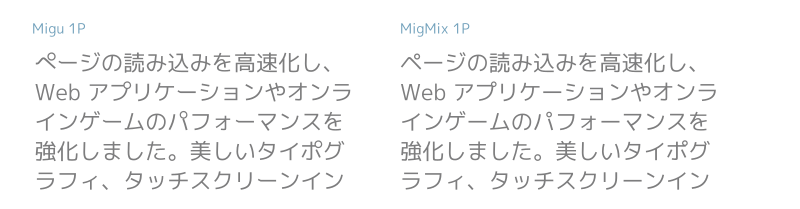

因为去年把电脑系统从 macOS 换成了 Linux，手机也从 iOS 换到了 Android，很多之前用的软件需要重新寻找。和日语相关的软件也是其中的一环，吸取教训，有意识地尽量使用跨平台的软件，这样下次迁移的成本就会很低。

大体上而言大概分为这么几类

- 系统语言
- 输入法
- 字体
- 字典
- 生词本
- 电子阅读

## 系统语言

这个 Windows 也好 macOS 基本上都可以自己方便的选择，Linux 的情况一般把 `/etc/locale.gen` 里 `ja_JP.UTF-8 UTF-8` 前面的注释去掉，再次运行 `locale-gen` 重新生成再重启一下就行了。如果要把日语设成默认语言就把 `/etc/locale.gen` 里日语的优先顺位设成第一个就行了。

## 输入法

输入法可以使用[谷歌输入法](https://www.google.co.jp/ime/)，官网上只能下载到 Windows、Android、macOS 版本。对于 Linux 用户推荐使用开源的 Mozc，我的话使用的是 `fcitx-mozc`。基本没遇到什么问题，除了打人名什么的时候找起来稍微花点儿时间。(样子如下，右上有托盘图标)

## 字体

日文字体的话，推荐使用 [Migu（ミグ）フォント](http://mix-mplus-ipa.osdn.jp/migu/)，可读性非常好而且汉字支持也比较好（当然是指日本使用的汉字而言）。可读性好在于它对一些暧昧的汉字和假名做了区分，以及半浊点显得比较明显。预览如下，详细的说明还是参照官网。

## 字典

字典，日语就是辞書。脱离苹果的生态系统之后一直还挺怀念之前系统内嵌的各种字典，比如拿日语来说苹果系统自带大辞林。到了 Linux 这调查了一圈，找到了 [GoldenDict](https://github.com/goldendict/goldendict)，而且也是跨平台，支持的字典文件格式非常多，应该能覆盖各种字典的需求吧（我最初这么想）。不过还是有点儿小插曲，日文世界的字典一般采用一种叫 EPWING 的格式，而 GoldenDict 在最新版中也支持了这种格式，但是遗憾的是 Arch Linux 官方仓库编译的版本去掉了对 EPWING 的支持，我估计原因应该是 libeb 这个库不在官方仓库里吧。不过不要紧，还有 Arch Linux CN 仓库嘛，于是把 [goldendict-qt5-git](https://aur.archlinux.org/packages/goldendict-qt5-git/) 提交进去再安装就能愉快地使用那些字典了，试了広辞苑、スーパー大辞林、明鏡国語辞典都没问题。设定了快捷键就可以各种查生词了。

最后，到哪能获得 EPWING 格式的字典呢？唔，这里有个互联网上流传似乎很久的[网盘链接](https://onedrive.live.com/?id=AC31052BF2B8CA11%211937&cid=AC31052BF2B8CA11)。

## 生词本

[Anki](https://apps.ankiweb.net/) 恐怕是这一方面最著名的跨平台开源软件了（Anki 其实就是日语的暗記，就是记住的意思）。之前虽然也用过，但多半不长久（这一次拭目以待）。之前没长久坚持下去的根本原因是单词本直接用别人贡献的，而不是自己日积月累。使用别人写的生词本的抵触感以及我为啥非要记住这个单词的疑问导致不能长久。记忆的一条原则是理解，所以说死记硬背只会导致放弃。（扯远了）总而言之萌生了自己做生词本的想法，调查之后，原来早就有解决方案。简单地说就是 Anki + [AnkiConnect](https://foosoft.net/projects/anki-connect/) + [Yomichan](https://foosoft.net/projects/yomichan/) 后面两个软件都出自同一个人之手（感觉他一个人建立了整个生态系统）。

AnkiConnect  是一个 Anki 插件，启动了一个本地服务器来对外暴露 RESTful 接口用来与 Anki 交互，而 Yomichan 是一个功能强大的浏览器插件，用来查词也可以跟 AnkiConnect 联动把生词记录到 Anki 中，它强大的地方在于可以把生词的好几个字段自由组合，自由发挥定制自己的单词本。比如我把单词本设置了五个字段，分别是词条、读音、意思、例句、真人发音。这些都可以通过 Yomichan 发送给 Anki（例句就是你包含你查词上下文的句子，是不是很酷）。建一个词条只需要点击一下鼠标，我想这一次也许我能坚持使用下去也不一定。

我的 Yomichan 与 AnkiConnect 联动的设置

整个使用过程我做了个 GIF

## 电子阅读

简单地说就是在日本亚马逊买电子书，但不在 Kindle 里读。不仅不用 Kindle 阅读器读，也不用 Kindle 的 App。

{}

主要原因有两条

1. Kindle 对版权限制太多（其实其他电子书平台也一样）。不能复制电子书里过多的文本，也不能导出过多的划线和批注。
2. 只能用 Kindle 设备和软件阅读让人觉得限制太大，感觉不太灵活。我为什么不能用其他的阅读器阅读呢？我为什么不能本地保存一份电子书文本，以防哪天亚马逊不提供服务了我还能继续使用这本电子书？

{}

{}

调查了一圈，答案是肯定的。原理就是去 DRM[^DRM]（deDRM），就是把 Kindle 设备或者 Kindle App 自己下载的电子书文件去除 DRM，然后转成自己想要的通用格式，就可以在其他设备和软件上阅读了。其中如果有 Kindle 实体设备的话，deDRM 的过程应该是最简单的，装好 [Calibre](https://calibre-ebook.com/download) 和 [deDRM 插件](https://github.com/apprenticeharper/DeDRM_tools/tree/master/Obok_calibre_plugin)，配置好设备序列号，往 Calibre 里导入电子书的同时就直接吧 DRM 给去掉了，借助 Calibre 的电子书格式转换功能就能实现把通用格式的电子书保存在自己手里的愿望啦。[具体的教程](http://demikko-no-bibouroku.hatenablog.com/entry/2018/01/30/143650)想必互联网上有很多，稍微研究下应该就能实现。

[^DRM]: [Digital rights management](https://en.wikipedia.org/wiki/Digital_rights_management)

{}

有了以上步骤，甚至可以把亚马逊上买来的电子书在 iBooks 里或者放在 Google 的 Play Books 里读啦。我自己的话选择转成了 EPUB 用 Play Books 来读，一来 [Google 可以免费提供存放 1000 本电子书的功能](https://support.google.com/googleplay/answer/3097151?hl=en-GB)（单本上限 100MB，支持 EPUB 和 PDF），二来在 Play Books 里阅读做的划线和批注甚至能生成一个 doc 放在 Google Drive 里，这样用浏览器打开再配合上文说到的 Yomichan 一键登录生词本。無敵だ！

下面分别是上传到 Play Books 和存在本地的书目的部分截图，感觉还不赖吧。

