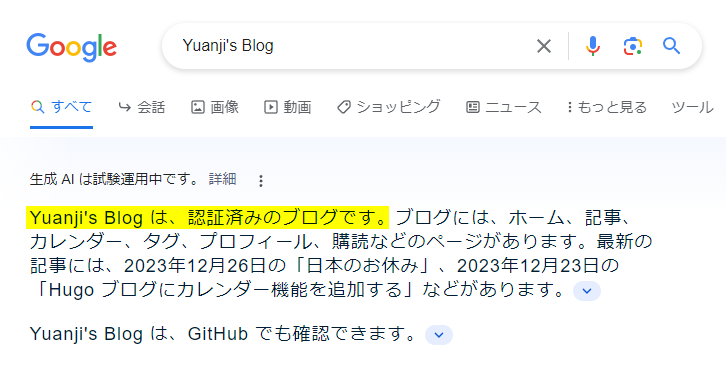

如果没有记错，这似乎是博客开张以来第一次写这样类似年度总结的文章。考虑到通常总结类型的文章都很无聊，我只挑选两点有意思的分享，然后简单回顾一下目前为止的博客情况和今后的展望。

<!--more-->

## 被认证的博客

之前单纯觉得有趣，[给自己的博客加上了类似 X（Twitter）上的认证标识]()，一转眼一年多过去了。前几天试着用 Google 搜索了一下自己的博客，没想到还在试运行的 Google 生成 AI（Bard）对我的博客似乎非常了解，在它看来我的博客是通过认证了:joy:。另外，看起来它已经收录了我最新的博客文章，还擅自（褒义）把一些文章的标题翻译成了日文，看起来似乎是个很勤快的 AI 呢。

## 被阅读最多的文章

另一个值得一提的是，2023 年年初[给博客加了一个自建的统计功能]()以来，现在一年过去也积累了一些数据。其中最有价值的信息大概是哪些文章的访问量最大，我把前十名列在了下面：



另外一些有关访客来源、操作系统、地区分布等的信息我也放在这里，感兴趣的读者朋友可以自行阅读。



 

 

 
附：<a href="umami_2023_screenshot.png">Umami 2023 年统计数据截图</a>


也许你会好奇上面表格里这么多数字我都是自己一个个打字上去的吗？当然不是，为此我专门做了一个叫做 `json2table` 的 Hugo Shortcodes，可以通过它直接把网站统计的 JSON 数据渲染成表格，之后可能会单独写一篇文章介绍一下。

## 回顾和展望

虽然断断续续，但我还是很庆幸 2023 年还在写博客，本文应该是第 90 篇。写着写着也算是写出了一些自己的风格，我自己总结如下：

- 博客从主题到写作环境基本稳定下来（基于自己写的 Hugo 主题，用 AstroNvim 书写 Markdown）
- 博客的内容之间不再那么孤立，文章之间开始出现联系（甚至可以开始写本文这样总结型的文章了）
- 博客有了一些固定的访问量（目前差不多日均 50 人，100 多浏览量，新文章发布日大概 2 倍）

通过上面这些观察，我估计在新的 2024 年会开始做一些小的改进，目前想到的有：

- 更新目前一些访问量大的文章或是出续集（上面访问量 Top 10 里的文章好几篇都是几年前写的了）
- 博客文章的主旨尽量明确，每一篇文章尽量只关注一个主题展开
- 给文章增加鼓励分享的按钮（方便自己以及读者可以分享到社交网络等）
- 尝试翻译一些文章到英文和日文（看到 Bard 已经主动用日文介绍我的博客而受到启发）

当然了，不管怎么说，最重要的还是再接再厉继续写下去。
