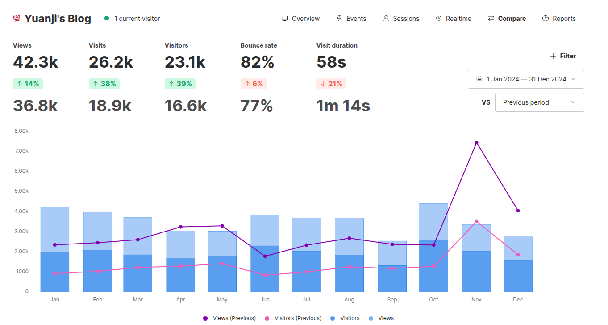

去年写了一篇 ，没想到时间过得飞快，又一年过去了。为了延续去年的传统，也写一篇 2024 年博客回顾好了。

<!--more-->

## 被阅读最多的文章

按照惯例，我下载了 Umami 上统计的信息，使用去年写的 Hugo 的 shortcode 渲染出 2024 年博客文章访问前 10 名大概是这样：



今年给那个 shortcode 加了个新功能，可以显示文章的发布日期，可以看到 2024 年写的文章里共有 3 篇文章上榜。



 

 



## 回顾和展望

回顾去年一年写的博客，感觉最大的变化是换上了新的域名 blog.yuanji.dev，一个原因是为了和博客的标题保持统一，另外也是因为夏天的时候[做了一个新的网站]()，想着在日本的生活渐渐稳定下来，准备在那个网站专门用来分享一些日语学习、日本生活的文章。（虽然目前也停更几个月了 😂）

至于 2025 年，这个博客就主要分享一些技术相关的记录和一些随笔吧！
