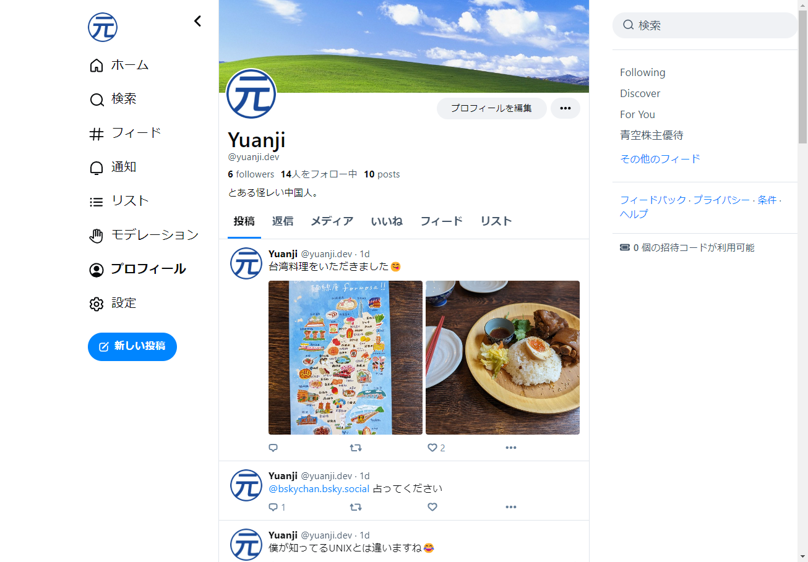

这个月初（2024/02）看到 [Bluesky Social](https://bsky.social/) 开放注册的消息，本着凑个热闹的想法，第一时间注册了这个新的社交网络。（虽然据说去年初就上线了，不过之前一直是邀请注册制）

<!--more-->

## 第一印象

不得不承认我对这个社交网络的第一印象非常不错，除了名字和我最喜欢的乐队（THE BLUE HEARTS）的名曲「青空」一样之外，蓝色也是我比较喜欢的颜色。比起黑色的 X 和 Threads，不觉得 Bluesky 更帅气吗？

下面是我的主页的样子，感觉上比 X 更像 Twitter？

## 基本使用

基本上和 X 相比，功能更少，颇有一开始玩 Twitter 和豆瓣的感觉，虽然开放注册了，但功能并不完善，不过我认为这正是它吸引人的一个地方。目前（2024/02/12）：

1. 只支持发文字和图片，不支持视频
2. 投稿完之后没有修改功能
3. 都是公开投稿，没有上锁的功能
4. 没有 Hashtag 功能
5. 没有私信功能

另外一个对我有吸引力的是这是一个全新的开始，老平台上已经被占用的用户名在这里大概率可以申请到，更有意思的是它可以把自己的域名作为用户名，正好我有一个注册之后没怎么用上的域名 yuanji.dev 在这里派上了用场，只需简单设置一条 DNS 记录就可以通过认证从而使用自己专属的用户名了。于是我主页的地址就变成了这样：[bsky.app/profile/yuanji.dev](https://bsky.app/profile/yuanji.dev)

## 信息流（Feed）

作为一个用了几天的普通用户，目前我还不甚了解这个社交平台背后运作的原理，仅从使用的角度，信息流（Feed）绝对是它的一大特色，不仅在于一些预置的比如 [Discover](https://bsky.app/profile/did:plc:z72i7hdynmk6r22z27h6tvur/feed/whats-hot)、[For You](https://bsky.app/profile/did:plc:wqowuobffl66jv3kpsvo7ak4/feed/the-algorithm) 这种通常社交网络都有的功能外，还可以订阅社区里其他人制作的信息流。

对于各种信息流感兴趣的朋友，我找到了下面两个导航站，可以参考。

- 英文： [goodfeeds](https://goodfeeds.co/)
- 日文： [Bluesky Feeds Navigator](https://bsky.geo.jp/)

## 定制信息流

既然上面有这么多社区分享的信息流，自然也就有自己制作信息流的方法。如果你愿意折腾，官方给了一个参考实现 [bluesky-social/feed-generator: ATProto Feed Generator Starter Kit](https://github.com/bluesky-social/feed-generator)，基本上只需要 clone 这个 repo 之后，根据 `.env.example` 的内容新建一个 `.env` 文件，`yarn start` 就可以看到这个网络上忙碌的投稿了，感觉日本（日文）投稿非常踊跃？

然后我顺腾摸瓜，把算法的代码稍加修改（简单匹配关键字），部署到了我的 VPS 上，做了个 Feed 叫[青空株主優待 — Bluesky](https://bsky.app/profile/did:plc:d2626hmd457osfl6umzg52ia/feed/yutai)

它的原理其实并不复杂，通过监听 `wss://bsky.network` 这个地址，就可以实时取得整个网络上的各种事件，你可以索引自己关心的内容（比如存到本地的 sqlite），然后配合自己的算法形成自己的 Feed（通过暴露 Web 地址），之后发布到 Bluesky 上，其他人就可以通过 Feed 的搜索功能来使用你制作的信息流了，是不是很有意思？

## 最后

总的来说，我感觉这个新平台很有意思，让我又燃起了一种准备在新天地施展拳脚的念头。通过官方开放的 API 可以制作 bot 或者定制信息流，对于喜欢折腾的用户比较友好，同时因为平台尚处在初期阶段更让人有一种跃跃欲试的冲动。

怎么样，读者诸君，不考虑一起相逢在蓝天之下吗？关注我请点击：[Yuanji (@yuanji.dev) — Bluesky](https://bsky.app/profile/yuanji.dev)
