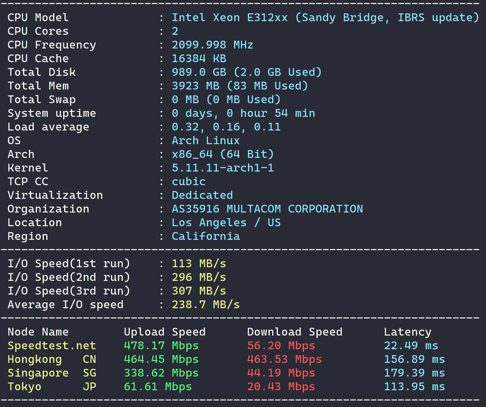

话说几天前收到了 [CloudCone](https://app.cloudcone.com/?ref=6708) （某廉价 VPS 提供商）发来的邮件说他们复活节会有一个寻找彩蛋的活动，实际上就是会在他们的网站里藏好特价 VPS 的相关链接，看了下最高有 96% OFF 的折扣，确实挺吸引人。

于是，抱着试试看的态度，我决定参加一下，活动定于太平洋时间 4 月 4 日早上 7 点开始，我换算了一下就是东京时间的晚上 11 点，我想着到点了直接去网站找肯定是赶不上趟了，但是我也不想在这个活动上投入太大的热情，就想着，到时候他的网站上说不定会多出新链接，这个新链接说不定就是彩蛋的地址，于是我掏出了我的 Huginn（关于 Huginn 是什么，我有空应该会单独写一篇日记），创建了一个  Website Agent，每分钟让他去解析一遍目标地址，然后把所有的链接抽出来（用 css 选择器就是一个字 a，取 href），这个 Website Agent 甚至自带了去重功能，那就直接放着跑了，一旦有新的链接出现马上发给我的电报，这个 Agent 的配置大概这样。

<!--more-->

```json
{
  "expected_update_period_in_days": "2",
  "url": [
    "https://app.cloudcone.com/compute",
    "https://cloudcone.com/",
    "https://hello.cloudcone.com/",
    "https://cloudcone.com/cyberpunk-2077-what-went-wrong/"
  ],
  "type": "html",
  "mode": "on_change",
  "headers": {
    "cookie": "CCM19=**************"
  },
  "extract": {
    "text": {
      "css": "a",
      "value": "@href"
    }
  }
}
```

到昨天晚上 11 点，我开始留意我的电报消息，然而并没有如期出现，本来已经放弃的我（寻思它估计写在 js 里了）竟然在 11 点 11 分的时候收到了链接，是一个 Survey 链接，打开只需填写邮箱即可，没想到这么容易就抢到了第一台。


然后我分析了一下他这个地址的域名又到其他几个网页搜了下源代码，竟然又找到了两台...他们确实有写在 js 的字符串里。不过因为最简单那台暴露了其他几个地址的域名使得找起来根本没费什么力。不过活动里有写每人只能选择一个 deal，于是要了一台 Bunny Z [HDD] 

```
2 vCPU Cores
4 GB RAM
1 TB RAID-10 HDD
7 TB Bandwidth at 1 Gbps
$34.55/YR
```

不过仔细想一想其实解析 HTML 还把链接取出来都有点儿多此一举，实际上直接 diff 一下新旧网页也许来的更快也不一定。

今天晚上收到客服发来的恭喜邮件，我马上装了个系统跑一下测试，感觉性能还不错，做个存储用的服务器应该是绰绰有余了。

```bash
curl -Lso- bench.sh | bash
```


