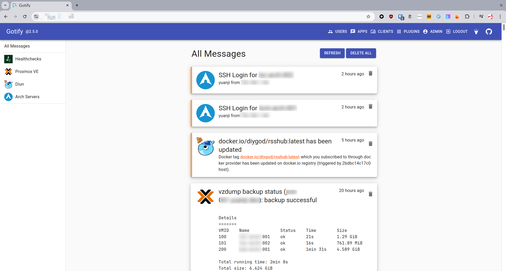
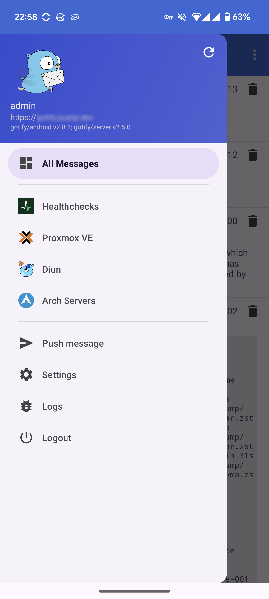
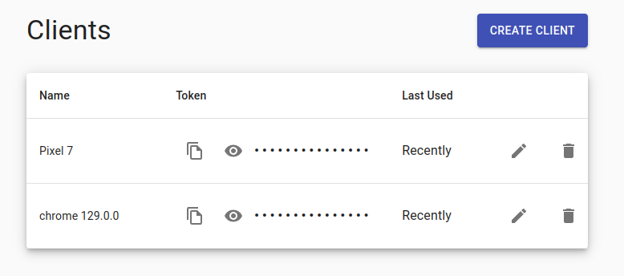
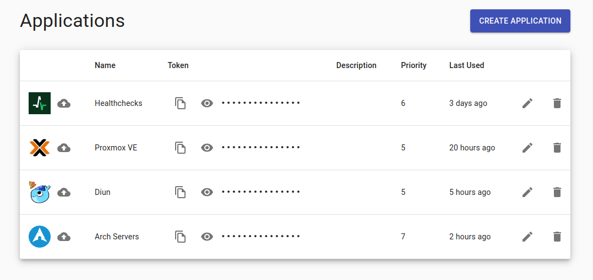

最近购入了新设备一台迷你主机后，在上面安装了 [Proxmox Virtual Environment](https://www.proxmox.com/en/proxmox-virtual-environment/overview)（简称 Proxmox VE 或者 PVE）之后，在上面运行了几个 LXC 的容器和虚拟机。在配置 PVE 的时候发现它的通知系统不仅支持传统的 SMTP 通过邮件提醒，还默认支持一个叫做 [Gotify](https://gotify.net/) 的通知，于是就花点时间研究了一下，在此做个记录和分享。

<!--more-->

## Gotify 是什么

Gotify 简单来说是一个可以自己搭建的用于发送和接受通知的服务，大体上分为了服务端和客户端两部分。

- 服务端的部分就是一个由 Go 语言写成的可执行文件
- 客户端的话目前有网页浏览器以及 Android 两种

由于我目前使用 Android，Gotify 足够简单再加上是因为 PVE 内置了 Gotify 的通知开始使用的，所以对于我来说就推送通知这个功能而言已经足够了。

如果平时使用 iOS 的读者，不妨看看类似的替代品 [ntfy.sh](https://ntfy.sh/)。

## 配置及运行 Gotify

由于是 Go 语言写的，最简单的运行方式就是下载可执行文件直接运行即可，而我的话为了方便管理以及使用统一的反向代理，使用了 Docker Compose 部署。

```yaml
services:
  gotify:
    image: gotify/server:2.5.0
    container_name: "gotify"
    restart: always
    # 如果你也使用 traefik 作为反向代理，可能需要下面这样的标签以及配置相应的网络
    #labels:
    # - "traefik.enable=true"
    # - "traefik.http.routers.gotify.rule=Host(`push.example.de`)" # 替换自己的域名
    # - "traefik.http.routers.gotify.entrypoints=websecure"
    environment:
      # 如果你也使用 PostgreSQL 可以酌情修改，默认的话会使用 SQLite
      #- GOTIFY_DATABASE_DIALECT=postgres
      #- GOTIFY_DATABASE_CONNECTION=host=xxx.xxx.xxx.xxx port=5432 user=gotify dbname=gotify password=****************** sslmode=disable
    volumes:
      - "./gotify_data:/app/data"
```

具体的配置选项可以参考：[Configuration · Gotify](https://gotify.net/docs/config)

部署成功之后，可以通过默认的账号密码（都是 admin）访问 Web UI，修改密码后即可开始使用。

另外在访问地址后加上 `/docs` 则可以访问基于 Swagger UI 的 API 文档。

## Gotify 的使用

首先它的长相大概是下面这个样子，我分别给网页端和 Android 端截了图，主体大概就是展示消息列表，侧边栏可以按照 Apps 分类查看。





使用上也非常简单，总的来说，在 Gotify 的 Web UI 除了像 Android 端一样可以收到消息通知外，还附带了一些简单的管理功能，除去用户密码的管理，剩下需要管理的大体分为两类。

- 客户端（Clients）
- 应用（Apps）

### 客户端（Clients）

客户端的话最好理解，比如说我们登录上 Web UI，这个 Web 算一个客户端，如果在 Android 上登录的话，那也是一个客户端。总之就是用来接收通知的设备就对了，一般不需要单独做什么操作，除非你想删除某个设备。



### 应用（Apps）

应用的话，则像是一个分类的功能，拿聊天软件类比的话，有点儿像频道。创建一个应用的话就会生成一个单独的 Token，可以拿那个 Token 作为凭证来发送消息。

推送消息的话，就是一个简单的 POST 方法的 HTTP 请求，详细可以参考官方文档 [Push messages · Gotify](https://gotify.net/docs/pushmsg) 或是位于 `/docs` 的 API 文档。

```bash
curl "https://push.example.de/message?token=<apptoken>" -F "title=my title" -F "message=my message" -F "priority=5"
http -f POST "https://push.example.de/message?token=<apptoken>" title="my title" message="my message" priority="5"
```

其中的 `priority` 代表了优先级，数字越大代表了优先级越高，主要和在客户端接收到消息后展示的顺序有关。

消息发送成功后就会自动推送到各个客户端了。另外为了让消息的分类更为一目了然，它自带了一个上传应用封面的功能，就像我下面截图展示的那样，那些应用的封面的图片是我自己上传的。



## 我目前使用 Gotify 的用途

通过我上面的截图，想必读者也多少可以看出我使用 Gotify 的用途，大体上有下面几种：

- 当有人通过 SSH 登录我的服务器时，发送通知显示是谁从哪（IP 地址）登录的。
- 当服务器上的软件有更新时，发送通知并显示哪些软件有更新，同时显示新旧版本号。
- PVE 上的通知，主要是 LXC 容器和虚拟机的备份详情。
- [Diun](https://github.com/crazy-max/diun) 的通知，提醒我使用的 Docker 镜像是否有更新。
- [Healthchecks](https://healthchecks.io/) 的通知，提醒我是否有预期执行的 Cronjob 没有在规定时间内执行。

## 总结

如果你也是 Android 用户，想要一个简单的接收通知的功能，Gotify 将是不错的选择。像是 PVE、Healthchecks 和 Diun 等对它有内建的支持，基本只需要在相应的系统中设置相应 App 的 Token 即可。

而比起 Telegram 等基于聊天软件的推送通知，可以自己部署使用上会比较自由，消息也不会和普通聊天的通知混在一起。

当然了，是否需要为了消息提醒单独部署一个服务就因人而异了，不过因为它足够简单，对于我来说只是几分钟的举手之劳而已。
