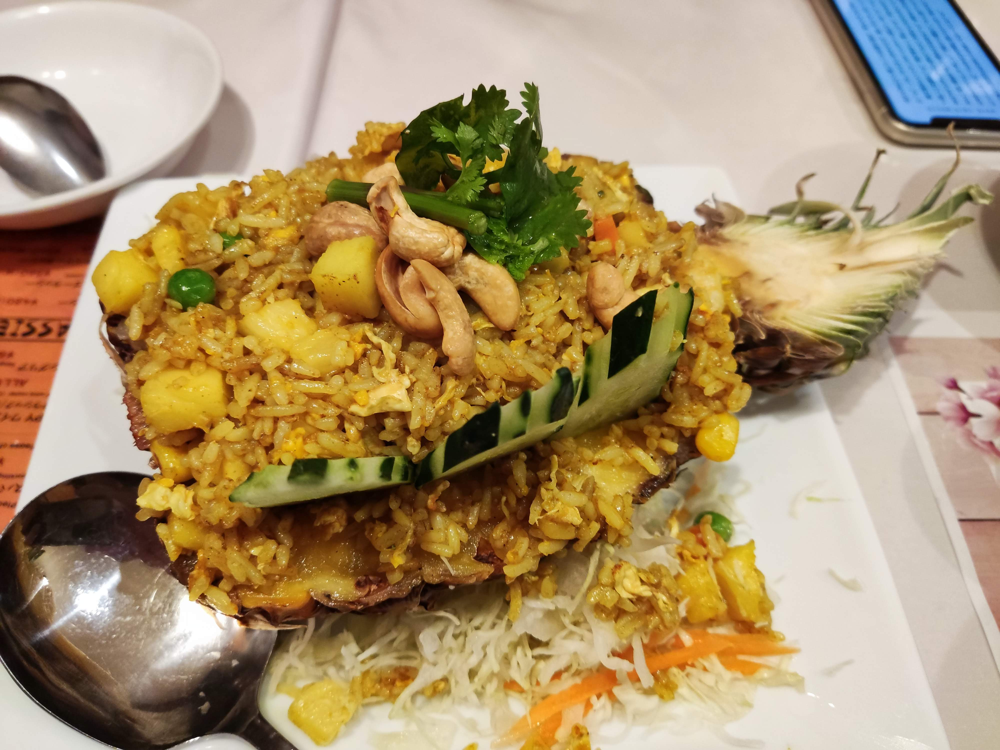

上周五（严格来说是连续两周）和妻子去吃了一个泰国餐馆叫「タイガーデン 渋谷店」，总得来说：

- 分量比较大，适合饥饿状况下去
- 味道还不错，点的几道菜都以酸辣为主

我们两次都是去吃晚饭，没有排队的现象，听周围食客的声音有很多是来自中国的同胞，不知是偶然还是因为他们家的口味确实很接近中餐。

另外背景音乐感觉也和华语流行曲风接近，只不过歌词一句都听不懂。比起之前去过的越南餐馆的背景音乐，泰语似乎更柔软一些。

<!--more-->


