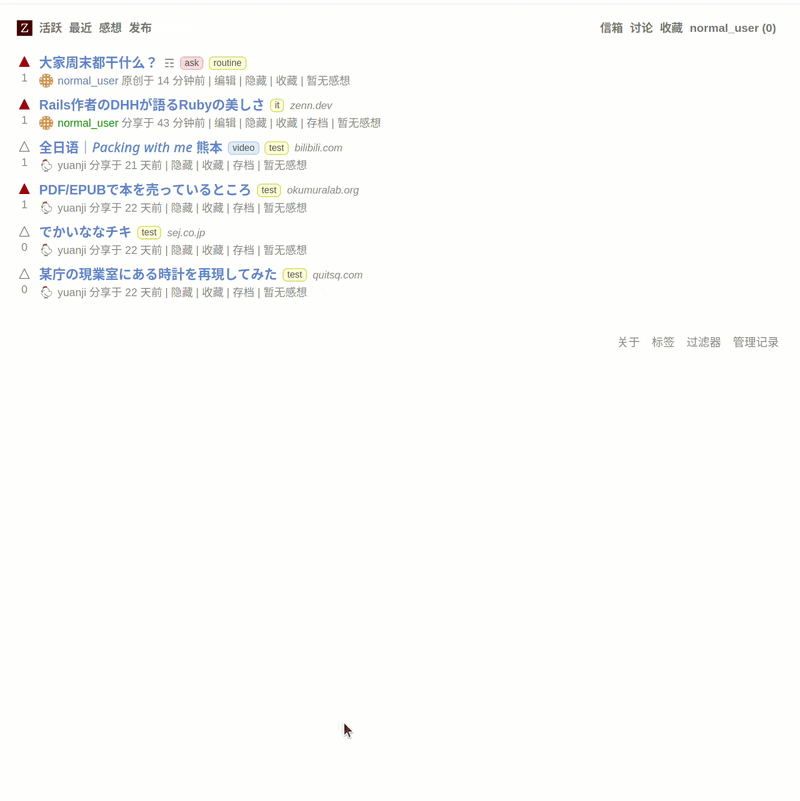
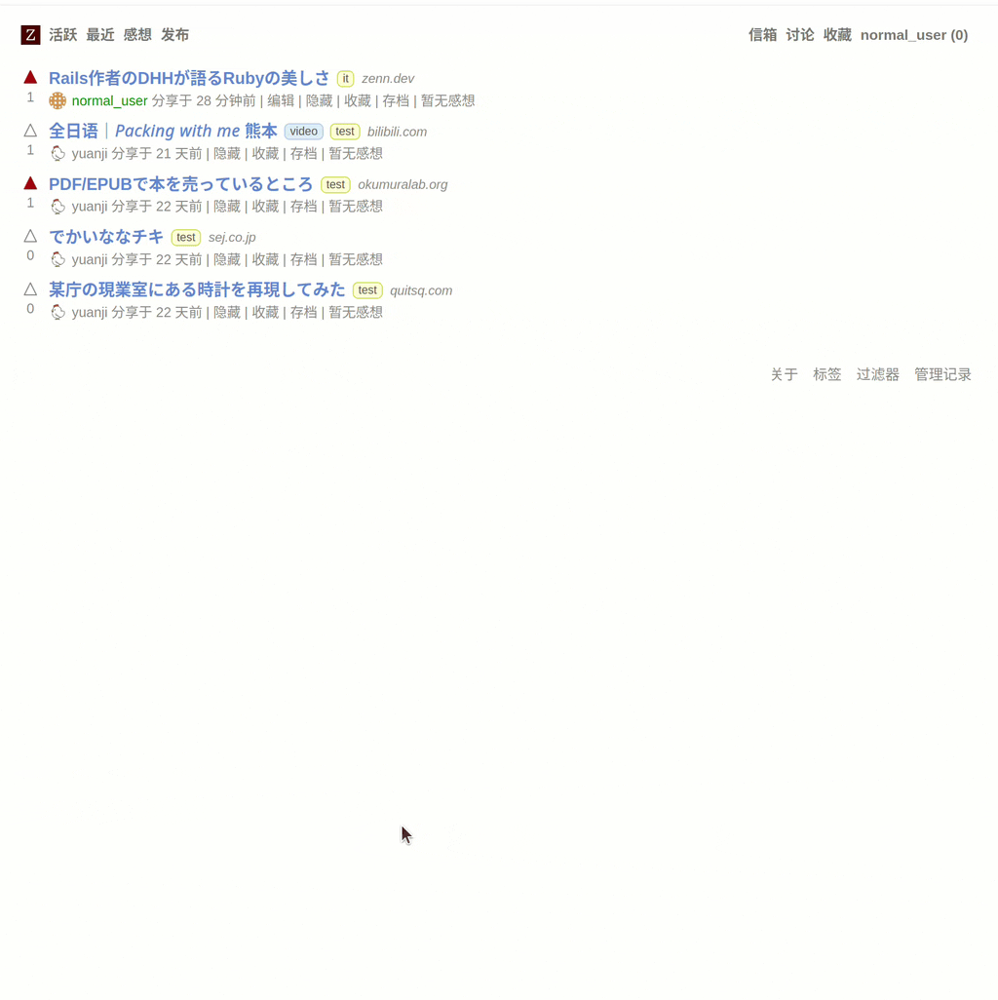

这个月我“偷偷”上线了一个社区网站叫做「在留.jp」网址是 <https://zairyu.jp> 说是偷偷因为我只在自己的 Telegram 频道上说了一下，既没有交代为什么要做这么个网站，也没有介绍该怎么玩这个网站。加上最近感冒了快两个星期，一直也就没有做更多的说明。这周末终于也恢复得差不多了，就让我写篇博客简单介绍一下它吧，如果你有兴趣非常欢迎你来玩。


如果你想一探究竟，可以直接访问: <https://zairyu.jp>

如果你想注册账号，可以在 <https://zairyu.jp/invitations/request> 这里填写表单发起邀请申请。也可以给我的邮箱 <yuanji@yuanji.dev> 写封信说明来意，我可以直接向你的邮箱发送邀请。


<!--more-->

## 契机

订阅我的博客的读者大概有一部分是读了我 2019 年准备来日本以及之后在日本工作生活等的[一些列文章](/tags/日本)。期间断断续续也有一些读者联系我，询问我有关工作或是来日本生活的前景的问题等。不过说实话我自己的经历并非有什么代表性，除了我生活中实际认识的几人之外，对于更多在日本工作、学习或是因为任何原因常年居住在日本的人的经历、生活一无所知，转眼我来日本都快 6 年了，这一点似乎与过去几年比也变化不大。

于是我就想，如果有一个相对开放透明的社区，大家可以分享自己在日本或是有关于日本、日语等的见闻，对此可以发表各自的感想那感觉是一件很有意思的事。说不定还能多认识一些同在海外，或者曾经在海外，又或是即将出国的朋友们。我们在这里发表的讨论可以通过网页记录在互联网上，以后感兴趣的人也可以像考古一样阅读当时的人的活动轨迹等。

有了这个想法之后，于是我就开始构想取给这个社区叫一个什么名字。思索了片刻想到目前常住在日本的外国人一定对一样东西不陌生，那就是在留卡。于是 zairyu.jp 这个域名也就应运而生了。当然了，这个域名只是为了好记，并不是说如果你想加入一定得待在日本，你只要对网站的内容、氛围感兴趣就可以加入进来。有了名字加上我自己今年来自学了 Ruby on Rails，虽然很想重头做个网站，但既然已经有存续了十几年的社区网站 <https://lobste.rs> 提供开源代码，站在巨人的肩上显然来得更实际。

## 「在留.jp」是一个什么样的网站

简单来说是一个链接聚合型的论坛网站。但是与传统的论坛发帖不同你并不非要煞有介事地填写标题、正文然后发帖。你可以简单地分享一篇你觉得有趣的文章、视频等的链接，网站会自动抓取文章标题，只要选择与文章相关的标签就可以发布了。我甚至不鼓励你填写正文内容，如果你想发表自己的看法直接在回复区像其他用户一样回复即可。当然，也可以像传统论坛一样发帖直接分享自己的见闻或是询问他人的想法。

不过，对于分享和发表的内容最好是和日本、日语有关系，仅此而已。分享内容的语言的话汉语、日语或者是英语都可以。

{}

{}

{}

{}

### 特点

除了上面所说的链接聚合作为它的一大特点外，因为使用了 [lobsters/lobsters](https://github.com/lobsters/lobsters) 的代码，它自然也拥有了 Lobste.rs 这个网站的几乎所有功能。对于不熟悉那个网站的读者，我在此简单介绍下。

- **免费，简洁的界面与功能。** 浏览器直接访问即可，没有广告、不需要安装任何 App。如果你只想阅读而不想参与发帖和讨论，没有账号也可以阅读所有内容，没有任何必须登录才可见的内容。如果你使用 RSS 阅读器，甚至不必直接访问网站即可订阅网站动态。
- **规则简单且公开透明。** 首先代码是开源的，没有暗箱操作，没有 Shadow ban，固然管理员为了维护网站的运行会有一些特有的删帖等功能，但全站有一个管理记录日志，所有管理操作都会记录在案。对于所有注册用户对于帖子和回复的投票没有权重之分，每个用户一人一票可以决定内容在网站内的排序。
- **邀请制。** 为了防止可能的 SPAM，也为了让各位注册的用户更有归属感。从网站上线第一天我就决定实行邀请制，但是一旦你加入之后，你就拥有了与所有注册用户一样的邀请功能，没有邀请人数限制，你可以向任何你觉得适合这个网站的人发起邀请。
- **来去自由。** 用户名随时可以更改，如果你觉得一个账号玩累了，要是愿意可以再邀请自己作为小号重新开始，当然删除账号也可以。
- 注册会员还有一些额外的收藏、屏蔽、提醒、私信一类的功能，更多的功能欢迎注册账号来体验。

### 我的期待

- 首先，开始的时候当然主要用户只有我自己。我期待这个网站可以成为一个可以分享自己见闻和感想的渠道，一段时间过后再回来看自己分享的见闻和发表的感想应该会有一种奇妙的感觉，如果有人对我分享的内容感兴趣那就更好了。
- 作为我业余时间的公益项目，我希望在学习和使用 Ruby on Rails 的同时尽可能保证这个网站的运行，因此做了较为规范的上线流程，以及基本的维护、备份等。置于费用，我使用的都是我购买股票的日本公司的服务，算上之前的株主优待和分红等其实一年额外开销并没有多少。作为用户你不必过于担心我会跑路，毕竟我这个博客都更新 10 年了。
- 如果有幸能吸引到一些很有分享欲的人，能在这里看到不同的生活方式，以及看到不同的对于日本社会的视角等。当然空闲之余也可以发发工作学习的牢骚、谈一谈周末的计划等等。说不定我们可以举办一些线上或线下的聚会等结识更多的朋友。
- 如果这个网站最后真的吸引更多的人加入，我也期待有志同道合的朋友一起来管理维护本站，最终本站可以通过集团自治或者说不需要我个人的特意维护也可以健康维系下去。

## 最后

说了这么多，有没有多少引起一些好奇读者的兴趣呢？欢迎通过下面的方式访问网站或者直接申请加入吧。虽然目前积极发帖的人还只有我，但我相信随着更多感兴趣的人的加入，说不定网站的内容会渐渐变得更丰富起来。


如果你想一探究竟，可以直接访问: <https://zairyu.jp>

如果你想注册账号，可以在 <https://zairyu.jp/invitations/request> 这里填写表单发起邀请申请。也可以给我的邮箱 <yuanji@yuanji.dev> 写封信说明来意，我可以直接向你的邮箱发送邀请。

