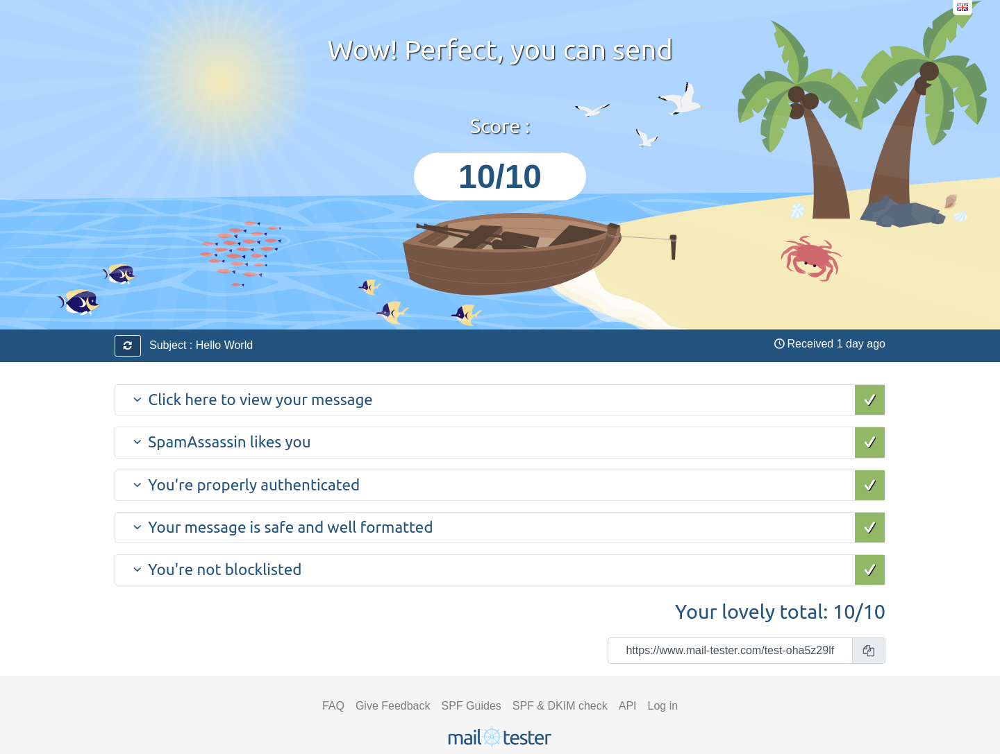

自从上次以来已经过去快 3 年了，再过几个月就到了续费的时间。这期间我对他家的服务几乎没有任何不满，配置好之后，几乎不用任何担心，服务感觉非常稳定。只是有一点儿，他们家的收费策略果然还是有点不太灵活，比如每个域名、邮箱都需要单独收费，毕竟背后是 Namecheap 这样的企业，需要赚钱也可以理解。

于是从去年就有意识地开始找了找可以替代的更平价的产品。

<!--more-->

## 为什么使用域名邮箱

在谈及 MXroute 之前我才发现上次那篇文章没有提及为什么要使用域名邮箱，这次借此机会先介绍一下。可能不同的人有不同的原因，对于我来说主要是三个：

1. 最早因为好玩，感觉有自己域名的邮箱很酷，久而久之这个习惯一直保留了下来。每年也确实有一些人给我的邮箱写邮件。
2. 另一个更主要的原因是，我自己维护的一些系统和服务（比如 NAS 的系统消息、Huginn 和 qBittorrent 等的通知）如果没有一个可用的邮箱服务用来发送系统消息的话，体验上会大打折扣。
3. 自己开发一些小的工具、网站时，如果有一个邮箱服务可以用来收发邮件会比较方便。

## 为什么选择 MXroute

1. 根据上面的介绍我主要用来自娱自乐，所有并不需要太高的可用性（尽管这几个月使用下来也没遇到任何问题）比起选择一家大公司提供的服务，选择这样的小团队或者个人的服务显得更有性价比。甚至直到现在（2024/03）去年黑色星期五的套餐还能下单，可以直接买 15 美元三年，或者 75 美元终生会员。
2. 服务内容简单明快，不限邮箱、不限域名，所有套餐的唯一区别仅仅是邮箱空间大小不同。
3. 他们团队虽小，但是比较专业而且只有邮箱生意。文档、社区的交流我觉得也较为活跃。按照文档配置好后，通过 [mail-tester.com](https://www.mail-tester.com/) 测试得分满分。

## 如果你也打算使用 MXroute

因为是小公司的产品，所以基本不要太期待客服能为你解决技术相关的问题，建议没有使用过域名邮箱，不太清楚如何配置的朋友可以先了解一下各种 DNS 记录的设置方法。可以参考一下 [MXroute 家官方的文档](https://mxroutedocs.com/dns/) ，我之前写的这篇也可以作为参考，因为配置的内容虽然不同，但需要配置的项目是完全一样的。无非就是 MX、SPF、DKIM以及DMARC 这些记录。

另外就是在购买他家的服务之前读一下[售前的说明](https://mxroutedocs.com/presales/)，千言万语汇成一句话，不要发送任何 SPAM 邮件。

## 其他域名邮箱服务

反正也不贵本着用一年赚一年的态度我就买了他们家的终生会员服务。当然我们知道没有什么是永久的，作为万一他们家跑路的替代，我也列两家潜在看起来还不错的服务提供商，以及一个在 HN 上的贴子，为了我也为了可能有需要的读者可以找到适合自己的服务。

1. [Free Email Forwarding for Custom Domains](https://forwardemail.net/en)
2. [Cheap email for everyone | Purelymail](https://purelymail.com/)
3. [Ask HN: Alternate Email hosting to G Suite | Hacker News](https://news.ycombinator.com/item?id=30128198)
