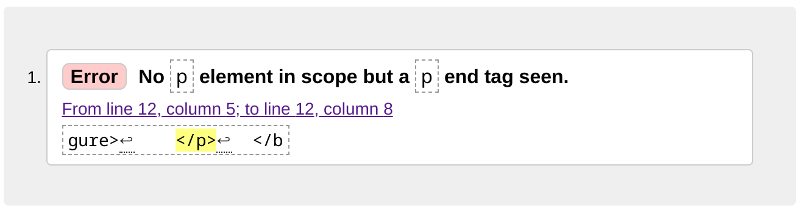
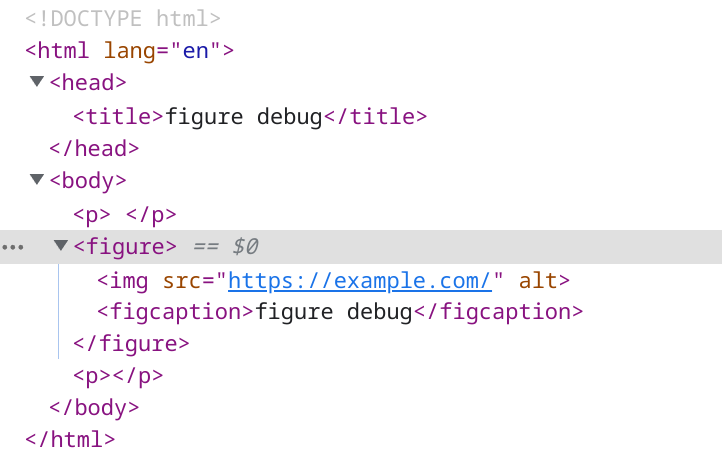

在制作 Hugo 主题的过程中，免不了要和 Markdown 打交道，尤其是希望在 Markdown 转 HTML 的过程中想要额外做点儿什么的时候。

比如常见的使用场景：

- 区分生成的链接是内部链接还是外部链接，如果是外部链接希望加上 `target=_blank` 的属性
- 给生成的子标题加上链接
- 处理图片（比如压缩，转格式之类）

Hugo 为了让用户方便的实现这个需求，提供了 Markdown Render Hooks。利用这个钩子就可以劫持 Markdown 生成 HTML 这一过程，目前支持 `image`、`link`、`heading` 和 `codeblock`。详细的信息请参考：[Markdown Render Hooks 官方文档](https://gohugo.io/templates/render-hooks/)

**本文并非是要讲如何使用这一功能，而是分享一个“滥用”这个功能产生的一个副作用。**

<!--more-->

## 问题点

话不多说直接上有问题的代码，像是这样的一个 Render Hook 一般位于 `layouts/_default/_markup/render-image.html`

```go-html-template
<figure>
  
  <figcaption>{{ .Title }}</figcaption>
</figure>
```

乍一看似乎毫无问题，就是让 Hugo 在渲染图片的时候不要把 `` 默认转成 HTML 的 `img` 元素，而转成 `figure`。这样显示图片的时候还能配上一段解说的文字，对用户较为友好。

不过其实问题不是出在这里，而在于尽管图片被转成了`figure`，它仍被包裹在一个 `p` 段落元素中。简单地说，<mark>figure 作为 p 的子元素就是问题。</mark>

## 代码复现

比如下面这段代码：

```html
<!DOCTYPE html>
<html lang="en">
  <head>
    <title>figure debug</title>
  </head>
  <body>
    <p>
      <figure>
        
        <figcaption>figure debug</figcaption>
      </figure>
    </p>
  </body>
</html>
```

其实是不符合规范的，我们可以复制到 [The W3C Markup Validation Service](https://validator.w3.org/) 里验证会得到下面的错误



如果我们新建一个 HTML 文档再用 Chrome 打开，用 DevTools 查看元素结构会得到一个奇怪的现象，`figure` 元素前后分别出现一个空的 `p` 元素。



## 查阅 MDN 文档

通过查阅文档得知，按照规范，`p` 元素允许的子元素要是 _[Phrasing Content](https://developer.mozilla.org/en-US/docs/Web/Guide/HTML/Content_categories#phrasing_content)_，而 `figure` 并不在其中。

同样的道理，我们也不能把 `div` 元素放到 `p` 元素下，因为 `div` 同样不是 Phrasing Content。

## 回避方法

得知了这个错误的原因后，基本上有这么两种方法回避的方法：

1. 老老实实在 Markdown 转 HTML 的过程中，碰到图片标记转成 `img` 而非 `figure`
2. 干脆不用 Markdown 来表现图片，而用 Hugo 自带的 shortcodes 功能

出于兼容性的考虑，我选择了第一种方法。并且通过一点儿 CSS 来实现了图片说明文字的展示。

## 最后

通过遭遇这次的问题，我发现 Nu HTML Checker 是个好东西，可以用来检查文档的 HTML 是否符合规范，为了更简单地一键检查，我在本站 footer 最后加上了一个小徽章，只要点一下就可以查看当前页面的检查报告了，是不是非常方便？顺便一提，这个徽章来自：[bradleytaunt/html5-valid-badge](https://github.com/bradleytaunt/html5-valid-badge)
