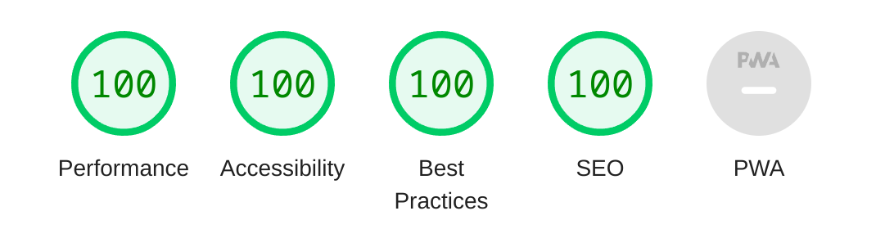

距离[上次动手写 Hugo 主题]()已经过去近 9 个月了。之间虽然也没有写多少文章，却又动起了折腾主题的念头。实际上比起上次的初次挑战写主题，这次是在原有的基础上做修改，显然省了不少力气，说是一次大扫除也不为过，于是我把标题美其名曰叫作「性能篇」

当然叫作「性能篇」也不是完全没有道理，正常来说作为本博客读者的你应该已经感到页面打开速度飞快才对，如果不是请务必给我留言。

这篇文章就主要来介绍我在上次博客主题的基础上做了哪些优化。想直接看代码的朋友请移步：



<!--more-->

## 结论

首先就结果而言的话，对于大部分页面（包括本文）无论是桌面端还是移动端的 Lighthouse 得分都获得了满分，虽然之前的版本也不是很低，不过全部 100 分看着还是挺舒服的。



## Classless CSS

这次博客主题更新的主要变化之一就是去掉了 Bootstrap 这一个 CSS 框架，当然我不是说它有什么不好，实际上上次尝试写主题多亏了它才能短平快地搓出一个像样的主题来。然而对于一个简单的博客来说多少有点儿杀鸡用牛刀的感觉。

不过要我从头开始写一套没有太多违和感的主题，哪怕就是一个简单的博客，对于现在的我来说难度也颇高。于是有一类叫作 Classless 的 CSS 样式很好地填补了这块空白，既不会像成熟的 CSS 框架动辄上百 KB，也不至于需要从头开始写样式。

正如名字所暗示的样子就是不需要在 HTML 的标签中插入任何 class，这一特性与我这个主要就是通过 Markdown 转换成 HTML 的静态博客非常契合（想想用 Bootstrap 的时候我为了给由 Markdown 渲染出的 table 标签加上相应的类名做了[多大的努力](https://github.com/masakichi/futu/blob/v1.0.0/layouts/shortcodes/table.html)），甚至不难想象哪天要是想换换主题风格只需要简单地替换到唯一的 CSS 文件即可。

如果你对 Classless CSS 感兴趣，可以看看下面我收集的一些：

- [igoradamenko/awsm.css: Simple CSS library for semantic HTML markup](https://github.com/igoradamenko/awsm.css)
- [kognise/water.css: A drop-in collection of CSS styles to make simple websites just a little nicer](https://github.com/kognise/water.css)
- [yegor256/tacit: CSS framework for dummies, without a single CSS class](https://github.com/yegor256/tacit)
- [jenil/chota: A micro (3kb) CSS framework](https://github.com/jenil/chota)
- [kevquirk/simple.css: Classless CSS template that allows you to make a good looking website really quickly.](https://github.com/kevquirk/simple.css)
- [alvaromontoro/almond.css: Collection of CSS styles to make simple websites look nicer](https://github.com/alvaromontoro/almond.css)

也许你已经发现，我目前的博客主题就是基于 awsm.css，当然 water.css 我个人也很中意。

## 语义化 HTML

基本上由于使用了 Classless CSS，语义化的 HTML 结构也是自然而然的事了，尤其是对于博客而言，也正是这个原因，对比上一个版本的主题，如果说 Classless CSS 让我可以删除所有的 HTML 里的类名，那语义化的 HTML 标签让我可以删掉许多单纯为了布局而写的 div。于是大概 20 行 Hugo 模板代码就可以构成整个博客的骨架 `layouts/_default/baseof.html`：

```go-html-template
<!DOCTYPE html>
<html lang="{{ .Site.LanguageCode }}">
  <head>
    <title>
      {{ block "title" . }}
        {{ if .IsHome }}{{ else }}{{ if .Title }}{{ .Title }} | {{ end }}{{ end }}{{ site.Title }}
      {{ end }}
    </title>
    {{- partial "head.html" . -}}
  </head>
  <body>
    <header>{{- partial "header.html" . -}}</header>
    <main>
      {{- block "main" . }}
      {{- end }}
    </main>
    <footer>{{- partial "footer.html" . -}}</footer>
    {{- partial "script.html" . -}}
  </body>
</html>
```

而正文的模板 `layouts/_default/single.html` 也非常简单：

```go-html-template
{{ define "main" -}}
  <article>
    <header>
      <h1>{{ .Title }}</h1>
      {{- partial "meta.html" . -}}
    </header>
    {{ if (.Params.toc | default (.Site.Params.toc | default false )) }}
      {{ with .TableOfContents }}
        {{ if ne . "<nav id=\"TableOfContents\"></nav>" }}
          <aside>
            <header>
              <h2>{{ i18n "TOC" }}</h2>
            </header>
            {{ . }}
          </aside>
        {{ end }}
      {{ end }}
    {{ end }}
    {{ .Content }}
    {{- partial "disqus.html" . -}}
  </article>
{{- end }}
```

## Hugo Pipes

基本上做完上面两步，页面冗余的代码基本已经被干掉七七八八了，不过加上 Hugo Pipes 的使用可以让性能得到进一步的提升。简单来说就是通过 Hugo 内置的这一功能可以实现对前端文件更细致的处理、控制。

之前我习惯把所有的静态文件放到 `static` 目录，Hugo 就会一五一十地把这些文件复制到网站的根目录下，相应地在 HTML 里引用它们即可，而这次呢，我基本把 `CSS`，`SCSS`，`JavaScript` 这类文件放到了 `assets` 目录下，与 `static` 不同，借助 Hugo Pipes 我们可以把 `SCSS` 文件转译成 `CSS` 文件，再与其他 `CSS` 文件组合，之后再一起压缩处理最后生成一个 bundle 化的 `styles.min.$sha256.css`，这样一来用户就只要下载一个文件即可，这通常认为比分开下载多个较小的文件要高效。这一流水线的操作就被称为 Hugo Pipes，下面是摘至我博客模板 `layouts/partials/head.html` 中的片段：

```go-html-template
{{ $awsmCss := resources.Get "scss/awsm.scss" | resources.ToCSS }}
{{ $syntaxCss := resources.Get "css/syntax.css" }}
{{ $miscCss := resources.Get "css/misc.css" }}
{{ $styles := slice $awsmCss $syntaxCss $miscCss | resources.Concat "styles.css" | minify | fingerprint }}
<link rel="stylesheet" href="{{ $styles.RelPermalink }}" />
```

## 图片处理

对于我个人博客来说，内容方面能够极大提升性能的部分当属减少图片体积了，当然一张一张专门去转换格式压缩不仅繁琐，而且极大地伤害写作的积极性，那有没有直接写 Markdown 然后 Hugo 就直接能把图片处理好呢？答案是肯定的。虽然我在网上没有搜到现成的答案，不过靠着组合 [Markdown Render Hooks](https://gohugo.io/templates/render-hooks/) 和 [Image Processing](https://gohugo.io/content-management/image-processing/) 两章的内容，自己实现了这一功能，可以自动把图片转换成 WebP 格式，大体的思路如下：

```go-html-template
{{ $image := .Page.Resources.GetMatch .Destination }}
{{ $image := $image.Resize (print $image.Width "x" $image.Height " webp") }}

```

至于图片的质量，可以在 `config.toml` 设置，详见 [Hugo 官网文档](https://gohugo.io/content-management/image-processing/#processing-options)。

```toml
[imaging]
  quality = 75
```

另外有一点需要注意的是如果原图是 GIF，转成 WebP 之后动画会失效，所以我[加了一个判断](https://github.com/masakichi/futu/commit/376802df052bb7c83b216734079ce6dd872e8804)，如果是动图的话就不转换直接用原图了。

## Disqus & Google Analytics

虽然已经做出上面种种努力，最后，还有两个拖累性能的大户。Disqus 评论系统和 Google Analytics，对于后者我直接关闭了，本来也没啥用，另一方面基本的统计功能 [Cloudflare Pages](https://pages.cloudflare.com/) 已经内置了。对于 Disqus 而言我还没找到任何能和它功能、体验相似还免费的替代品，能做的就是给它加了个按需加载的功能，有兴趣的朋友可以参考：[Lazy-Loading Disqus Comments | CSS-Tricks - CSS-Tricks](https://css-tricks.com/lazy-loading-disqus-comments/)

## 感想

通过这一整套下来，自我感觉还是非常不错的，以后想要增改功能也不会太难，整个主题基本只提供一个骨架的功能，甚至用户可以在自己博客目录下的 `assets` 里覆盖内置的主题。当然由于历史原因，目前代码里还留有一点（不多，大概一两个 shortcodes 相关文件）和我博客已有文章相关的遗留代码，之后再一并做清理。

最后介绍一下启发我对博客做性能提升以及撰写本文的来源 [512KB Club](https://512kb.club/)，等过段时间也许会试着申请加入它的列表。
