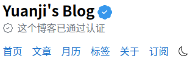

自从上次之后，总想着既然有了新的头像就得用起来，这不陆陆续续把一些账号的头像都换了个遍。

这还不够，这周又花了点时间给博客的头部和分享图前也加上这个新头像。

<!--more-->

## 在博客头部显示头像

新旧博客头部的对比如上，如果你也是 Google One 会员的话，你可能留意到我偷了下会员专享的那个彩色圈圈，套在了博客头部的头像上。

## 在博客分享图显示头像

分享图的话除了加上了头像，也趁机改了改之前旧的域名，也换上了一个较为圆润的字体叫做[源泉圓體](https://github.com/ButTaiwan/gensen-font)

## 检测 HTML 是否合理的动态徽章

因为期间修改了博客的一些 HTML 结构，一般新的改动上线后我会手动检测一下新的 HTML 是否合理，结果还真出了一些问题，现在已经修复。

之前在页面最下方有一个静态图标，点击这个图标就可以一键打开检测网站直接查看检测结果，这次更进一步通过利用 [Shields.io](https://shields.io/) 可以在图标上动态显示检验结果，像是这样：，如果 HTML 有问题这个图标会自动显示错误数量。
