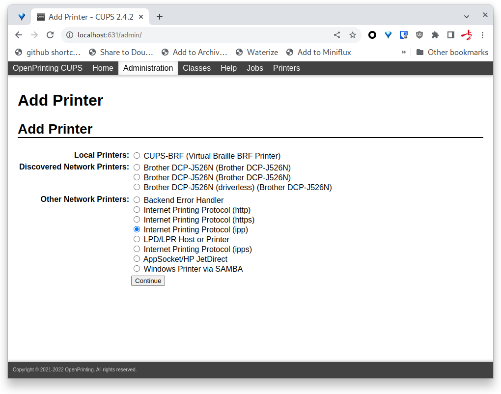
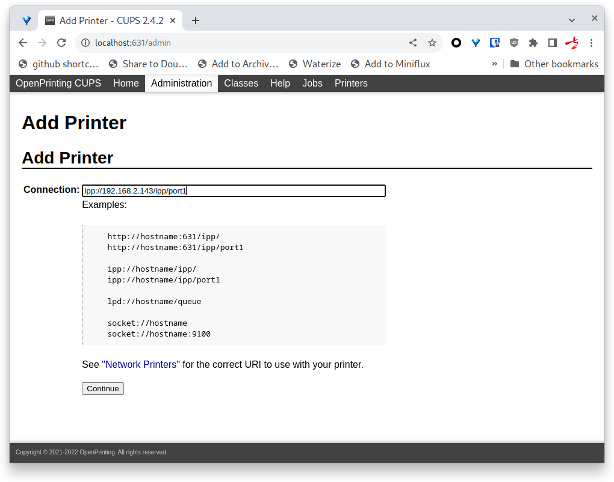
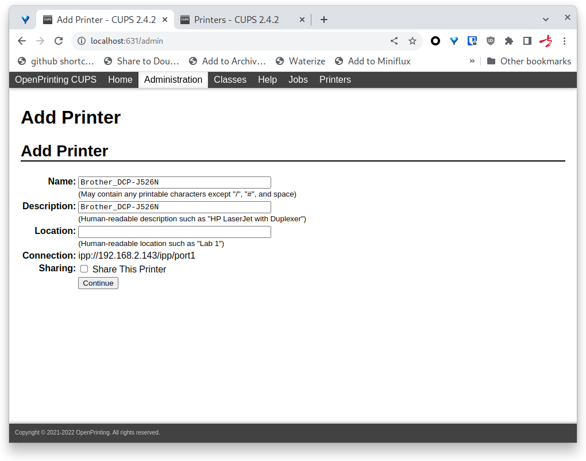
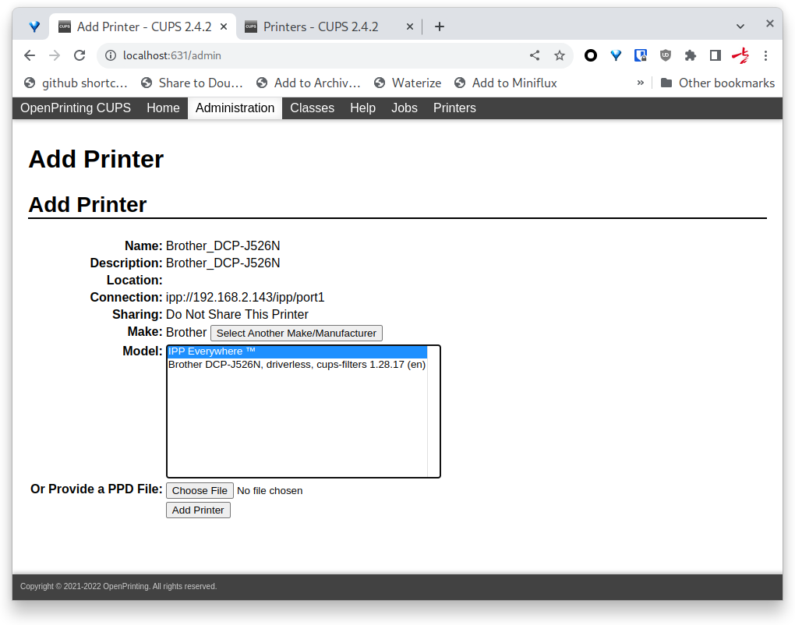
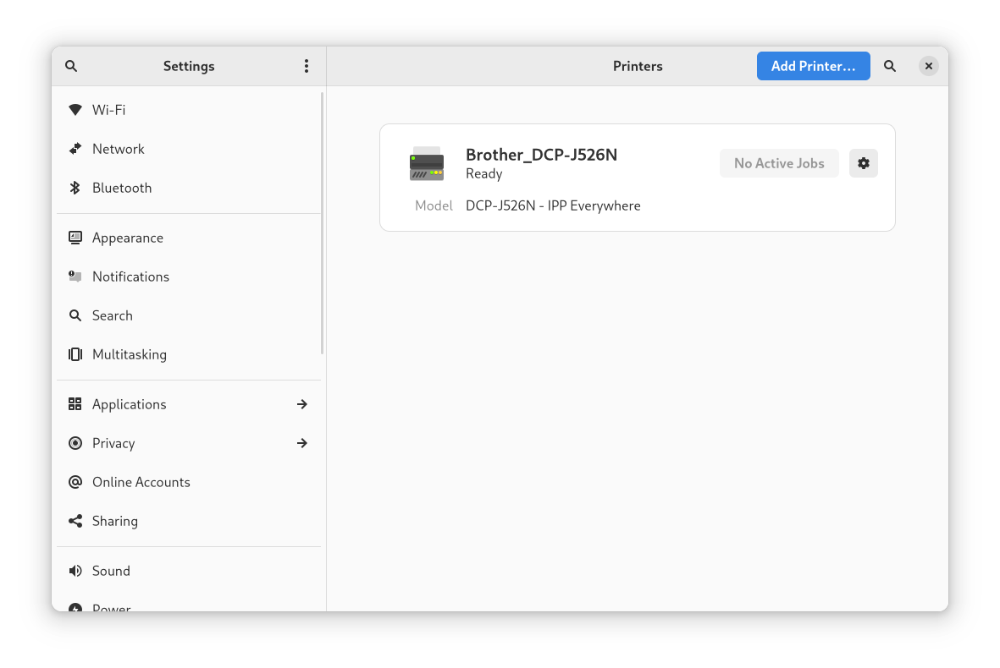
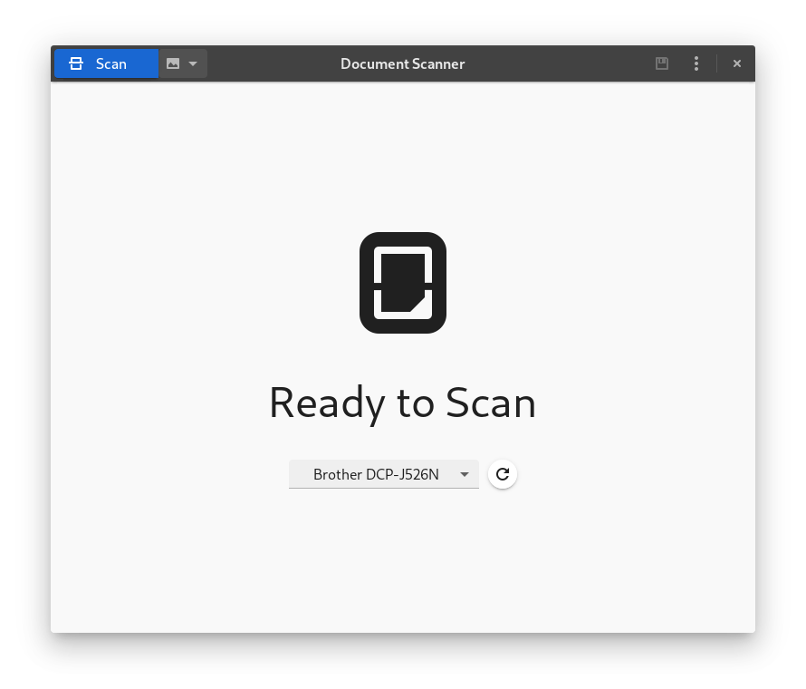

去年十二月趁着年末的打折，正好妻子需要一台打印机，我想要一台扫描仪。于是我们一拍即合下单了一台兄弟（Brother）牌带扫描的打印机，型号是 [Brother DCP-J526N](https://www.brother.co.jp/product/printer/inkjet/dcpj526n/index.aspx)。当时花了不到 16000 日元，约合人民币 800 元。

感叹于现在的打印机比小时候使用起来可方便多了，在手机上装个 App，打印机本体连上家里的 Wi-Fi 都不用任何其他设置就可以愉快地工作了。

不过这周末闲来无事，研究了一下怎么在 Arch Linux 上使用，虽然走了点儿弯路，但结果上无论是打印还是扫描都可以完美运行了。

<!--more-->

## 打印

### 安装

首先参考 [CUPS - ArchWiki](https://wiki.archlinux.org/title/CUPS) 安装必要的软件 cups，并启动相应的服务。

```bash
sudo pacman -S cups
sudo systemctl enable --now cups
```

### 配置

访问 [http://localhost:631/](http://localhost:631/) 添加打印机即可。但我卡在这一步很久，虽然 CUPS 可以自动发现机器但是不知道为什么添加完打印机就是无法成功打印，由于官方并没有提供给 Arch Linux 的驱动安装包，不过也有 deb 和 rpm 包，我通过解压出里面的驱动程序，照道理应该可以使用才对，但就是不如愿，最后想要放弃的时候，通过手动配置 ipp 地址竟然成功添加并打印成功了，下面附上详细的步骤，以供后人参考。











## 扫描

相比打印，扫描就来得简单多了。参考 [SANE - ArchWiki](https://wiki.archlinux.org/title/SANE) 只需要安装几个软件即可，GNOME 桌面甚至提供了一个非常简洁美观的 GUI 界面方便使用。

### 安装

```bash
sudo pacman -S sane sane-airscan simple-scan
```

### GUI 程序

打开 Document Scanner（simple-scan），稍等片刻扫描仪设备便会出现，然后就可以扫描了。

另外通过比较，一般来说文字扫描有个 300 dpi，图片扫描最多 600 dpi 已经非常好了。往上除了徒增文件尺寸外似乎并没有太大用处。



## 最后

一直以为 Brother 是美国牌子，这次上它的官网找驱动才发现它是个土生土长的日本牌子。
