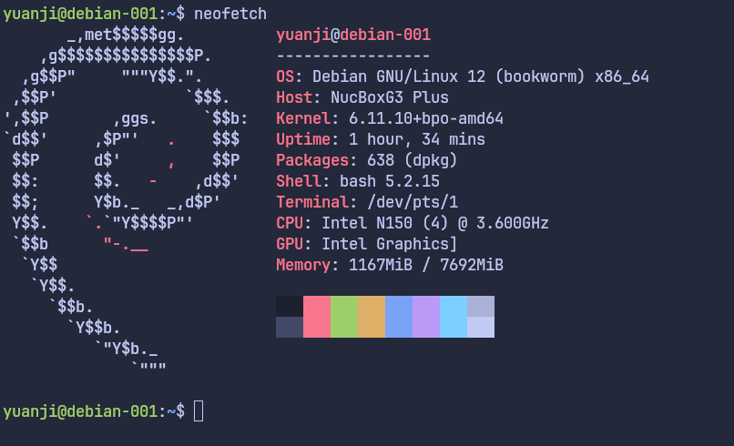

今年 10 月初购买了一个 GMKtec（极摩客）NucBox M5 Plus 的迷你主机，搭载 AMD Ryzen 7 5825U 这颗 8 核 16 线程的 CPU 用来安装 Proxmox VE 正合适，作为家用的小号服务器，感觉运行稳定体验不错。Proxmox VE 本体使用的 Debian 操作系统，感觉个把月小小地升级维护一下基本丢在角落就不用管也印象不错。

这次因为想把卧室里的电视信号使用起来（可以不用网络直接收看、录制日本这里的电视节目）本来准备直接运行相应的软件在之前的主机上，可惜现在放主机的客厅里没有电视信号，而有电视信号的卧室又没有有线网（这对于 PVE 来说比较不利）于是就又买了一台最近新出的 GMKtec NucBox G3 Plus 用来担任这个任务。

<!--more-->

## 购买途径和基本配置

因为在日本这里上市的版本没有准系统的，都是带上内存和硬盘的。而我手头又有两张 8G 的内存和一个闲置的硬盘，于是上京东看了下准系统，只需要 RMB 560 元，加上 45 的运费，差不多就 600 左右。下单一周寄到了日本。

因为并不需要它跑什么繁重的任务，Intel N150 的 CPU 以及自带的核显完全够用。不过需要注意的是内存槽只有一个，本来想着能把两张闲置的内存条都用上，结果只用上一张，不过也绰绰有余了。



接口方面有 4 个 USB 3.0 接口，2 个 HDMI 接口，一个 2.5G LAN 口，以及内置 Realtek 8852BE 的无线网卡。详细的参数可以参考[极摩客官方网站](https://www.gmktec.cn/product/4414/)

## 运行 Debian 12 Bookworm

考虑到家里的设备，包括之前那台主机上的虚拟机渐渐多了起来，就想找个相对不怎么变化可以不经常升级的操作系统。思来想去就决定使用 Debian 最新的 stable 版本。不过因为之前没怎么用过 Debian，这次安装和配置还是遇到一些麻烦，好在都一一解决了，这里稍作记录，希望帮到同样需要的人。

下载安装镜像和安装过程非常简单这里不再赘述，安装的时候因为我的卧室没有有线网，我就用手机的 USB 热点联网安装的，想着安装个 NetworkManager 应该就能通过无线网卡联网了吧，结果安装好之后发现无线网卡完全识别不了，驱动也不支持。调查发现，因为机器硬件较新，当时 Debian 12 发版时候的 Linux 内核版本 6.1 还不支持这个迷你主机自带的网卡型号 `Network controller: Realtek Semiconductor Co., Ltd. RTL8852BE PCIe 802.11ax Wireless Network Controller`，基本上有两种方法，要么 自己下载模块重新编译内核，或者使用 6.2 之后的内核版本，因为 Realtek RTL8852BE 在这个版本正式得到支持，于是问题就变成了在 Debian 上如何使用较新的 Linux 内核。

### 使用 Bookworm Backports 仓库

为了稳定，Debian Stable 默认的软件会较为陈旧。有时候为了能用上较新的软件就需要另外想办法。其中看起来较为普遍的做法是使用 [Backports](https://wiki.debian.org/Backports) 仓库，启用的方法很简单，只要在 `/etc/apt/sources.list` 文件里加上下面两行即可：

```
deb http://deb.debian.org/debian/ bookworm-backports main non-free-firmware
deb-src http://deb.debian.org/debian/ bookworm-backports main non-free-firmware
```

加上后完整的内容如下：

```
deb http://deb.debian.org/debian/ bookworm main non-free-firmware
deb-src http://deb.debian.org/debian/ bookworm main non-free-firmware

deb http://security.debian.org/debian-security bookworm-security main non-free-firmware
deb-src http://security.debian.org/debian-security bookworm-security main non-free-firmware

deb http://deb.debian.org/debian/ bookworm-updates main non-free-firmware
deb-src http://deb.debian.org/debian/ bookworm-updates main non-free-firmware

deb http://deb.debian.org/debian/ bookworm-backports main non-free-firmware
deb-src http://deb.debian.org/debian/ bookworm-backports main non-free-firmware
```

### 安装 Backports 里最新的 Linux 内核

之后使用如下命令安装 Backports 里最新的内核即可（以下命令如不特意说明使用 root 权限执行）

```bash
apt update
apt install -t bookworm-backports linux-image-amd64
```

### 安装 firmware

虽然最新的内核可以支持无线网卡，但是要让它正常工作还需要下载对应的固件（firmware）才行。好在 Debian 提供了相应的包，不过需要注意的是也要下载 Backports 仓库里的版本，因为 Stable 默认的仓库里也有同名的包，所以安装的时候需要明确指定 `-t bookworm-backports`

```
apt install -t bookworm-backports firmware-realtek
```

到这里应该就安装好了网卡对应的固件了，可以查看下是否存在 `/lib/firmware/rtw89/rtw8852b_fw-1.bin` 这个文件，然后重启应该就能正常使用无线网了。

### 启用 Wi-Fi 联网

这里我使用 NetworkManager 来连接无线网，主要使用 `nmcli` 这个命令行工具。

```bash
apt install network-manager # 安装 NetworkManager
nmcli radio wifi on # 开启 Wi-Fi
nmcli dev wifi # 显示可以连接的 SSID 一览
nmcli dev wifi connect <SSID> --ask # 连接想要的无线网，会提示输入密码
```

不出意外，这样之后就可以正常访问网络了。

### 安装其他 firmware

基本上我只是把这个迷你主机当作一个小型服务器来用，除了联网之外并没有感觉有其他问题，不过还是通过 `dmesg | grep firmware` 查看了下是否有其他固件文件缺失，还真发现了一些。与这个主机相关的主要似乎是显卡的部分，安装 `firmware-intel-graphics` 这个包即可。

```bash
apt install -t bookworm-backports firmware-intel-graphics
```

至于其他的，比如一些 USB 外设之类的，各位可以自行查看，这里分享一个小技巧，就是可以通过 `apt-file` 这个命令查看哪个包提供某个文件。首先安装 `apt-file` 并更新数据库。

```bash
apt install apt-file
apt-file update
```

然后我们以上面的网卡为例，`dmesg` 里报错说找不到 `rtw8852b_fw-1` 这个文件，我们可以通过 `apt-file search rtw8852b_fw-1` 这个命令查找，应该会得到如下结果：

```
firmware-realtek: /lib/firmware/rtw89/rtw8852b_fw-1.bin
```

这样，我们就可以知道 `firmware-realtek` 这个包提供这个固件文件了，以此类推基本可以解决大部分因为固件产生的问题。

## 总结

总得来说因为这个 GMKtec NucBox G3 Plus 的迷你主机的硬件本身比较新，在 Debian 12 发布时的 Linux 内核还不完全支持网卡等一些设备，需要更新内核以及安装相应的固件包来解决问题。如果你使用 Arch Linux 或是 testing/unstable 的 Debian 估计这不会是一个问题。

另外借此机会也大致了解了下 Debian 的包管理以及发版的策略等。比起 Arch，似乎 Debian 的世界里更注意软件是否是自由的，对于 firmware 一类的包分的比较细，Arch 里可能安装一个 [linux-firmware](https://archlinux.org/packages/core/any/linux-firmware/) 就可以一把梭的状况，Debian 下需要自己挨个摸索着安装？此外，Debian 里似乎安装某个包会更积极地被推荐着安装一些其他的包，并且如果某个包带有 systemd 的服务，默认会自动启动。嘛，我个人倒是对这种 Omakase 的文化不抵触。

以上就是在 GMKtec NucBox M5 Plus 上运行 Debian 12 Bookworm 的经过了，更新了内核和装上相应的固件后似乎就没什么需要额外操心的地方了，现在它已经在我卧室的角落默默录制电视节目去了。
