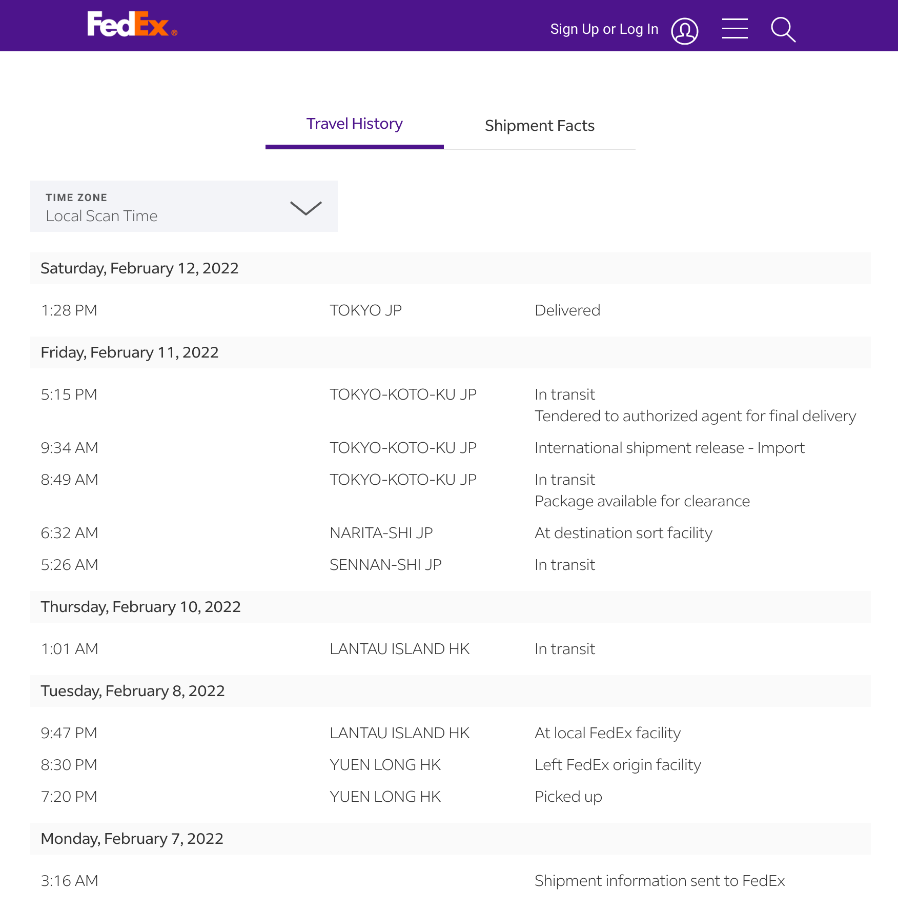
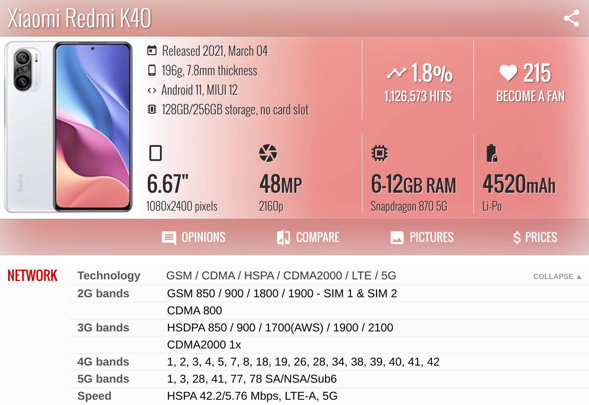
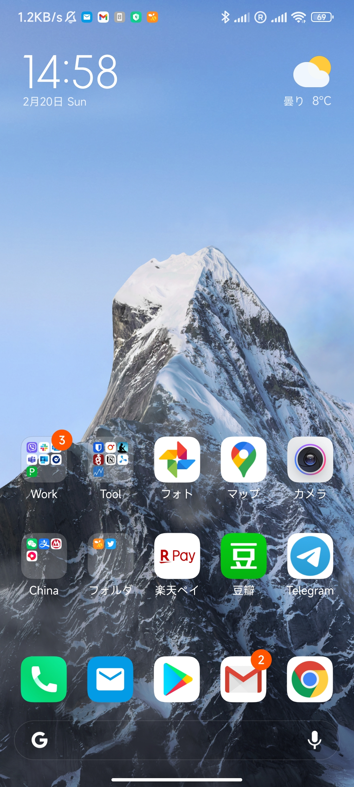

最近托妻子的福，收获了一台红米 K40 手机作为新年礼物，这里就记录一下从买手机到投入使用的过程。同样在日本/海外的朋友也许可以参考一下。

<!--more-->

## 反向海淘

这台手机是在 1 月 31 日晚（除夕夜）京东上下的单，2 月 12 日下午拿到手机，除去中国过年假期的话，实际上快递还是非常快的。至于有没有税的问题，目前我还没有收到税单，可以再观察看看。

详细的追踪可以参考下面的截图。

## Redmi K40

话说为什么选择 Redmi K40（也叫 Xiaomi Mi 11X 或是 Xiaomi Poco F3 都是一个手机的不同叫法） 呢？主要原因有以下几点：

- 从我的购买时机看，性价比非常高，两千人民币出头可以买到顶配（因为它的后继机型 K50 马上要发布）
- 社区非常活跃，无论是 [Xiaomi.eu](https://xiaomi.eu/community/threads/miui-13-stable-release.64441/) 还是 [XDA](https://forum.xda-developers.com/f/xiaomi-poco-f3-xiaomi-mi-11x-redmi-k40.12161/) 上都有不错的反响，[LineageOS](https://download.lineageos.org/alioth) 也有官方支持
- 可以解决我现有手机的不足，Sony Xperia XZ2 Compact 的电池和性能已显疲态，Redmi K30 5G 对我使用的运营商的无线频段支持不是很好。

所以赶上打折，以及妻子之前也有从国内电商购物到日本的经验，就果断下单了。

## 注意点

如果你也想从国内买手机，或者干脆也想买我这一台，有一些注意点最好事先了解。

### 通信频段

首先作为一台移动通讯的工具，如果不能上网想必是一件伤脑筋的事情。尽管一般来说最近一两年的手机应对老牌的运营商应该问题不大，考虑到我目前的手机运营商是日本的楽天モバイル（乐天 Mobile），还是有必要做点儿事先的调查，不过 K40 对乐天以及其他友商的支持都不错，这也是我更换现有 K30 的一个原因。

具体的可以参考一些手机配置网站上的信息，比如 https://www.gsmarena.com/xiaomi_redmi_k40-10728.php

### 解锁 bootloader

如果这个 K40 不能解锁 BL 的话，哪怕它硬件配置再高，基本上我也不推荐在海外的朋友购买使用，因为没有 Google 的服务，方方面面都会变得很麻烦，好在它可以解锁，只是需要等待 168 个小时，也就是一周时间，期间需要插入 SIM 卡以及登录小米的帐号，之后用官方的解锁工具就可以了。

第一时间解锁之后，我就刷入了 MIUI 欧版的 ROM，好处是没有广告，自带 Google 服务，尽管日文系统的翻译还不尽人意，但是日常使用应该没有太大问题，想尝试其他 ROM 的话可以去 [XDA 论坛](https://forum.xda-developers.com/f/xiaomi-poco-f3-xiaomi-mi-11x-redmi-k40.12161/) 转转。

### VoLTE

昨天弄完各种配置，才发现手机用自带的拨号软件无法顺利拨出电话（尽管用 Rakuten Link 可以免费打电话），查了好久才了解到小米默认把 VoLTE 给禁用了，而打开的方式是在自带的拨号软件下，输入 `*＃*＃86583＃*＃*` 后就自动打开了，然后就可以自动拨号了。

### 其他

目前为止我还是非常满意这台手机的，虽然网络上有人抱怨为了节约成本相机的配置较为低下，不过在我看来还是不错的。可能硬件不够软件来凑吧，另外一个不知是否是因为在日本的缘故，似乎拍照的快门声音是无法关闭的。

以上就是最近购买和使用 Redmi K40 的经过啦，附一张新手机桌面的截图，我常用的软件大概就是桌面上的这几个了，只要它们不出问题，想必用上几年问题不大。

