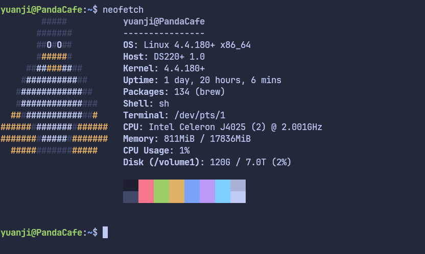

最近趁着打折加上一些返点，家里买了一台群晖的 DS220+，加上一块 8T 的硬盘和 16G 的内存，预算控制在了 5.5 万日元左右。

购物清单如下：

- [Synology DiskStation DS220+](https://kakaku.com/item/K0001257428/)
- [SEAGATE ST8000DM004 [8TB SATA600 5400]](https://kakaku.com/item/K0001026180/)
- [CFD Selection D4N2666CM-16GR [SODIMM DDR4 PC4-21300 16GB]](https://kakaku.com/item/K0001324104/)

<!--more-->

## 用途

主要想用来存储照片，下载的文件，以及方便家里共享文件等。

虽然是 3 年前的产品但感觉价格合适，性能足够，另外比起新出的 ARM 架构的新款，我还是比较喜欢 x86_64 的机器，感觉软件生态会更丰富一些。

目前只用了一个盘位，之后可能会在合适的时候再入手一块。

## 软件

第一次体验群晖的系统，感觉易用性还是相当不错的，跟用智能机差不错。自带的软件商城也集成了不少软件。

但是对于一些我日常用的命令行软件，感觉就不是这么方便了。我最迫切想使用的软件目前有：

- [rclone](https://github.com/rclone/rclone)
- [yt-dlp](https://github.com/yt-dlp/yt-dlp)

虽说也可以手动安装它们，但之后升级维护它们恐怕不方便，于是我就参考之前折腾 Chromebook 的经验，看看是不是能用上个包管理软件。

要是可以我当然还是希望可以用上 Arch 的 pacman，但估计不使用 Docker 或者 VM 怕是有难度，但为了个把软件又感觉太折腾了。

## Homebrew

于是退而求其次，找到了 [Homebrew](https://brew.sh)。可能 macOS 用户用 Homebrew 比较多，但是对于一些不是很主流的 Linux 系统，Homebrew 我个人感觉也是个不错的选择，软件也都很新，还不用自己编译。安装方法和 macOS 没有什么不同，只是对于群晖的系统，安装 Homebrew 前需要稍加改动而已，理论上应该对系统本身不会有任何破坏。

过程主要参考了 [Installing Homebrew on DSM: done! | Synology Community](https://community.synology.com/enu/forum/1/post/153781) 这个帖子，这里做下总结。

主要的改动实际上也就两点：

1. Homebrew 的安装脚本有一行会执行 `ldd --version` 然而群晖的系统没有 `ldd` 这个命令
2. Homebrew on Linux 建议最好安装在 `/home/linuxbrew/.linuxbrew` 下，然而群晖系统的用户目录在 `/volume1/homes` 下

对于 1，我们可以手动创建一个 `/usr/bin/ldd` 内容如下：

```bash
#!/bin/bash
[[ $(/usr/lib/libc.so.6) =~ version\ ([0-9]\.[0-9]+) ]] && echo "ldd ${BASH_REMATCH[1]}"
```

然后给执行权限：`chmod 755 /usr/bin/ldd` 即可。这一步仅仅用来让 Homebrew 的安装脚本获知 glibc 的版本而已，甚至可以直接 `echo "ldd 2.26"` 这样硬编码。

对于 2，可以使用如下命令

```bash
sudo mkdir /home
sudo mount -o bind "/volume1/homes" /home
```

这样就可以向通常的 Linux 系统一样访问 `/home` 了，这里推荐让群晖的系统开机启动是执行一下这个挂载命令。在 _任务计划_ => _新增_ => _触发的任务_ 添加以 `root` 用户执行的脚本，如下：

```bash
#!/bin/sh
sleep 10
mount -o bind "/volume1/homes" /home
```

## 总结

在这两步额外操作下，再安装 Homebrew 就没有问题了，我安装的 `rclone` 和 `yt-dlp` 也完美运行，理论上应该适用于任何 x86_64 型号的 DSM 7.x 的系统。


