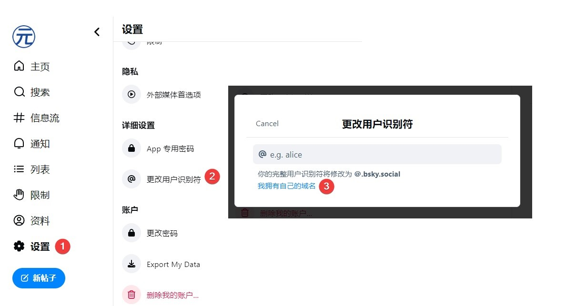
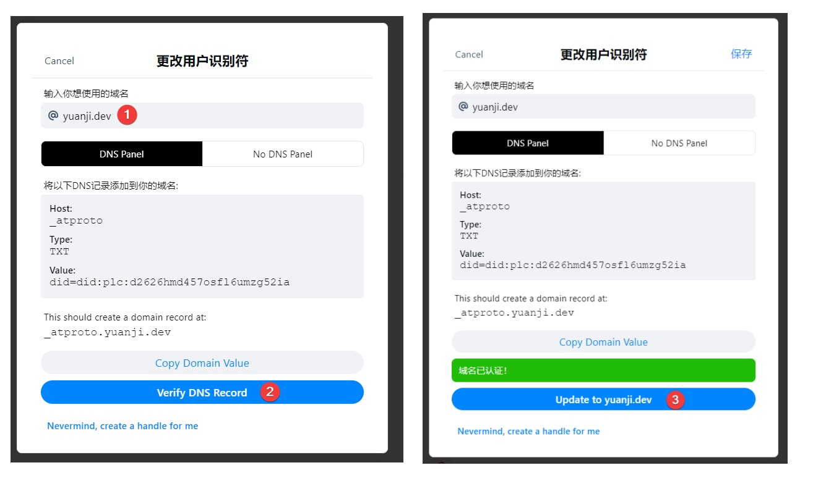

在上一篇里提到一句可以用自己的域名作为 Bluesky 上的用户识别符（英文、日文叫 Handle，其实简单来说就是用户名）。

这似乎并非什么新的功能，看文档早在去年 4 月就有[官方教程](https://bsky.social/about/blog/4-28-2023-domain-handle-tutorial)出现了，无非是通过设置 DNS 记录，或者在 `/.well-known/atproto-did` 里写入自己的用户 id。

昨天看 Bluesky 官方账号发文可以[将自己的域名直接跳转到自己的 Bluesky 主页](https://bsky.app/profile/bsky.app/post/3klko6estz62t)，似乎还是实验性功能还没有写到文档里，感觉目前 Bluesky 的中文资料还很少，就简单写一篇文章介绍下如何用自己的域名当作用户识别符，并且让域名自动跳转到 Bluesky 主页。

**本文以我自己的域名 `yuanji.dev` 且仅以 DNS 设置为例，读者可以按需自己调整。**

<!--more-->

## 将域名作为用户识别符

把域名当成用户识别符就可以通过 https://bsky.app/profile/yuanji.dev 而不是 https://bsky.app/profile/yuanji.bsky.social 访问自己的主页，提到自己的时候，可以直接 `@yuanji.dev` 而不是 `@yuanji.bsky.social` 这个功能可以在 Bluesky 的客户端直接更改，按照如下顺序打开设置界面：



按照要求设置一条包含自己 did 信息的 TXT 记录即可。验证之前可以自己通过 `dig` 检查一下，比如我的记录如下：

```bash
❯ dig +short _atproto.yuanji.dev TXT
"did=did:plc:d2626hmd457osfl6umzg52ia"
```

确认没有问题后，点击验证，然后更新即可。



## 将域名跳转到 Bluesky 主页

尽管通过 https://bsky.app/profile/yuanji.dev 这样的地址访问自己的 Bluesky 主页很酷，但是能不能直接通过访问 https://yuanji.dev 一步到位呢？答案是肯定的。

之前我通过 Cloudflare 的 [Page Rules](https://developers.cloudflare.com/rules/page-rules/) 来实现跳转，现在 Bluesky 提供了一个官方的做法，可以往 DNS 记录里写一条 CNAME 记录 `redirect.bsky.app` 即可。

不过有一点需要注意，如果你绑定的域名是像 yuanji.dev 这样的根域名（root/apex domain）的话，理论上是不支持在根域名上设置 CNAME 记录的，不过我使用的 DNS 提供商 Cloudflare 使用了一种叫做 [CNAME flattening](https://developers.cloudflare.com/dns/cname-flattening/) 的技术可以让用户在根域名设置 CNAME 记录，实际上它会在背后转成 A 记录绕开这个限制。不过对于你我这样的用户而言并没有什么特别的体验上的区别。

如果读者的根域名已经用来作为个人网站，或者其他用途不便用来作为跳转到 Bluesky 主页。实际上设置二级域名也是可以的，比如我也设置了 bsky 和 bluesky 的二级域名用来跳转到我的主页。

```bash
❯ dig +short yuanji.dev A
140.82.2.153
❯ dig +short bsky.yuanji.dev CNAME
redirect.bsky.app.
❯ dig +short bluesky.yuanji.dev CNAME
redirect.bsky.app.
```

## 总结

感觉 Bluesky 在这些小众需求上显得挺人性化，毕竟 SNS 的一大乐趣就是彰显自己的个性，而域名作为一张互联网上的名片作为社交网络的 id 也很合适。另外，通过 DNS 记录，也一举两得地减轻了冒名顶替的问题？这一点我不禁想起了之前读到的 [Verified Personal Website - Jim Nielsen’s Blog](https://blog.jim-nielsen.com/2022/verified-personal-website/) 这篇文章。

总之通过这篇文章的内容，现在可以通过以下三个地址直接访问我的 Bluesky 主页了：

- https://yuanji.dev
- https://bsky.yuanji.dev
- https://bluesky.yuanji.dev
