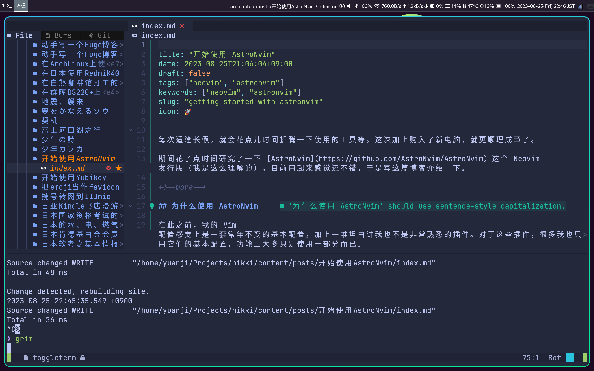

每次适逢长假，就会花点儿时间折腾一下使用的工具等。这次加上购入了新电脑，就更顺理成章了。

期间花了点时间研究了一下 [AstroNvim](https://github.com/AstroNvim/AstroNvim) 这个 Neovim 发行版（我是这么理解的），目前用起来感觉还不错，于是写这篇博客介绍一下。

<!--more-->

## 为什么使用 AstroNvim

在此之前，我的 Vim 配置感觉上是一套常年不变的基本配置，加上一堆坦白讲我也不是非常熟悉的插件。对于这些插件，很多我也只用它们的基本配置，功能上大多只是使用一部分而已。

如此配置好后，一段时间内基本也不太会有什么大问题，因为我平时也不怎么更新。但是一旦更新，多多少少又会出一些小毛病，然后就是定位到是哪个插件，然后去读它哪个变更导致了这些问题，再试图修复它们。等到哪天心血来潮再对插件们进行升级，可能又有其他的插件出现这样那样的问题，如此反复。

因为我并非是需要把编辑器打造成非常客制化的骨灰级玩家，只是大多时候使用基本配置的普通玩家而已。时不时去看每个插件的更新日志，多我来说也不太现实。于是，我想着能不能把这些因为插件更新造成的问题转嫁出去，尽可能保证编辑器本体稳定，又能享受这些零部件带来的更新呢？自然而然地，我上 GitHub 找了一些选项，除掉一些看起来太重量级的，我就从中挑了一个名字最顺眼的 AstroNvim。

## 开始上手

比起白手起家配置 Vim，换用一个发行版出奇的简单。根据[官网首页](https://astronvim.com/#%EF%B8%8F-installation)的几条命令，就可以启动一个拥有良好配置的 Neovim 了。

```bash
# 备份老的 Neovim 配置
mv ~/.config/nvim ~/.config/nvim.bak
mv ~/.local/share/nvim ~/.local/share/nvim.bak
mv ~/.local/state/nvim ~/.local/state/nvim.bak
mv ~/.cache/nvim ~/.cache/nvim.bak

# 安装 AstroNvim 本体
git clone --depth 1 https://github.com/AstroNvim/AstroNvim ~/.config/nvim
nvim
```

从这一点儿来说，对于一个 Vim 的老手来说，基本上开箱即用，然后可以之后慢慢配置。而对于 Vim 初学者来说，也不至于学习曲线太陡峭，又可以有足够的生产性。

## 简单配置

配置方面，比起直接对 Neovim 及自己安装的插件进行配置，转而对 AstroNvim 这个发行版进行配置显得容易很多，虽说自由度会有所下降，但是个人感觉更加有条理方便管理。以前那些直接从插件官网 copy & paste 默认配置，哪天突然用不了的窘境想必会相应减少，因为这部分就有发行版 AstroNvim 以及社区去解决了，我作为用户就主要时不时盯一下 AstroNvim 它的更新日志就好。

要配置 AstroNvim，或者说改变一些 AstroNvim 的默认行为，可以把配置文件放置于 `~/.config/nvim/lua/user` 或者 `~/.config/astronvim/lua/user`。我个人更倾向于使用后者完全独立的目录，我使用的 dotfiles 管理软件 chezmoi 也更容易管理。

另外，AstroNvim 官方为了降低配置的门槛，甚至专门有 [user_example](https://github.com/AstroNvim/user_example) 这么个 repo 作为配置文件的示例，我也就不另起炉灶，直接拿来用了。所有可配置的选项可以查看 [Available User Options](https://astronvim.com/Configuration/config_options) 这份文档。值得注意的是所有配置你可以选择放在单文件里，也可以分别放在不同的细分文件中。

如果你对我的配置文件感兴趣，可以查看[我的 dotfiles](https://github.com/masakichi/dotfiles/tree/main/home/dot_config/astronvim/lua/user)

## 社区支持

上面提到的配置主要针对 AstroNvim 本身行为的配置，除此之外另一大配置的对象就是插件（无论是 AstroNvim 本体自带的插件，还是用户自己选择安装的插件）。AstroNvim 用来管理插件的插件是 [lazy.nvim](https://github.com/folke/lazy.nvim)，借助它，管理插件变得简单又有条理。就像我上面说的像我这样的普通玩家很多插件直接用默认配置就好，AstroNvim 估计也考虑到了这一点，于是就有 [AstroNvim/astrocommunity](https://github.com/AstroNvim/astrocommunity) 这个仓库专门收集志愿者提供的插件配置文件。所以如果你有需要使用额外的什么插件不如看看是不是社区已经有人配置好了。对我而言，其实并不需要本体以外的太多插件，不过也为了尝个鲜，拿配色的插件 tokyonight-nvim 试了试。

```lua
-- ~/.config/astronvim/lua/user/plugins/community.lua
return {
  -- Add the community repository of plugin specifications
  "AstroNvim/astrocommunity",
  -- available plugins can be found at https://github.com/AstroNvim/astrocommunity
  { import = "astrocommunity.colorscheme.tokyonight-nvim" },
}
```

## 总结

目前我用下来差不多两周，感觉还不错。工作中写代码也好、私底下写这篇博客也好都是用 AstroNvim 完成的。总得来说有一种不再是自己缝缝补补支离破碎的 Vim 配置的安心感。现在时不时的就会试着更新看看，有一种当时开始使用 Arch Linux 的时候更新系统的感觉。因为尽可能多的使用了本体自带的配置，假如以后实在需要更换一个别的 Neovim 发行版，想必迁移起来也不会太麻烦。所以有相似处境感兴趣的朋友不妨也试一试。

{}

{}
