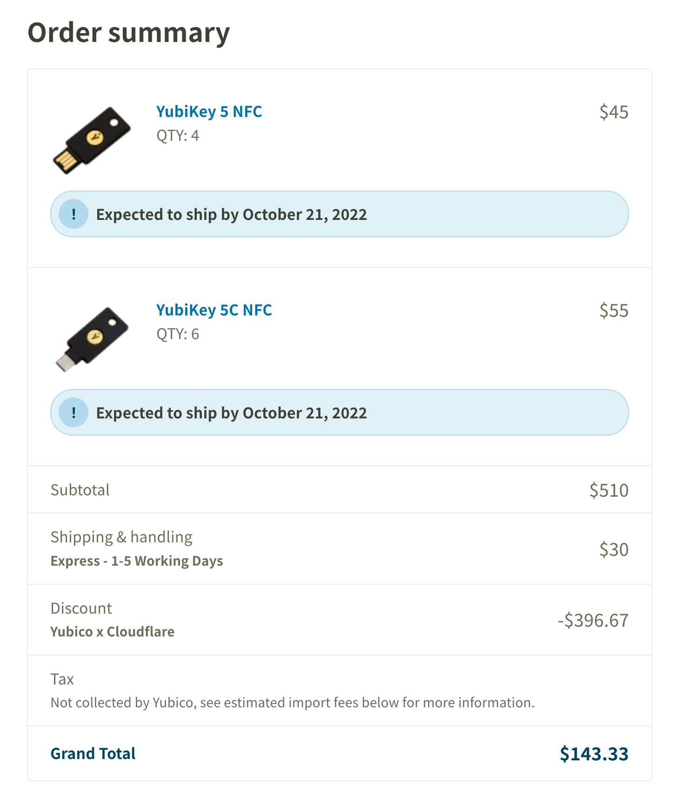
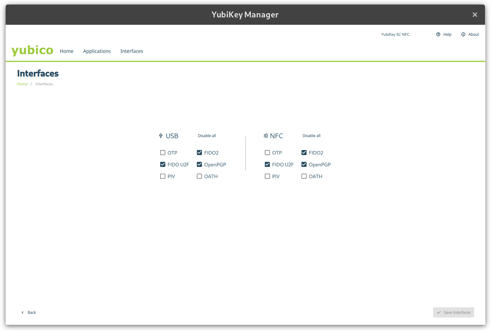
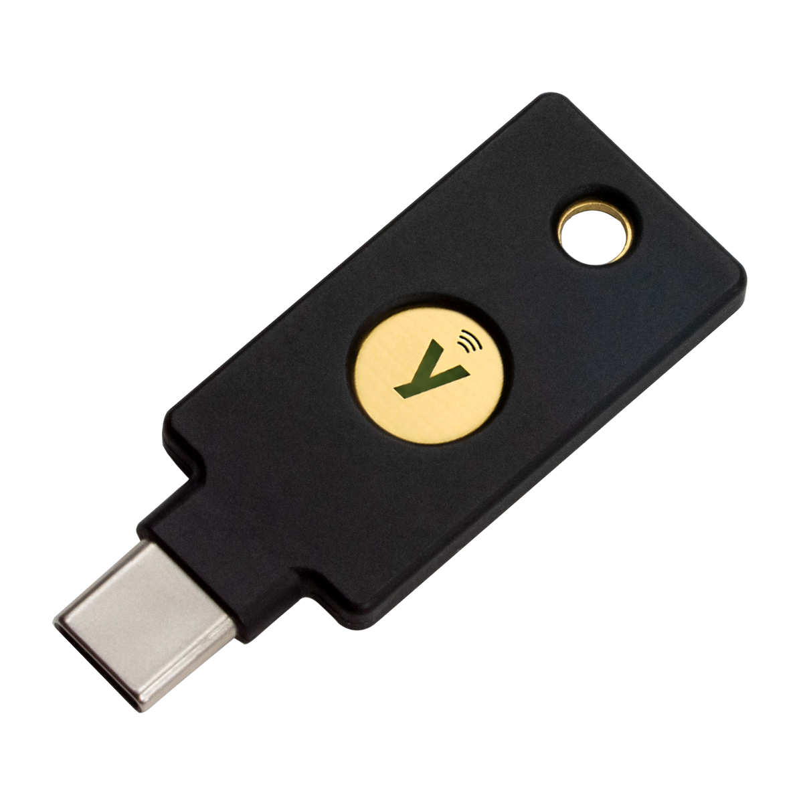

托 Cloudflare 的福，这周一的时候收到了 Yubico 从瑞典发来的 Yubikey，于是这一周的大部分业余时间都放在了折腾这些 Key 上了。

<!--more-->

## 购买

购买的契机是因为 Cloudflare 最近和 Yubico 合作推出了可以以非常便宜的价格买到 Yubikey 5C NFC 和 Yubikey 5 NFC 的活动（每个 $10），之前也一直想购买，但因为价格、转运等原因一直迟迟没有尝试，这次趁着人在国外利用这个机会一下子买了 10 个。



为了尽快拿到选了 UPS 的快递，果然非常快，我在 10/05 下单，显示 10/06 从瑞典发货，我在 10/09 一早就收到了（坐标东京）。

## 初体验

打开快递包装，里面意外地简洁，就是 10 个 Key 加上一张卡片，上面告诉我去 http://yubico.com/start 了解如何开始使用。因为这个 Key 其实像是一个缝合怪，整合了好几种非常不同但又有所联系的功能，再加上许多陌生而又熟悉的英文简称，搞得云里雾里，比如打开 Yubikey Manager 就可以看到诸如 OTP, FIDO U2F, FIDO2, OATH, OpenPGP, PIV...



感兴趣的朋友可以逐个去了解，我就不逐个展开了，本文想从用途着手介绍一下我目前了解到的和日常会使用的功能，这样多少会简单些。

## 代替键盘

一个非常令人迷惑的设计就是这个 OTP（one-time password）功能，默认情况下如果你触摸 Yubikey 上的金属片（对了我的这个 Yubikey 长下面那样），很可能你会注意到在你的输入框会输出一段奇怪的乱码，这其实是 Yubikey 的一个非常基础的功能，就是扮演一个键盘的角色，一下子输入一串字符，迷惑的点在于默认是输出 Yubico 自家的 OTP，然而我感觉它们自家的这个协议并没有啥太大的实际用途，而如果进入设置界面完全可以把这个默认功能设置成输出一段固定的密码（比如手动输入非常麻烦的复杂密码用于开机或者硬盘全盘加密等），或是输出经常用于二步验证的 TOTP（就是常见的六位数字验证码）。当然我其实并不需要这个功能，直接禁用了。



## 2FA（双重认证）

另外一个我目前用得比较多的就是双重验证（也叫双因子验证等），在没有 Yubikey 之前最多用的是基于时间的 TOTP，就是登录网站时除了要账号密码外，追加一步需要输入 6 位数字，现在可以用 Yubikey 作为验证了，简单来说之前需要输入 6 位数字多少有点儿麻烦，现在直接摸一下 Yubikey 的金属片就可以完成认证了，其使用的技术叫作 FIDO U2F。这里说明一下使用 Yubikey 你可以在任意支持的网站上绑定你的 Yubikey 不会占用任何 Key 上的存储空间，细节可以看：[Yubico’s Take on U2F Key Wrapping - Yubico](https://www.yubico.com/blog/yubicos-u2f-key-wrapping/)

总之我先后在下面这些网站启用了 Yubikey 作为 2FA。

- Bitwarden
- Cloudflare
- Google
- GitLab
- GitHub

## OpenPGP

这个功能也非常实用而且相对简单，在没有 Yubikey 之前，我使用 gpg 的方式基本上是把专门用于签名的 subkey 私钥导入到电脑，然后每次开机的时候输入密码之后就不管了，但是不管怎么说私钥本身是一直在电脑里躺着的，有了 Yubikey 之后呢，可以把原有的私钥存到 Yubikey 里，同样也是需要用到的时候摸一下金属片就行。把私钥存到 Yubikey 里也非常简单：

1. ` gpg --edit-key 1234ABC`
2. 选择想要导出到 Yubikey 的 Key，交互命令行中输入类似 `key 1`
3. 然后输入 `keytocard`
4. 最后 `quit` 即可

提示要保存的地方选择保存就大功告成了，有一点值得注意的是，之后本机的私钥就会没有了，需要自己注意备份。详细的步骤可以参考官方教程：[Using Your YubiKey with OpenPGP – Yubico](https://support.yubico.com/hc/en-us/articles/360013790259-Using-Your-YubiKey-with-OpenPGP)

转移到 Yubikey 之后，再在本机运行 `gpg --list-secret-keys` 会显示类似下面这样，注意 `ssb>` 就意味着私钥在实体的 Yubikey 上了。

```
/home/yuanji/.gnupg/pubring.kbx
-------------------------------
sec#  rsa4096 2018-06-20 [SC]
      1D5AB52A241CC492A724FE14E8D79E63E3D142F3
uid           [ultimate] Yuanji <self@gimo.me>
uid           [ultimate] Yuanji (Douban Inc.) <yuanji@douban.com>
ssb>  rsa4096 2018-06-20 [E]
ssb>  rsa4096 2018-12-04 [S]
```

## SSH

最后一个也是日常使用最多的功能，非 SSH 莫属，不仅登录服务器需要它，Push 代码也用它，我还有一个特别的需求，就是我加密了 VPS 的 root 分区，每次启动我需要[透过 SSH 来输入 LUKS 的密码](<https://wiki.archlinux.org/title/Dm-crypt/Specialties#Remote_unlocking_of_the_root_(or_other)_partition>)，不过网上有关如何使用 Yubikey 来连接 SSH 的教程很多都已经过时，又因为 Yubikey 提供了好几种不同的方式来实现更安全的 SSH 使用，比如使用上文提到的 OpenPGP，以及 PIV 都能用于 SSH，而 2022 年现在我感觉只要不是对应的服务器太老，SSH 服务端以及客户端的软件太旧，FIDO U2F 或是 FIDO2 应该是最为简单的了，我选择的正是这种方式，[官方的文档](https://developers.yubico.com/SSH/Securing_SSH_with_FIDO2.html)非常详细，下面摘要了一些重要的部分。

### FIDO U2F

首先说这个 **U2F** 实际上和上文说的网站的多重认证用的是一个原理，根据 Yubikey 的实现你可以生成任意多的 SSH keypair。生成的过程和普通用 `ssh-keygen` 没啥两样，不过 Key 的类型可以选择 `ed25519-sk` 或是 `ecdsa-sk` 取决与你 Yubikey 的支持情况，我的话选择了 `ed25519-sk`，顺便一提这个 `sk` 即 security key 的意思。完整的命令大概这样：

```bash
ssh-keygen -t ed25519-sk -C "Yubikey 5 NFC/xxxxxxxx"
```

备注里可以写上序列号以区别不同的 Yubikey，就和普通生成 key pair 一样，上面的命令会生成一个 `~/.ssh/id_ed25519_sk.pub`（公钥） 和一个 `~/.ssh/id_ed25519_sk`（私钥），只是这个私钥不是真的私钥而是一个叫 `key handle` 的东西，它在结合每个 Yubikey 唯一的“私钥”就可以在认证时得到真正对应的私钥来完成认证过程，这就是为什么我说使用 U2F 可以不受限制生成任意多的 key pair，因为这个 `key handle` 压根不存在 Yubikey 里，自然也就不占用任何 Yubikey 本身的存储空间了。

### FIDO2

那么如果你要在不同的电脑上使用上面生成的 key pair 呢？你需要把在一台电脑上存的 `key handle` 转存到另外一台电脑上，然后在另外那台电脑上插上 Yubikey 就可以继续使用了。这样的方式多少有点儿麻烦，于是就有了 **FIDO2** 的登场，过于具体的细节我也不太了解，但是到使用和理解上并不复杂，还是一样的生成 key pair 命令，只是加上一个叫 `-O resident` 的选项即可，这样就会把上面所说的 `key handle` 存到 Yubikey 里，这样到新的机器上，运行 `ssh-keygen -K` 就可以把 `key handle` 自动导入目标机器，是不是很方便呢？之后的使用过程应该就和上述 FIDO U2F 方式一样了，摸一摸 Yubikey 就可以完成验证了。当然了它的坏处就是会占用 Yubikey 的存储空间。关于 Yubikey 存储空间的限制，可以参考：[How many accounts can I register my YubiKey with? – Yubico](https://support.yubico.com/hc/en-us/articles/360013790319-How-many-accounts-can-I-register-my-YubiKey-with-)

另外，如果你需要其他方式来保护 SSH 的认证，可以查看 [Securing SSH with OpenPGP or PIV](https://developers.yubico.com/PIV/Guides/Securing_SSH_with_OpenPGP_or_PIV.html)

## 最后

上面几种就是我一周以来目前常用到的 Yubikey 的功能了，其他的一些诸如把 TOTP 信息保存到 Yubikey 里功能我感觉不太用的到而且 Yubikey 的空间有限，就不一一介绍了。对了，顺便一提既然用了 Yubikey 的话最好有个备份键，关键的时候也许会用上。所以上面介绍的用途我都有设置到一主一备两个 Yubikey 上。

最后，如果也有对 Yubikey 跃跃欲试的读者不妨先看看 [Works with YubiKey catalog | Yubico](https://www.yubico.com/jp/works-with-yubikey/catalog/?sort=popular) 是不是都有你常用的软件、网站或平台。
