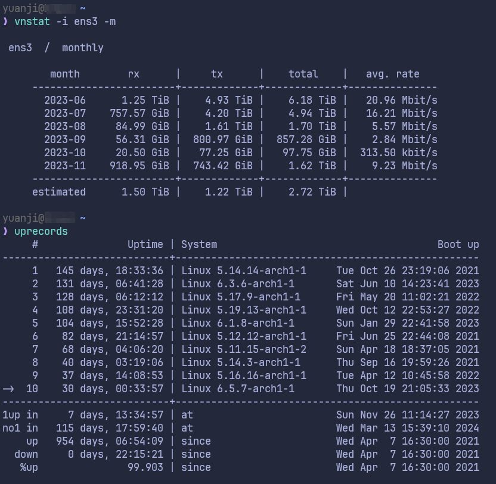
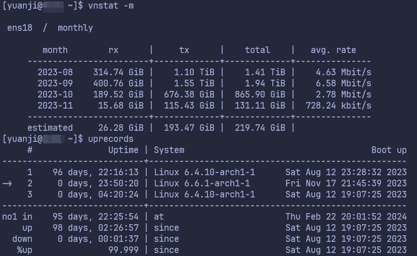
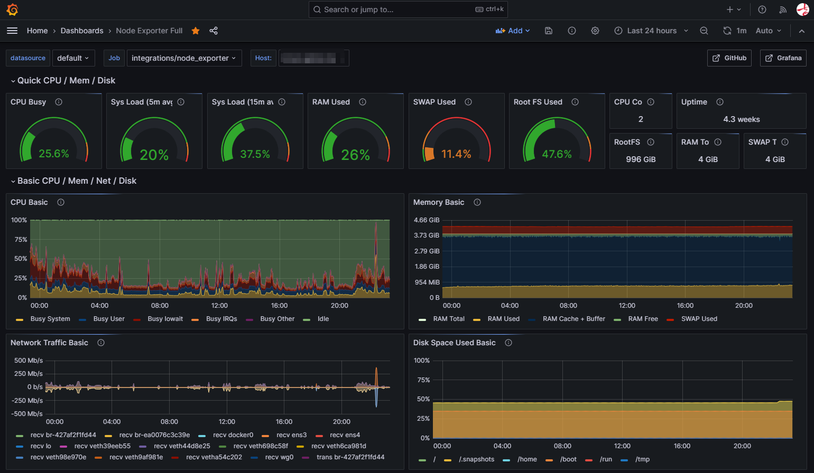
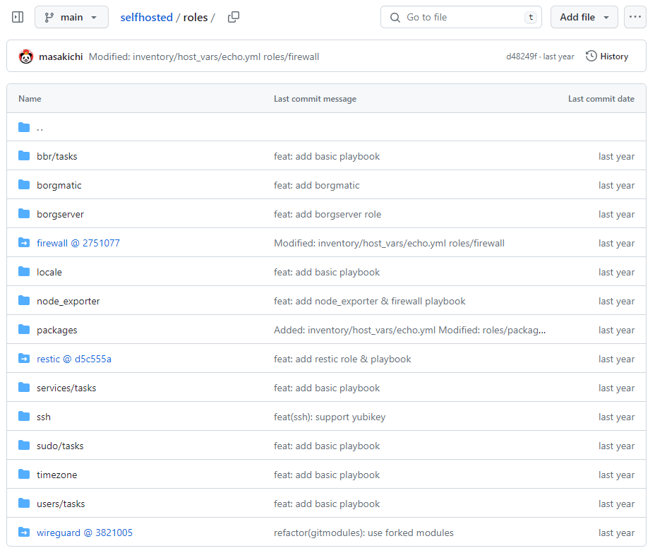
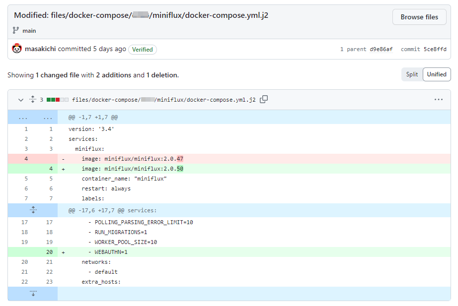

马上要到一年一度的黑色星期五，不少软件、服务即将开始促销。对于 VPS 用户和商家来说黑五也是一个非常重要的节日。我也收到了好几家之前有用过的 VPS 商家发来的邮件，相信现在网上最不缺的就是促销和测评的文章了。然而似乎很少有人写一写自己较为长期使用 VPS 的经验，我翻了翻自己关于 VPS 的文章已经有两年多没更新，今天就以即将到来的黑五为契机写一写我现在（2023 年末）使用 VPS 的状况。

<!--more-->

## 使用的服务商

之前[写的文章]()里还用过其他家的，这两年随着使用和维护的方式逐渐稳定下来，目前还在使用的就只剩下面两台 VPS 了。

以免让本文有作为广告的嫌疑，我就不包含他们的购买链接了。

| 商家      | 配置        | 位置           | 价格      | 备注                       |
| --------- | ----------- | -------------- | --------- | -------------------------- |
| CloudCone | 2C/4G/1000G | 美国洛杉矶     | $34.55/年 | 支持 IPv6 7T 流量          |
| Contabo   | 4C/8G/400G  | 德国杜塞尔多夫 | €5.99/月  | 支持 IPv6 无限流量 200Mbps |

像我这个 CloudCone 的配置可能很难再次出现，对于这次黑五想用他家的朋友估计没有太多参考性，但是 Contabo 家这个套餐我换了没几个月，如果这次黑五没有推出类似的套餐的话，可以说就没有太大的诚意了。

## 使用的操作系统

我的选择是 [Arch Linux](https://archlinux.org/)，不少人说 Arch 不太适合作为服务器的操作系统，也许生产环境有一定风险，但对于个人而言，我觉得倒是再适合不过。我过去两年半在 CloudCone 升级了近二十次系统，没有挂过一次。有时候三、四个月升级一次，有时候可能一个星期升级数次。就算出了问题，一般 VPS 提供商都会提供 Live CD 可以进去修。下面我贴一下两台 uprecords 和近几个月 vnstat 的记录。（因为今年 8 月份 Contabo 推出了硬盘翻倍的活动，我重新建了个 VM 做了迁移，实际上总共使用也超过 2 年）

{}

{}

{}

{}

另外值得一提的是我没有使用商家自带的 Arch，而是挂了 Live CD 自己重新装的，我甚至用 cryptsetup 给系统盘加了密，稍微麻烦一点儿的是每次重启需要用 SSH 输入一下解密的密码。

感兴趣的朋友可以参考一下我之前写的脚本： [Install Arch Linux on VPS with Encrypted System Partition](https://gist.github.com/masakichi/3ef03fe422ae102fdfe8a4a3015149fb)，如果你有安装过 Arch 的经验，稍微修改下应该就能用。

另外如果商家没有提供基于 Arch 的 Live CD 的话，可以参考下 [tokland/arch-bootstrap: Bootstrap a base Arch Linux system](https://github.com/tokland/arch-bootstrap) 这个项目如何用其他系统安装 Arch。

## 自建的各种服务

VPS 的一大魅力就是可以自己搭建只属于自己的各种服务，除了数据库和文件共享之类的服务，几乎所有应用我都使用 [Docker Compose](https://docs.docker.com/compose/) 部署。列在这里给对 VPS 跃跃欲试的朋友一个参考。

| 服务                                                             | 用途                                           | 部署类型 |
| ---------------------------------------------------------------- | ---------------------------------------------- | -------- |
| [traefik](https://github.com/traefik/traefik)                    | 作为全局唯一的反向代理，作为各种其他服务的网关 | Docker   |
| [ArchiveBox](https://github.com/ArchiveBox/ArchiveBox)           | 保存各种网络链接，以对抗动不动就 404 Not Found | Docker   |
| [atuin](https://github.com/atuinsh/atuin)                        | 跨设备同步 shell 的历史记录                    | Docker   |
| [huginn](https://github.com/huginn/huginn)                       | 各种简易爬虫，定时服务，通知等等               | Docker   |
| [miniflux](https://github.com/miniflux/v2)                       | 简单的 RSS 阅读器                              | Docker   |
| [umami](https://github.com/umami-software/umami)                 | 博客的访客记录                                 | Docker   |
| [qBittorrent](https://github.com/qbittorrent/qBittorrent)        | 种子下载                                       | Docker   |
| [vaultwarden](https://github.com/dani-garcia/vaultwarden)        | 兼容 Bitwarden 的密码管理服务端                | Docker   |
| [RSSHub](https://github.com/DIYgod/RSSHub)                       | 社区驱动的 RSS 化项目                          | Docker   |
| [PostgreSQL](https://wiki.archlinux.org/title/PostgreSQL)        | 使用 Arch 的包安装，提供其他服务使用           | Host     |
| [WireGuard](https://github.com/githubixx/ansible-role-wireguard) | 使用 Ansible 部署 WireGuard 组建内网           | Host     |

顺便提一下我有个专门的私有仓库管理各种 docker-compose 文件，通过 [docker context](https://docs.docker.com/engine/context/working-with-contexts/) 的功能，我可以在本地机器上对 VPS 上的 docker 镜像和容器进行方便的管理。

## 监控

自从 NodeQuery 倒闭之后，中间寻觅过一阵替代品，并没有发现那样小而美的替代产品。不过去年看到 Grafana Cloud 家有提供免费使用配额，因为我只用两台 VPS，免费配额对我而言绰绰有余。

使用起来和自己搭 Grafana 那一套并没有太大不同，只是数据大概留存两周左右，不过对我来说无所谓。

{}

{}

## 备份

至于备份，尽管这两年多来我对 CloudCone 并没有什么不满，但考虑到无论是规模还是成立年数，重要的服务我都放在位于德国的 Contabo 的机器上，然后通过 [Borg](https://borgbackup.readthedocs.io/en/stable/index.html) 备份到 CloudCone 的机器上，同时对于最为重要的数据，用 [restic](https://restic.net/) 备份到 Cloudflare R2 上。其他通过下载存放到 VPS 上的文件，如果觉得有收藏价值的话，会通过 [Syncthing](https://www.syncthing.net/) 同步到我位于日本的 NAS 上之后，再分类归档最后通过 [Rclone](https://rclone.org/) 上传到网盘。

## 总结

比起之前经常冲动购买 VPS 吃灰，现在基本保持 2 台 VPS 用来满足各种日常自建服务的需求。因为自己有一个简单的系统安装脚本，以及一个基于 Ansible 的私有管理仓库。一般来说如果看到实在不错的优惠服务（尽管我预判今年黑五并不会出现比我目前使用的 VPS 更优惠的产品），迁移到一个新的 VPS 差不错也只需要一两个小时（主要大概是传数据和恢复会需要手工干预）。另外加上使用 Arch Linux 滚动更新，基本一直可以用上最新的系统，而不必动不动重装系统了。至于我自建的服务，我都有订阅他们的 Release notes，一般发布一两周之内我就会更新到最新版本，说是更新，其实就是改一下 docker-compose.yml 里的 tag，然后重新启动一下容器而已。

虽然对于我的那个 Ansible 仓库，敏感信息我都用 ansible-vault 加密了，但考虑到潜在的风险，就不公开了，贴一个 roles 目录截图可以感受一下。

{}

{}

以及刚巧前几天更新了下 Miniflux，于是就有了下面这样一个更新版本和启动新功能的改动。

{}

{}

以上就是我这两年总结的一些使用和维护 VPS 的经验了，希望有需要的朋友可以参考，以及也欢迎其他 VPS 玩家交流。
