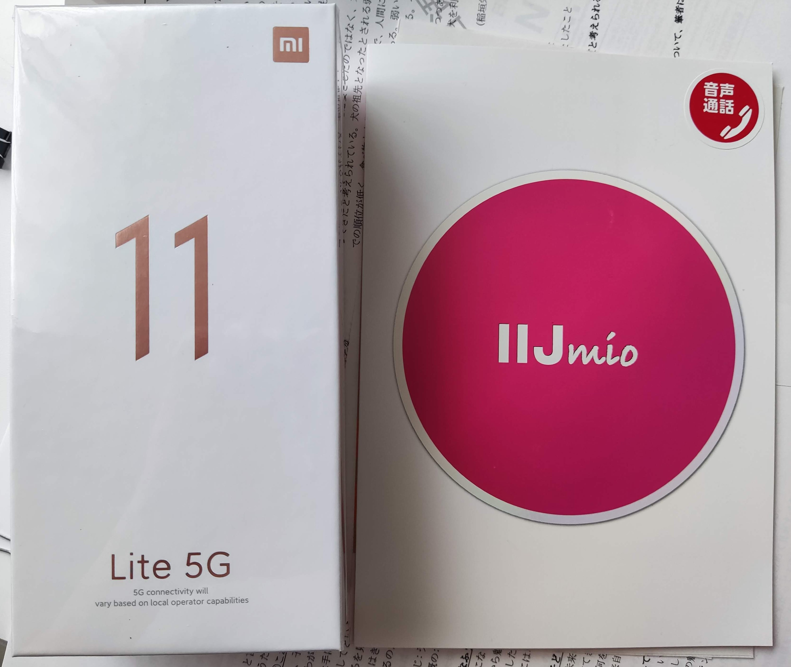
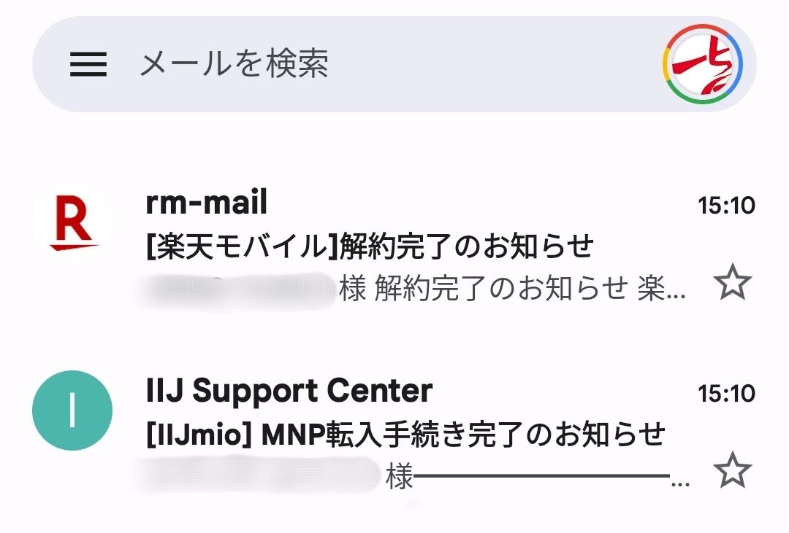

因为前段时间 Rakuten Mobile 宣布取消免费套餐，我为期一年多的薅羊毛生涯眼看要告一段落，正好很多其他运营商也是看准了这个时机，纷纷推出了各种携号转网优惠套餐，因为乐天新的套餐对我没有太大的吸引力，我也计划转到其他运营商。

经过一番比较我决定选择 [IIJmio](https://www.iijmio.jp/)，本来上次从 SoftBank 转出来的时候就有考虑过他家，不过由于乐天免费套餐的诱惑实在太大就搁置了，这次终于有机会可以一试。可能很多人不太了解这家运营商，实际上在日本格安手机卡里算是大手，母公司 IIJ（Internet Initiative Japan Inc）更是日本第一家本土 ISP，我个人在中国国内的时候还用过他家[免费的 DNS 服务](https://public.dns.iij.jp/ "IIJ Public DNSサービス")总得来说印象不错。他家套餐如下，还是非常简单明了的，回线可选 docomo 或者 au，我选择了 docomo 每月 850 日元带通话短信以及 2G 流量的套餐。

因为目前在活动期，比起单单携号转网，还可以以折扣价买手机，于是我就选中了 Xiaomi Mi 11 Lite 5G 配置不差，还自带おサイフケータイ（就是地铁刷卡的那个功能），只需支付 17800 日元（相当于 900 人民币不到）

决定好之后就在这周三提交了申请，过程其实并不复杂，首先在原运营商处拿到一个叫作 MNP 预约番号的东西，然后就到新运营商处填上手机号和这个番号即可。除此之外对于 IIJmio 来说就是需要填入个人信息和支付手段。这里有几个注意点：

- 他家<mark>只支持在日本办理的本人信用卡</mark>，所以没有信用卡就只能绕道别家了
- 他们家的申请系统填写姓名时如果没有汉字名字，可以填写片假名替代
- 上传证件照的时候记得把正反面都拍一下

我周三晚上提交后，周四就通过了审查，周五下班后收到邮件说已经发货，于是今天中午收到了快递来的手机和 SIM 卡。

然后就是按照说明开通即可，我这里是打一个自助电话按照说明输入手机号和 SIM 卡的某个序列号的后四位即可开通，开通的同时也就意味着与原运营商正式解约了。

最后就是把新卡插入新手机开始无聊地数据迁移和设置了，基本没什么坑，一开始接收短信似乎有点儿问题，一段时间后就可以收到了，还有就是这个新的小米手机预装了一些日本人喜闻乐见的消消乐、连连看之类的游戏，我体验了一下就都删掉了。

另外出于好奇，查了下 IIJmio 的名字来源，mio 意思是意大利语「我的」，[官网说明](https://www.iijmio.jp/guide/iijmio/ "IIJmioとは")如下：

> mio ＝私のインターネット
>
> mio（ミオ）は「私の」「私のもの」という意味のイタリア語です。
>
> IIJmio は、自分のスタイルを大切にする方へ、ワンランク上のインターネット環境をご提案します。

正巧晚上和妻子去（意大利菜餐馆）萨利亚吃了顿饭，点了从来没点过的墨鱼汁意面，下面是用新手机拍的照片：

总得来说我还是挺满意这次携号转网的，除了 IIJmio，还有不少富有魅力的运营商可以考虑，现在转出转入也方便，在日本的朋友不妨去[格安 SIM カード比較｜ MVNO・キャリア 25 社 - 価格.com](https://kakaku.com/mobile_data/sim/)对比研究一下。
