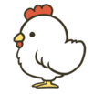
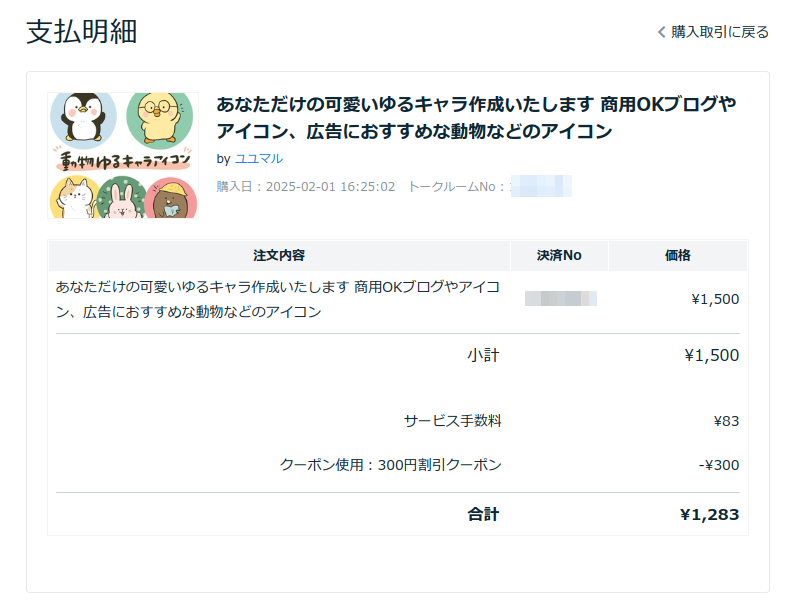
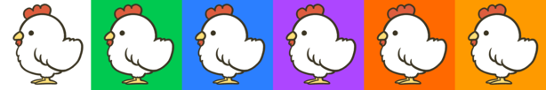
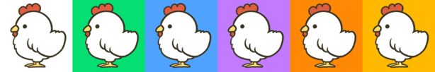
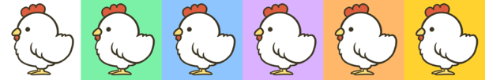

不知道各位有没有同样的感受，每当注册一个新的什么账号上传头像时总会有点儿犹豫，使用哪张照片比较好呢？为了解决这个问题，上个周末花了点时间想着能不能想办法做一个简单、却又容易分辨的头像。经过一番思考，结合自己的属相等综合情况，于是准备以“鸡”来代表自己在网络上的形象。

当然了，没有任何绘画天赋的我是不可能凭空画出什么来的，灵机一动想到了去日本这里的技能交易平台[ココナラ](https://coconala.com/)找人画一张。因为要求简单，加上有新人优惠，一共花费 1283 日元就有了我现在新的头像。话不多说，下面就请欣赏我的新头像。

<!--more-->

## 我的新头像

## 与画师的沟通

为了和画师沟通我要什么样的照片，我简单描述了下：

1. 图片为鸡的全身照
2. 样子比照星露谷物语里鸡的形象（附上截图一张）
3. 结构保持简单，最好在小尺寸屏幕上也容易分辨出是一只鸡

过了一会儿，画师收到消息表示感谢后马上回我：

1. 成果是 2000x2000px 的图片可以吗？还是特意需要分辨率小的
2. 以及鸡需要是正面照还是侧面照

我跟她说照最大分辨率出图就可以我可以自己调整，鸡要侧面照。然后很快就收到了草图，不过她跟我抱歉说没有画像素画的技术，给了一张她作品集里风格的草图，问我有没有问题，没有问题就可以接下来的涂色环节了。我看了下除了鸡脚有点粗之外没有太大问题，就让她修改了。之后双方确认后就上色了。

最后的成品是透明背景的 png 图，问我要不要加背景颜色，我说你看着自己的喜好加吧。其实主要是我也不知道加什么好，于是她给我绿色、蓝色、粉色和水蓝四种背景的图片。在我确认完后，双方互评结束了本次交易。以下是交易账单的详情。

## 自己的再创作

后来我想到其实背景可以用 ImageMagick 自己加，于是就去 [Tailwind CSS](https://tailwindcss.com/docs/colors) 偷了它们的配色版，按照白、绿、蓝、紫、橙、金这样[稀有度排序](https://warcraft.wiki.gg/wiki/Quality)生成了下面这带不同背景的头像图片，虽然平时基本还是用白色背景居多。

## 最后

不知道各位对于我的新头像有什么看法。

如果你也想去那个网站平台找人画头像你甚至可以使用我的邀请链接 https://coconala.com/invite/KNHHG3 据说能得到 1000 日元的点券（不知道能不能直接用，未经证实）日本海外的用户似乎也可以用 PayPal 支付，只是交流上可能还是需要日语。
