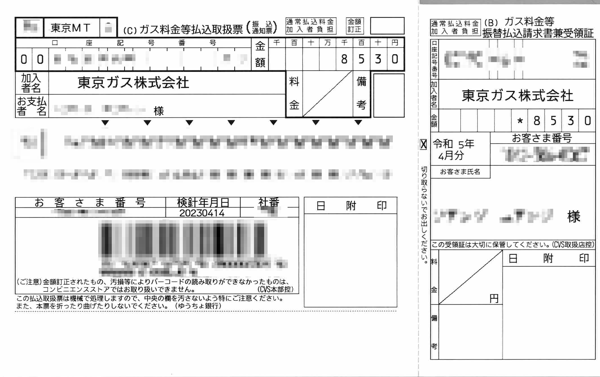
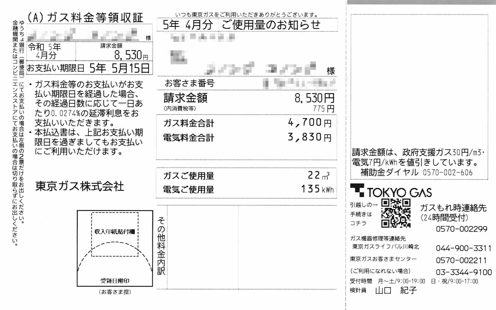
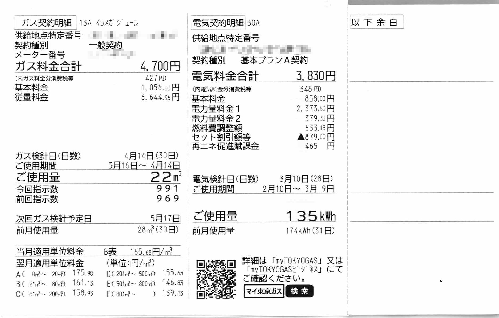
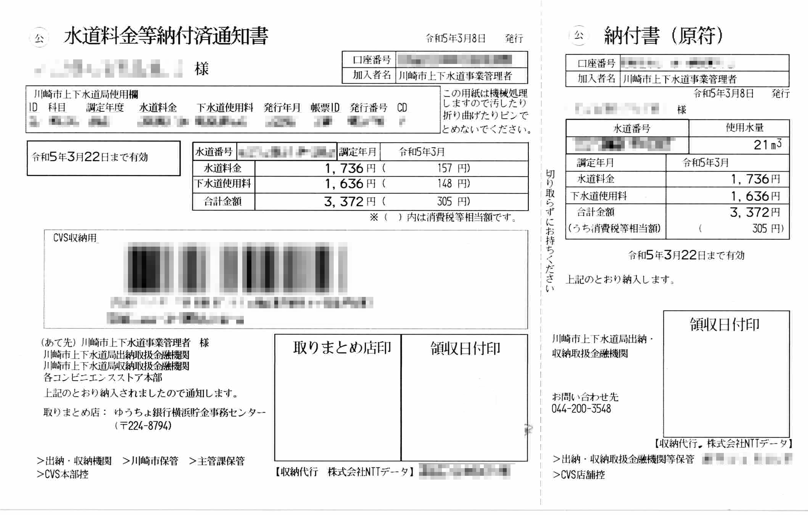
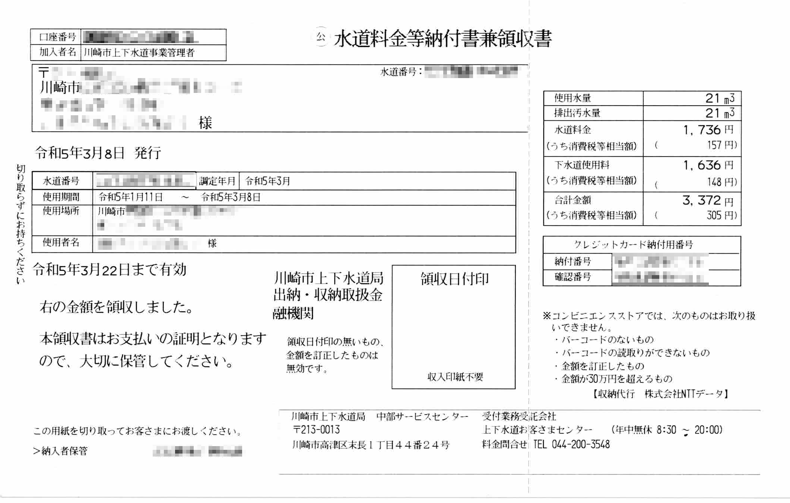

[自从买了打印机]()之后，除了扫描一些文件和证件之外，偶尔也用来试着记录一下生活花销的账单，反映一下这个时代的生活状况，多少年后再回过头来看，说不定也有一番别样的感慨。

于是，扫描了下手头最新的水、电以及燃气的账单。

<!--more-->

我们家是和[東京ガス（TOKYO GAS）](https://www.tokyo-gas.co.jp)签约了电和燃气，所以账单是一起寄过来的。最早我都是拿着账单去便利店缴费，麻烦不说还要手续费。店员会在缴费之后，在单子上盖章。现在托妻子的福，都是用 PayPay 扫条形码支付了，所以单子上的印章部分就都是空的了。

总的来说，电气和燃气寄过来的单子有三张，分别是通知票、领收证以及使用明细。四月份一共缴费 8530 日元，其中燃气使用了 22 m3 计 4700 日元，电气使用了 134 kWh 计 3830 日元。

用水又需要跟水道公司签约，之前住东京时是和东京都水道局签约，现在住神奈川川崎，是与[川崎市上下水道局](https://www.city.kawasaki.jp/800/)签约。同样，现在也支持条形码扫码支付了。与电气燃气不同，我这里是两个月缴费一次，今年一月到三月一共缴费 3372 日元，上下水道使用量各为 21 m3。

这两个月的账单比前几个月冬天的账单的费用有所下降，大约和空调的使用和泡澡的频率下降有关。另外因为之前也没怎么仔细读过这些账单，现在看来上面的汉字还真不少，感觉哪怕不会日语估计也能看懂大部分吧。以上就是一个两口之家最近在日本神奈川的水、电、燃气的生活支出了。欢迎在评论中分享你们那里的使用情况。
