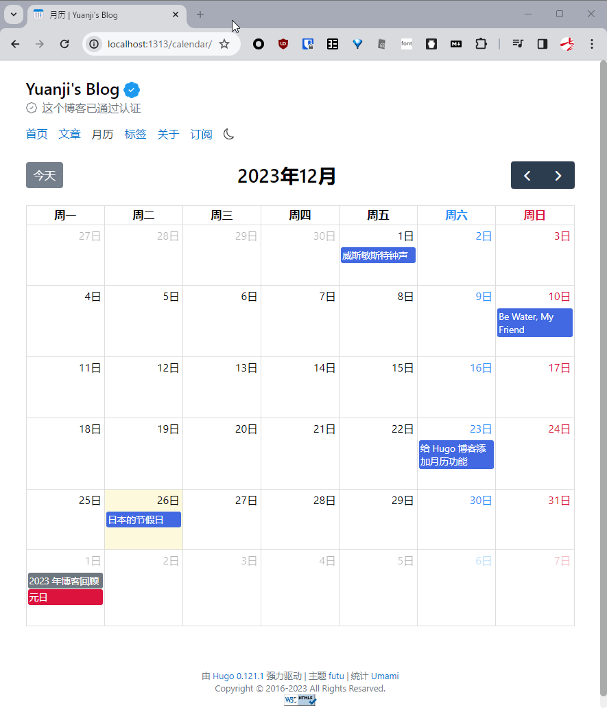

日本在进入令和时代以来，十二月就没有了任何节日（日语叫「祝日」）了。可能是因为这个原因，在[给博客加上月历]()的时候竟然忘了把节日给加上。

这篇文章就作为上一篇的后续，介绍一下我观察到的日本的节日、日本月历有关的有意思的发现，然后顺便将这些观察反映到我博客的月历上。

{}

{}

<!--more-->

## 红日子

作为一个来日本工作的社会人而言，不用说最先关心的几件事之一就是节假日。听职场上的中国人前辈们经常用「红日子」来指代周末和放假的节日。我在网上搜了下，确实也有日本人把这些节假日称为，但我在字典中并没有找到，字典里有的词叫「」，据说这些节日的时候会升旗庆祝。但不管怎么说把节假日称为红日子还是很形象的，因为在日本的月历确实节假日是印刷成红色的。据说这甚至影响了 iOS 系统的日历图标，将系统的区域设置成日本后，在非节假日的时候图标上的文字是普通的黑色，而只有节假日会变成红色。在搜索的结果也很清晰地反映出，日本月历配色的特点。（读者朋友要是愿意可以上搜索 Calendar 试试，这个区别还是一目了然的）


## 星期六是蓝色的

看了上面的截图，你可能也注意到，的颜色区别于的红色，竟然是蓝色的。通过一番调查，发现这篇[こよみの学校 第115回『土日の色はいろいろ』｜暦生活](https://www.543life.com/campus115.html)文章解释地非常清楚。简单来说星期六使用不同的颜色和上世纪 70 年代日本开始推行周休两天制度有关系，但使用蓝色大概和印刷技术有关系，因为印刷原色黄、红、蓝、黑四种颜色，而红和黑已经被使用，剩下黄色和蓝色二选一的话，因为黄色不够醒目，自然就有蓝色来当此大任了。

顺便说一句，不知道是不是这个周休两天制度落实得不够彻底，直到今天，在日本如果某个节日和星期日重合的话，之后最近的一个非节日的日子（通常就是星期一啦）会补假。然而如果节日和星期六重合，法律并没有提到会补假。2023 年非常不幸，竟然有 3 个节日和星期六重合。

## Hugo 处理数据

铺垫了这么多背景，终于到了改造我博客日历功能的时候了，简单总结一下我要做的：

- 按照传统，把日历里的星期六的颜色设置成蓝色
- 在日历中加入节日信息（因为 2019 年年底来的日本，我决定把 2020 年开始的日本节日放上去）

把星期六的颜色改成绿色，只需简单一句 CSS 即可，就不细说了。这里主要介绍一下如何在日历上放上节日信息。首先要做的就是去[政府网站](https://www8.cao.go.jp/chosei/shukujitsu/gaiyou.html)找到准确的节日信息，这个网页很清楚的列出了今明两年的节日信息，顺便附带了一个 CSV 文件，包含从 1955 年开始的所有节日。虽然 Hugo 也可以处理 CSV，但显然比起 JSON、YAML 或是 TOML 格式而言处理起来并没有那么友好。不过好在已经有其他人考虑到了这一点，[国民の祝日API](https://national-holidays.jp/about.html) 这个网站直接提供了简单的 API 可以获取到 JSON 格式的节日信息。虽然我们可以直接使用 [data.GetJSON](https://gohugo.io/functions/data/getjson/) 这个方法让 Hugo 编译博客的时候，从远端下载必要的 JSON 文件，不过考虑到我们只需要每年更新一次节日信息，我选择把从 2020 年开始的 JSON 文件放到了我的博客仓库，减少一个不必要的外部依赖。比如 `https://api.national-holidays.jp/2024` 通过访问这个地址就可以得到 2024 年的节日信息，将其保存为 `2024.json` 放到 `data/calendar/holidays_jp` 目录下，所有下载的文件像是这样：

```
❯ ls -alh data/calendar/holidays_jp
Permissions Size User   Date Modified Name
.rw-r--r--  1.4k yuanji 25 Dec 18:55  2020.json
.rw-r--r--  1.4k yuanji 25 Dec 18:56  2021.json
.rw-r--r--  1.3k yuanji 25 Dec 18:56  2022.json
.rw-r--r--  1.4k yuanji 25 Dec 18:56  2023.json
.rw-r--r--  1.7k yuanji 22 Dec 23:16  2024.json
```

根据 [Data templates | Hugo](https://gohugo.io/templates/data-templates/) 文档，只要把这些数据文件放到 `data` 目录下，就可以在模板中通过 `$.Site.Data` 访问，比如我在模板里使用了如下代码：

```go-html-template
{{- range $.Site.Data.calendar.holidays_jp -}}
  {{ range . }}
    {{- $holidayEvents = $holidayEvents | append (dict "title" .name "start" (time.Format "2006-01-02" .date) "allDay" true "color" "red" "kind" "holidays_jp" ) }}
  {{ end }}
{{- end -}}
```

因为 `holidays_jp` 是一个目录，`$.Site.Data.calendar.holidays_jp` 就会得到以该目录下文件名为 Key，文件内容为 Value 的 `map` 了，虽然有点儿怪，但是直接 `range` 这个 `$.Site.Data.calendar.holidays_jp` map 会遍历所有 Value（某一年的节日内容）而不是 Key，再 `range .` 一下就得到每一条节日信息了。

## FullCalendar 渲染数据

原理上和上一篇渲染博客文章信息到月历上并没有太大的不同，只是我做了一点小小的重构，比起把所有信息放到一个 `$events` 对象里，我试着做了下区分，分为了三个不同的对象，用来分别存储已发布文章、草稿，以及今天的主角——节日。

```diff
- events: {{ $events }},
+ eventSources: [{{ $postEvents }}, {{ $draftEvents }}, {{ $holidayEvents }}],
```

## 总结

本来[上一篇文章]()就是今年最后一篇了，本文对于月历的更新部分在那篇文章里增补即可。但那样的话就失去了一个介绍日本节日、月历配色等有趣地方的机会了。

另外想到今年好几个之前的同事、同学来日本玩，网上也读到不少来日本游玩的游记，想必来年还会有更多的游客来日本旅游，或许有一篇有关日本节日的文章可以帮助想来日本旅游的朋友做计划也不一定。

最后，提前祝各位读者朋友新年快乐！
