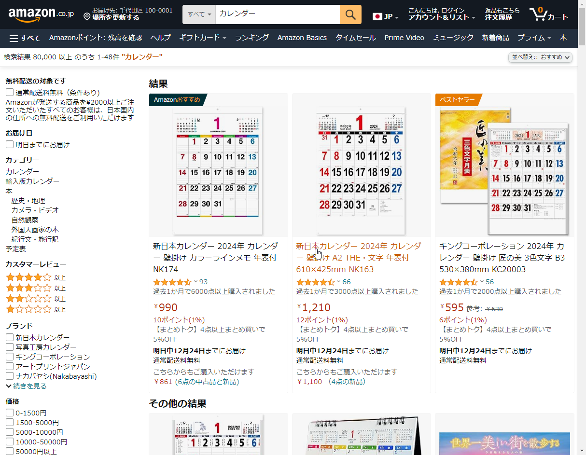

日本在进入令和时代以来，十二月就没有了任何节日（日语叫「祝日」）了。可能是因为这个原因，在[给博客加上月历]()的时候竟然没有把节日给加上。

这篇文章就作为上一篇的后续，介绍一下我观察到的日本的节日、日本月历有关的有意思的发现，然后顺便将这些观察反映到我博客的月历上。

<!--more-->

## 红日子

作为一个来日本工作的社会人而言，不用说最先关心的几件事之一就是节假日。听职场上的中国人前辈们经常用「红日子」来指代周末和放假的节日。我在网上搜了下，确实也有日本人把这些节假日称为，但我在字典中并没有找到，字典里有的词叫「」，据说这些节日的时候会升旗庆祝。但不管怎么说把节假日称为红日子还是很形象的，因为在日本的月历确实节假日是印刷成红色的。据说这甚至影响了 iOS 系统的日历图标，将系统的区域设置成日本后，在非节假日的时候图标上的文字是普通的黑色，而只有节假日会变成红色。在搜索的结果也很清晰地反映出，日本月历配色的特点。（读者朋友要是愿意可以上搜索 Calendar 可发现，这个区别还是一目了然的）

## 星期六是蓝色的

看了上面的截图，你可能也注意到，的颜色区别于的红色，竟然是蓝色的。通过一番调查，发现这篇[こよみの学校 第115回『土日の色はいろいろ』｜暦生活](https://www.543life.com/campus115.html)文章解释地非常清楚。简单来说星期六使用不同的颜色和上世纪70年代日本开始推行周休两天制度有关系，但使用蓝色大概和印刷技术有关系，因为印刷原色黄、红、蓝、黑四种颜色，而红和黑已经被使用，剩下黄色和蓝色二选一的话，因为黄色不够醒目，自然就有蓝色来当此大任了。

## Hugo Data

## FullCalendar
