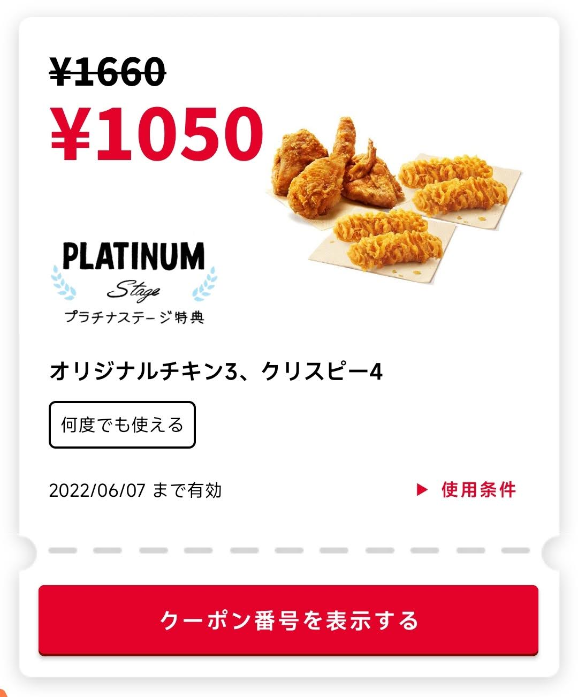
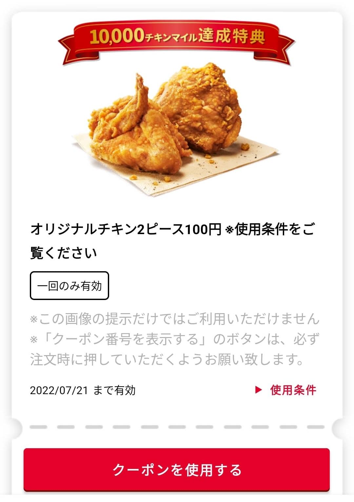

要说我来日本之后吃的最多的快餐店是哪家，那毫无疑问是肯德基。

今年从三月份开始下了他们家的 App，注册了个帐号，每次点餐就会用来积分，这不到三个月的时间我就成为了会员等级的最高一档：白金会员，真是可喜可贺。

<!--more-->

成为白金会员之后，会自动解锁两张不限使用次数的特殊优惠券如下：

**2022/07/15 更新：**

积分累积超过 10000 分还会额外送一张 100 日元购买两块吮指原味鸡的优惠券

