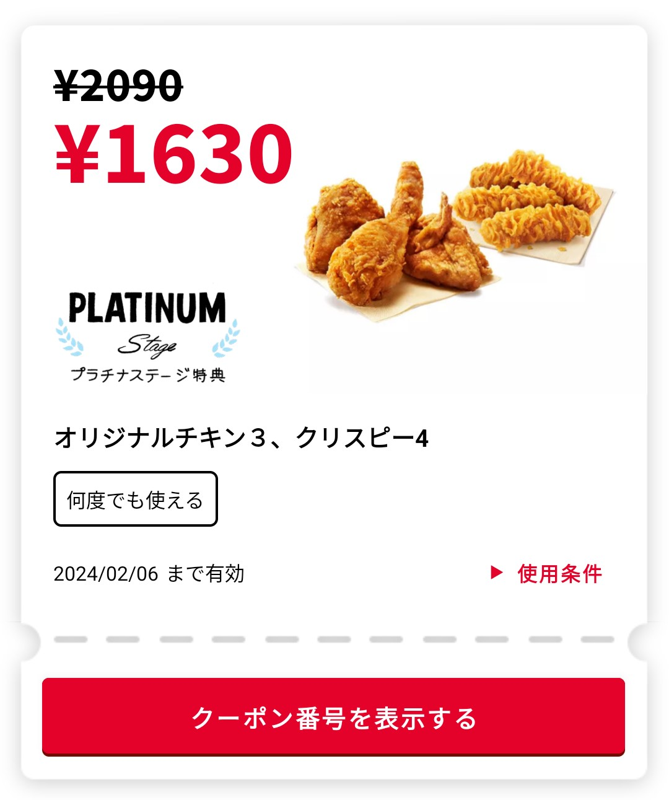
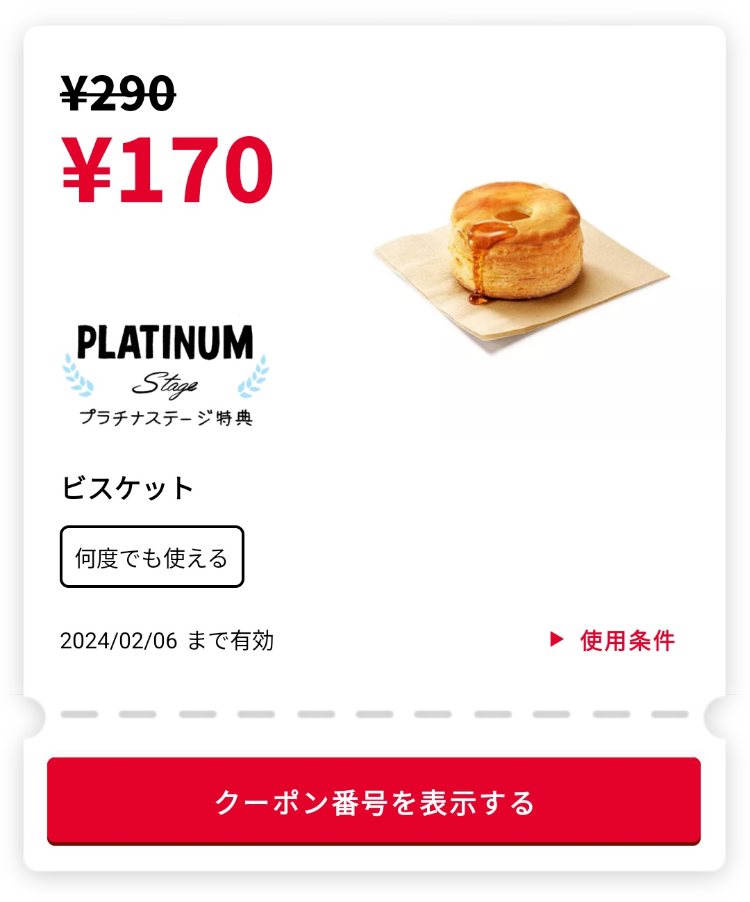

要说我来日本之后吃的最多的快餐店是哪家，那毫无疑问是肯德基。

今年从三月份开始下了他们家的 App，注册了个帐号，每次点餐就会用来积分，这不到三个月的时间我就成为了会员等级的最高一档：白金会员，真是可喜可贺。

<!--more-->

成为白金会员之后，会自动解锁两张不限使用次数的特殊优惠券如下：

**2022/07/15 更新：**

积分累积超过 10000 分还会额外送一张 100 日元购买两块吮指原味鸡的优惠券

**2024/01/08 更新：**

过去的一年虽然吃的不如从前多了，但基本上每月 28 日的「[とりの日パック](https://www.kfc.co.jp/menu/detail/028990)」没怎么缺席，加上时不时地肯德基做活动会去打包个 1000 日元左右的优惠包，平均下来每个月我估计还是会去 2 次左右。因此依然保持着白金会员的头衔。只是白金会员专属的优惠券似乎好久没用过了，今天心血来潮看了下现在的白金会员优惠券，没想到涨价涨了这么多。对比刚写本文的时候不过一年半时间，一样的优惠券内容，只是吮指原味鸡x3 + 松脆鸡肉x4的优惠价涨了 55%，另一个松饼优惠价甚至涨了 70%。

