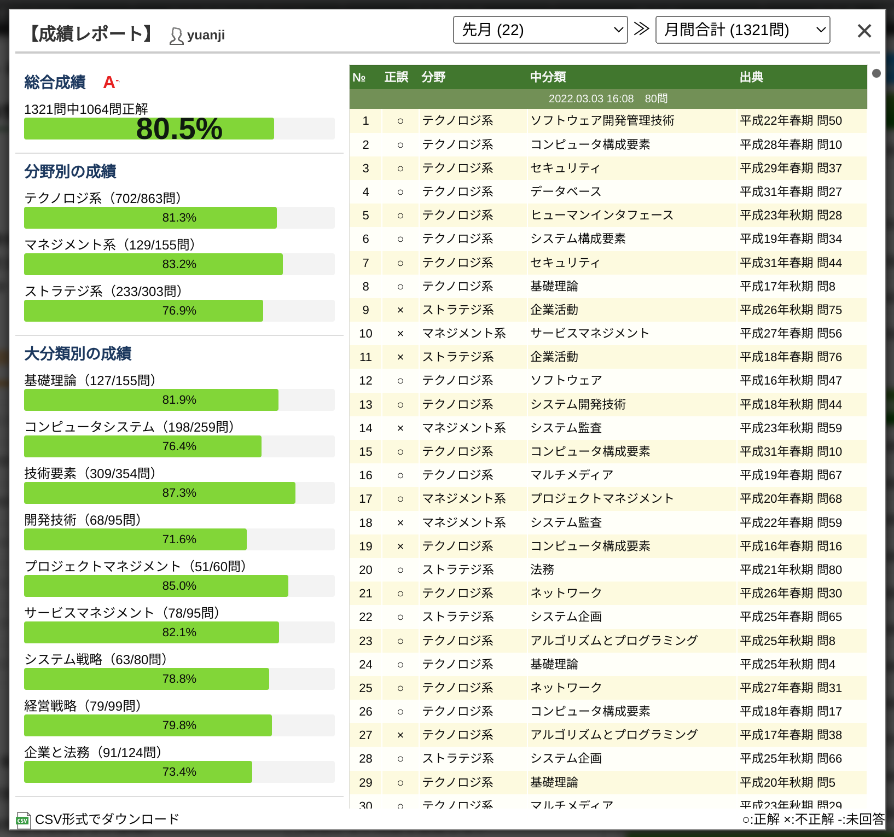
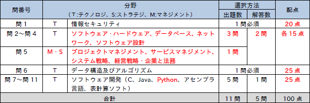
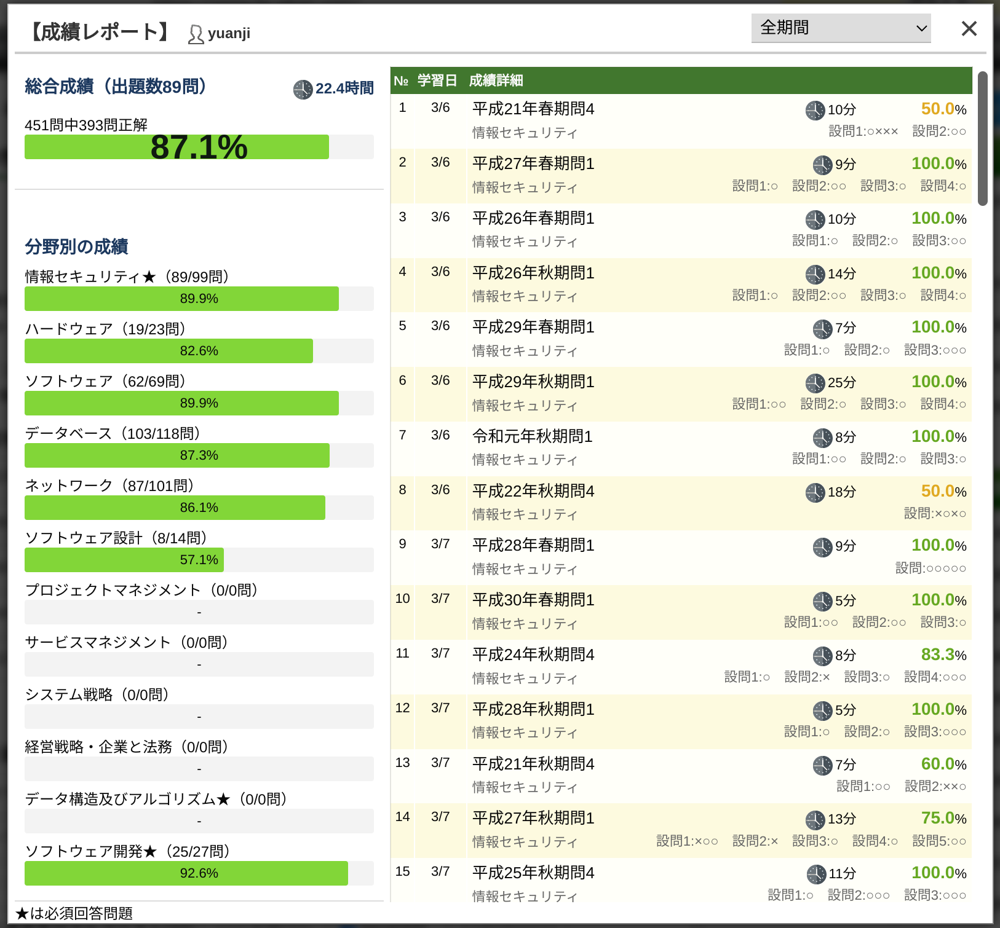

这周一考完了一个叫作「基本情報技術者試験」的考试，不出意外的话应该是合格了。准备这个考试差不多前后历经了一个多月，这篇文章准备把这个过程交代一下，如果有读者在日本对这个考试感兴趣的，可以作为一个参考。

<!--more-->

## 介绍

首先有读者可能会对「基本情報技術者試験」这个奇怪的考试名称感到一头雾水，倒也不是什么厉害的考试，就像标题一样相当于中国国内软考的程序员考试，也因为这个考试有国际上的[互认机制](https://www.ipa.go.jp/jinzai/asia/kaigai/china.html)，如果你在国内考过软考的话实际上在日本也是通用的哦。反过来说，我通过了这个日本的考试，应该也就相当于通过了国内同等级的考试？



|     中国の試験区分名      |      日本の試験区分名      |
| :-----------------------: | :------------------------: |
|    信息系统项目管理师     |   プロジェクトマネージャ   |
| 系统分析师 系统架构设计师 |    システムアーキテクト    |
|     数据库系统工程师      | データベーススペシャリスト |
|        网络工程师         | ネットワークスペシャリスト |
|        软件设计师         |       応用情報技術者       |
|          程序员           |       基本情報技術者       |



那这个考试的难度如何呢？当然啦我自己本身作为一个程序员，日语阅读水平也还尚可的情况下一个月通过还是不成问题的，只是因为好久没有考试了多少有点儿紧张。如果你没有程序员的背景，从头开始的话，打个不太恰当的比喻，难度大概相当于从零到 JLPT N2 的等级，因为这个考试是一系列技术型考试中属于中级的考试，初级的有「IT パスポート試験」，高级的有「応用情報技術者試験」，再往上就不是通用型的考试，而是各个分野的专门考试，比如网络、数据库等。

这个考试有什么用呢？这个问题就见仁见智了，对于像我这样在日的外国人来说对于签证的取得多少有点儿帮助，同时既可以检验自己的日语水平也可以对基础的信息处理有个全面的理解，而且这还是个没有期限的国家认证资格，所以合格的话肯定没啥坏处。

## 考试的准备

虽然我已经有近三年没参加考试了，上次参加考试还是 [2019 年在国内考的 TOEIC]()，刚开始准备的时候多少有点儿不太适应，不过知己知彼，百战不殆，通过一段时间的研究，发现合理利用空余时间刷刷题基本问题不大，主要就是保持良好的心态就可以。

**首先题型来说，这个考试全部都是选择题，其次分为午前和午后两部分，考试时间各 150 分钟，两部分满分都是 100 分，两部分都在 60 分以上为合格。**

### 午前

午前的部分比较单纯，以理论为主，共计 80 题，涵盖技术、管理和策略三大块，简单来说这部分就是刷题为主的游戏，而且有很大概率考原题，利用闲暇的时间多做点过往的原题，午前通过基本不成问题，当然直接开始刷题可能有点儿云里雾里，可以买本参考书先用理论武装一下自己，比如我用的是这本[《令和 04 年 イメージ&クレバー方式でよくわかる 栢木先生の基本情報技術者教室 (情報処理技術者試験)》](https://www.amazon.co.jp/dp/4297123932)，然后就可以来这里[基本情報技術者過去問道場](https://www.fe-siken.com/fekakomon.php)愉快地刷题了，这个考试到令和元年为止都是公布题目的所以这个网站有到那之前的所有原题，令和元年之后考试改为上机（CBT）的方式之后就不公布原题了，不仅这个网站如此，线下书店的书也是一样，所以完全没有必要买过去原题的书，直接在这个网站刷题就行，像我还傻乎乎地买了本过去问的书完全没有用处，读者可以避免走我的弯路。一般来说刷个最近几年的真题就好，我的话大概刷了 12 套题，从令和元年到平成 26 年的 12 回考试我都刷了一下，加上一些零散的题大概总共 1300 道选择题左右，正确率大概 80%，最后考试的结果是 83.75 非常接近。

### 午后

如果说午前主要是理论和刷题为主，午后就相对没这么好对付了。午前基本上就是单刀直入的一问一答模式，也没有大段的说明，就是普通的选择题而已，午后则主要以解决实际问题为主，所以每道题目都配有大段的文字和图片描述，考生需要有全面的理解然后回答设问，这些题目通常还环环相扣，当然往好处想一旦理解了出题意图，那答起来还是挺爽快的，但不幸没有看懂题目就比较惨了，作为外国人阅读大段的文字这一点儿相对不利，不过其实也还好多做几套之前的原题练练手，熟悉了模式效率就会上升很多。

另外午后还有一个影响复习策略的是，午后并非都是必答题，而是需要做出选择，就如下图所示，午后的题目共有 11 道大题组成，其中第一题信息安全题和第六题数据结构和算法是必选题之外，考生需要在 2 ～ 5 题中任选 2 题，然后在 7 ～ 11 题中任选 1 题作答。

对于必选的题型，当然我能做的就是把之前所有的原题刷一遍，实际操作下来信息安全的题一般不太难，基本考防火墙和数据加密为主（对称加密和非对称加密都有）。数据结构和算法就稍微难一点儿了，一般我也就 60% 的把握左右。2 ～ 5 里面我主要准备了网络（网络配置、子网掩码之类的知识）和数据库（SQL 基础知识），还有软硬件的知识，这一块我本身就是程序员，所以做真题也大概有 80% 以上的正确率，最后就是 7 ～ 11 程序题了，这 5 题包括了 C 语言、Java、Python、汇编和表计算（其实就是 Excel），我的策略是主 Java，Python 要是简单就选 Python，而且 Python 是 2020 年之后加入的所以并没有原题可参考，对于没有编程经验的人来说也许选表计算是个不错选择。结果上来看，我最后选择了 Python，午后总分得了 94 分，笑。

## 感想

总得来说这个考试还是挺好的，考的东西也很全面，也很与时俱进，比如 2020 年加入了 Python 以取代原有的 COBOL，用 CBT 的方式取代了原有的笔试，基本上考完走出考场，考试成绩就发到电子邮箱了，非常刺激。当然啦这个考试对于工作的直接帮助虽然不太大，但对于巩固计算机知识的基础还是非常不错的，对于有兴趣转行编程的读者来说也是一次不错的挑战。

最后感谢过去一个月妻子把家里的电脑让给我刷题以及带我去熟悉考场。
