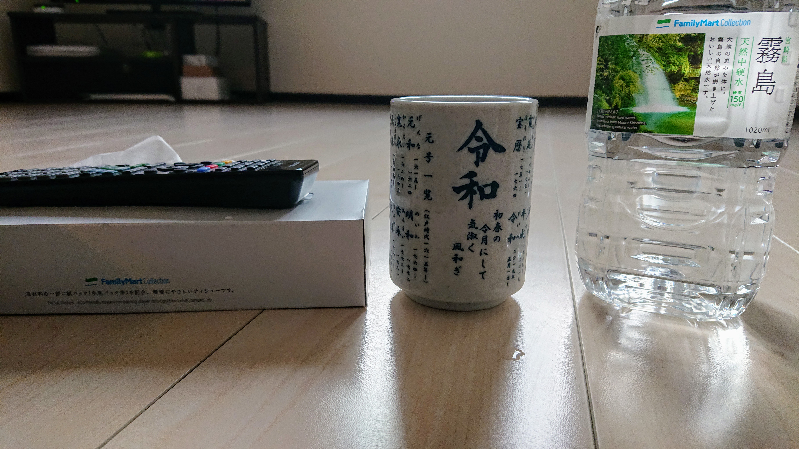

这里记录我登陆日本最初的一周是怎么度过的，趁着还能回忆起来的时候。文章可能因为隐私需要等原因隐藏了一些细节。如果以后有看到这篇文章并且需要更详细情报的朋友，可以通过侧边栏的联系方式联系我。关于对于赴日的准备参见：[赴日的准备工作]()

<!--more-->

## Day 1

2019.12.20(星期五) 早上从上海浦东国际机场起飞，携带护照，工作签证，在留资格认定证明书，西瓜卡等。下午 1 点多到达东京成田国际空港。与以往来日本旅游不同，这次因为携带了在留资格认定证明书，在机场会有工作人员将其换成在留卡，于此同时给了一张注意事项的文档。主要是三点

- 14 天内登记在日本居住的地址
- 随身携带在留卡，并且出入国也会用到。另外如果被要求出示在留卡，没有携带会被罚款。出示不了的情况甚至有可能要一年徒刑
- 如果在留卡内容变更及时到对应部门申报

拿到在留卡之后就是正常入境手续了。然后我坐 Skyliner 从成田空港到日暮里转 JR 山手线到池袋。出了车站到宾馆 Check in。因为还有一点儿时间，于是到附近的房屋中介相谈，预定次日的看房。因为在国内的不谨慎被家里的小狗划了一个小伤口，需要在日本补上国内没有打完的狂犬病疫苗。回到宾馆预约一个可以休日还营业可以打疫苗的诊所，关于哪里可以打疫苗可以查看厚生劳动省检疫所的网站搜索 https://www.forth.go.jp/moreinfo/vaccination.html

## Day 2

2019.12.21（星期六）赶着昨天预约的时间，赶到诊所，稍微等待了一会，对方有中文接待，我交代了我的情况之后，确认了情况以及在国内打的疫苗的型号，然后给我安排医生，本来前台还充当我的翻译，看我会日语后她就走了。我和医生再次描述了具体情况并表示了其实不是咬伤而是划伤「噛まられよりむしろ擦り傷」，并给他看了伤口，然后他修改了下病例。确认好之后告知我他们医院没有完全相同的疫苗，但是有具有互换性的进口疫苗，以及询问我在国内打疫苗有没有不良反应，我也反问这个疫苗会不会有啥副作用，他说一般没有，最多可能注射肌肉有点酸。另外他也告诉我按照日本的习惯会同时打一针破伤风的疫苗，问我需不需要，我说不要。所有都说明白之后，就让我出去等，不久就有个护士示意我进去，然后再三确认要打的疫苗品种，最后问我平时习惯使用左手还是右手，我想了想平时已经不怎么写字了，并且两只手都能写字，就说了「どっちでも」，她笑了让我随便选了一个。注射完之后让我留在诊所观察一段时间，最后就是付钱回去啦。

下午赶到房屋中介，让员工带我去看房，对方是在日本留学的中国人，目前在那个店里打工。打开了话题之后我们聊了一路，我也从他身上学到了不少在日本生活的小知识，坐车的时候也了解到了很多各种线路相关的知识，受益不少。房子还不错，作为候补，看完房子回池袋，又约了次日第二次看房。

## Day 3

2019.12.22（星期日）早上去办手机卡，因为还没有去区役所登记地址，所以并不能开通手机号码。中午开始下雨，不过还是去看了房子，这个房子虽然比较大，但是比较成旧，也稍微有些吵。于是看完之后还是决定要第一次的房子，返回池袋，回宾馆休息了一下去参加了一次线下在东京的豆瓣网友聚会，因为打疫苗的缘故不能吃辣，所以没有吃太多，气氛还是比较活跃的，组长还给所有到场的人发了小礼物，我收到了一个记账本，但是应该不会使用。

## Day 4

2019.12.23（星期一）因为事前调查过周一区役所会比较多人，于是 7 点就起床奔赴区役所，在工作人员的指示下，非常顺利地在在留卡的反面登录上了住址，然后开通手机号。在准备去办银行卡的时候，先是去邮局银行，很遗憾没有成功，不过后来换了一家叫「新生银行」的银行之后，在填写完必要资料以及出示在留卡之后，柜员再一条一条解释完他们银行的特点和使用方法后就办好了第一张银行卡，我也询问了我关注的一些问题，比如手续费、海外送金什么的，她都非常耐心地解答了，总体感觉非常不错，另外不像邮局人多都在排队寄年贺状，这里人相对较少，而且似乎因为提供英文服务比较受到外国人的欢迎。

下午就是去房屋中介签署协议，支付第一次费用等等。被告知了一些注意事项，比如怎么交房租，怎么改水电的用户之类的。到明天去领取钥匙应该就算告一段落了。另外得知日本的不动产公司大多周三休息。

## Day 5

2019.12.24（星期二）早上睡了个懒觉，到九点半才差不多出门，因为早上的任务很单纯就是去中介公司的新宿店领取钥匙，果然还是在新宿站里面迷了路，出了新宿站才第一次看到东京还有这么高的大厦！领取钥匙的同时店员还给我办理了一个自行车（来自台湾的店员小哥说的是脚踏车我一时没反应过来）的登记，给了我一个贴纸如果将来需要骑车的话可以把贴纸贴到自行车的后面，这样就可以停在公寓楼下了。领取了钥匙之后在附近的快餐店迅速吃了个早午饭直奔租房目的地。

下午到达后简单检查一下发现没有电，不过自来水是有的。于是准备开通水电服务，首先给东京电力公司打电话，自动接听的语音信息告诉我打电话的人很多，我按照指示，手机上收到一个通过网络办理的链接，一顿操作之后就申请成功了，然而电并没有来......转而打电话给水道，这次是直接有人接听（我的第一次日语电话），我告诉我的意图就是开通水道服务，然后就是询问我的各项信息，主要是姓名、住址、电话、缴费方式等，因为本来就有水我申请完就结束了，期间大概耗时 15 分钟左右。然而还是没有来电，我有些不安。于是再次拨通了东电的电话，还是一样告知电话服务很繁忙，这一次我没有再选择网络服务，依然执意要选择人工服务，没想到一秒钟就有人接听，我描述了我的遭遇之后，对方首先告知我要打开电闸，我告诉她电闸是打开的，她觉得奇怪询问了我在网上登记的号码，我报给她之后她大约查了几分钟，告知我选择的用电套餐比较新，可能不能马上开通，建议要不要选择一个传统套餐试试，我当即答应，毕竟我可不想在东京过一个没有电的新年，毕竟马上年末年始，可能会开通不了。在客服给我变更套餐之后，她建议我 20 分钟之后再尝试打开电闸，并告诉我不要担心，如果依然不能使用，2 小时之内会派工作人员上门让我今天用上电，当我询问如果不幸 20 分钟之后真没有电，是否要继续给客服打电话，她说他们远程就可以知道我的用电情况，所以不需要继续反馈。不过很幸运，在十几分钟内，房子里的灯就亮了起来。

水电告一段落之后，走了大概不到半小时来到最近的一个家具市场ニトリ，买了一些必要的物品，因为当时已经超过下午 4 点，只能选择次日派送。处理完这些就回到池袋结束一天的奔波了。

## Day 6

2019.12.25（星期三）早上从宾馆退房，然后继续去诊所打疫苗，中午在东京站里一家以 [THE BLUE HEARTS](https://ja.wikipedia.org/wiki/THE_BLUE_HEARTS) 的歌曲「電光石火」命名的广岛烧店里吃了午饭。然后打车准备前往住所附近。因为时间还早，就在车站附近的购物中心转了转，买了个写满日本年号的杯子。

下午抵达住所后发现没有热水，赶紧打电话给瓦斯公司，开通瓦斯是需要工作人员上门的，约了下午 5 - 7 点。5 点过了不久就有一个瓦斯公司的小哥上门检查了设备，并当场放出了热水。并且告诉我现在电和瓦斯可以绑定在一起缴费，征得我的同意后他打电话给东电开通，期间东电的客服还让我接了下电话以确认是否本人就在旁边，总之顺利地开通了瓦斯有了热水，那个小哥好像还有点儿感冒，辛苦了。晚上 7 点左右又有运送昨天在ニトリ购买物品的快递员上门，我收了快递后出去吃晚饭顺便在便利店购买了剪刀等必要物品。

最终洗了个热水澡刮了刮胡子，洗好了衣服，趟进了我新买的布团里，写下了今天的日记。

## Day 7

2019.12.26（星期四）圣经创世纪里前六天差不多工作就结束了，而第七天休息。我也差不多，早上睡了个懒觉，然后起来准备开始填写入职需要准备的材料，因为明天就是 DEADLINE 了，填得差不多的时候就出门去住所附近的电器店叫作ビックカメラ，不得不说真的非常大！里面基本啥电器都有，虽然我只需要买热水壶和吹风机，不过还是在里面转了很久，里面还有专门的角落卖杀毒软件，Adobe、Office 等软件。对了午饭就在这家店对面吃了个云吞面，讲道理可能还是中国的好吃。

买完回来又睡了个午觉，差不多到晚饭时间就出门去周围的便利店，因为早上的作业有一项需要扫描在留卡正反面，正好周围的便利店也多，我分别在 711 和全家扫描了正反面，体验都差不多，似乎 711 的更友好一点儿，价格都是 30 日元。晚饭就顺便买了分便当回来。

晚上因为没有啥太多的事情，就折腾了下带来的一块开发板 RockPi-4B，烧录了 [Armbian](https://www.armbian.com/download/) 系统之后，SSH 上去使用自带的 armbian-config 命令就可以一键把它设置成一个 Access Point 了，于是把它替换了住所自带的 WiFi 设备，虽然比不了国内动辄数百兆的光纤，不过测了下网速有 30Mbps 啦！（几乎比租房自带的设备快了 1 倍 👏）

