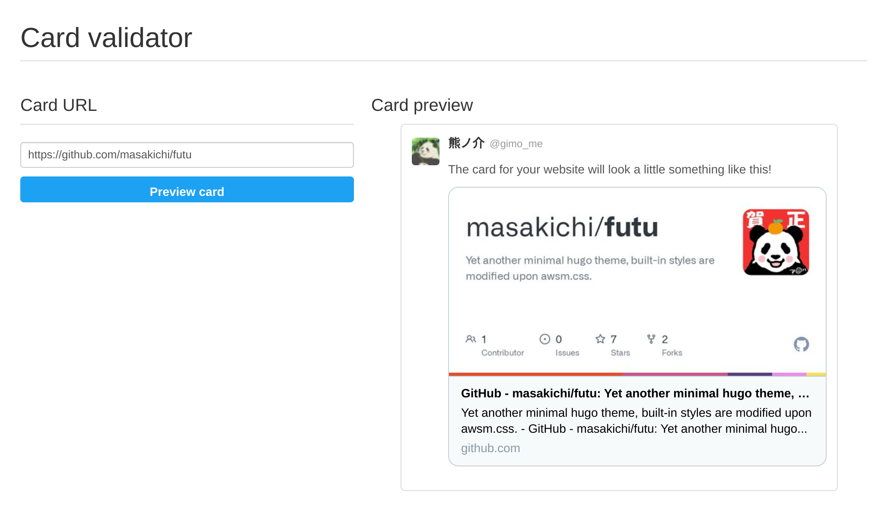

最近一段时间有点儿沉迷做博客主题，渐渐地已经折腾起小挂件起来了，不觉得和十多年前的 QZone 时代很像？这次主要想解决的问题是如何在文章里插入一个 GitHub 仓库的卡片（可能也叫挂件 Widget），就像下面这样。

本文就来介绍如何花较少的工夫来完成这样一个简单但又不失美观的卡片功能，虽然标题说是 GitHub 卡片，但理论上应该适用于不少其他场景。



<!--more-->

## Shortcodes

如果你也是 Hugo 用户，想必对 Shortcodes 并不陌生，无论是在文章中插入代码片段 gist，还是一段 YouTube 视频都可以用上。基本上想要在文章原文（假定是 Markdown）中插入一些动态的功能，或是单纯用静态的 Markdown 很难达成的功能，Shortcodes 基本是唯一解。

基本的用法像是 `` 或是 ``。前者比较简洁不过参数的位置比较重要，后者比较冗长但是可读性较高。

## GitHub Card

不像 gist、YouTube 这些 Hugo 本来就自带，开箱即用，要实现一个 GitHub 的小卡片就需要自己先实现一个 shortcode 了。不过如果已经对 Hugo/Go 的模板语言比较熟悉的话，无非是给官方的卡片/挂件包装一下加两个变量即可。

当然一开始我也是这么想的，如果一切顺利我也不至于需要单独写篇文章。主要问题是 <mark>GitHub 似乎就没有官方提供这样的挂件功能。</mark>那就意味着得从头写一个，于是首先看看有没有前人做过类似的工作？果然搜到一个民间的实现叫[github-cards](https://github.com/lepture/github-cards)，效果也很不错，用起来也简单，只需要创建一个 `div` 然后引入一个 js 脚本即可。但是它也带来了一些其他的问题：

- 它会生成一个 iframe 然后不知为何在我的测试下，它的高度计算似乎有 bug，有时会产生一个巨大的空白，非常影响体验
- 由于引入了外部脚本，AMP 页面就用不了了
- 它的代码里竟然内置了硬编码的 **Google Analytics**

对我来说为了引入一个小功能要做出这么大让步不太值得，于是开始找替代方案，无奈类似的已有实现似乎没有一个是堪用的。

## 其他方案

又经过一番调查，找到一个叫作 [Embedly](https://embed.ly/) 的 SaaS，应该很好的能实现这个功能，而且作为一个泛用型的工具想必对于其他的挂件需求也能得到满足，有兴趣的朋友可以研究一下。

## Twitter Card

不过对于我来说还是有种杀鸡用牛刀的感觉，接着调查找到了[Hugo でわりと楽してわりとかっこよく Amazon 商品紹介をする](https://yusukebe.com/posts/2020/amazon-shortcode/)这么一篇文章，它的实现确实有种眼睛一亮的感觉，不同的是他是做了日本亚马逊商品卡片的功能，好在原理都一样，其实也非常简单，就是利用网站的 Open Graph 或是 Twitter Card 标签里的图片作为素材，用 HTML + CSS 画出一张卡片来。甚至 CSS 都不怎么需要自己写，Twitter 提供了一个叫作 [Card Validator](https://cards-dev.twitter.com/validator) 的线上工具，我们可以打开 Chrome 的 DevTools 直接参考样式即可。



有了思路，接下来就简单了，基本上就是写一个 shortcode 放到 `layouts/shortcodes/github.html` 里即可，样式文件这里就不赘述了。

```go-html-template
{{ $title := .Get "title" }}
{{ $detail := .Get "detail" }}
<article class="shortcode-card">
  <a href="https://github.com/{{ $title }}" target="_blank" rel="noopener">
    <header>
      
    </header>
    <div class="shortcode-card-content">
      <h2>{{ .Get "title" }}</h2>
      {{ with $detail }}
      <p>{{ . }}</p>
      {{ end }}
      <span>github.com</span>
    </div>
  </a>
</article>
```

有了这个 shortcode，就可以在 Markdown 里这样使用了。

```go-html-template

```

## Bookmarklet

尽管如此，也许需要手动输入这个 shortcode 还是有点儿费劲，原文的作者甚至给出了一个 Bookmarklet 的功能，我也依葫芦画瓢跟着做了一个，这样在 GitHub 网页直接单击一下书签就可以一键生成这个代码了。

```
javascript:(function(){var[a,b]=document.getElementsByTagName("title")[0].textContent.split(":");window.alert('')})();
```

<video controls src="bookmarklet_usage.webm"></video>

## 2022/09/17 更新

根据[网友 sdvcrx 的建议](http://disq.us/p/2qvivgd)，对于 GitHub，可以通过它的 API 配合 Hugo 提供的 getJSON 来获取数据，就不必手动复制 Repo 的简介信息了，代码参见 👇


