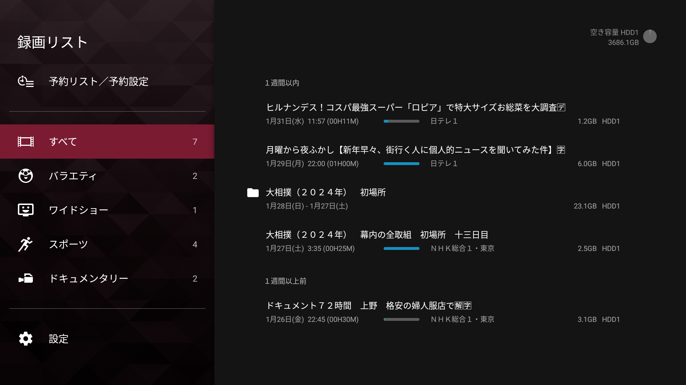
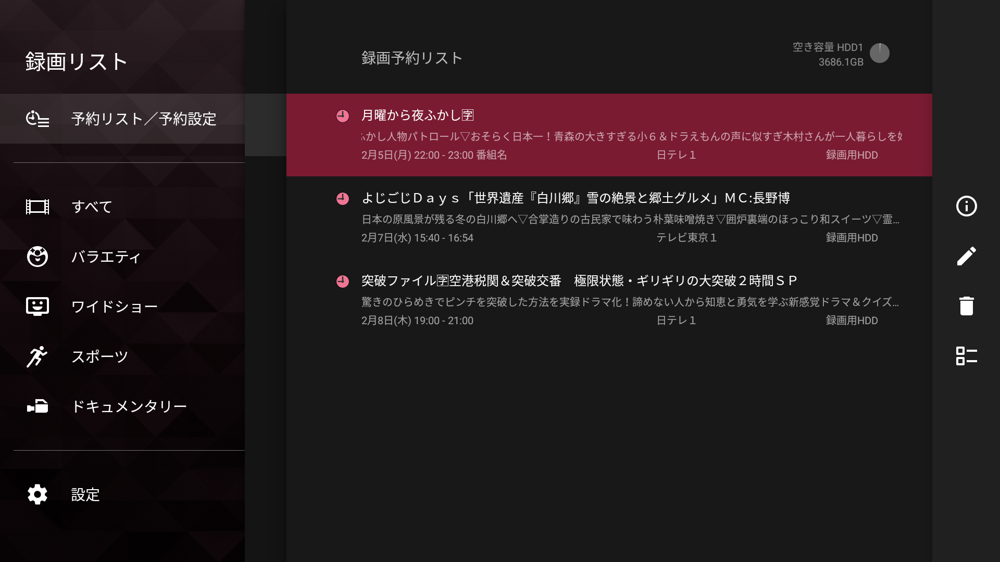
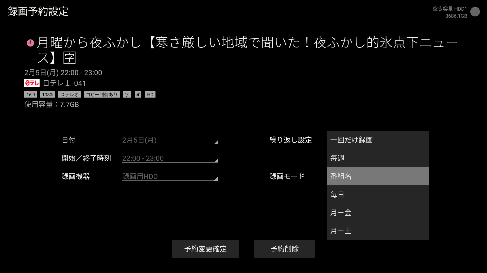

上周六因为妻子有事外出，因此会错过当天的大相扑。于是她想起来说我们家的电视机是不是有录像功能（日语叫録画）正好可以利用这个机会用一下。说实话自从 2022 年底买了这个新电视机（[SONY BRAVIA KJ-50X80WK](https://kakaku.com/item/K0001448876/)）之后，领教了各种日本电视机的花式功能，倒是还没有用过这个录像功能。

<!--more-->

## 录制电视节目初体验

先说结论，这个功能还挺好用的。

- 插上移动硬盘，初始化之后就能用，上手很简单。
- 录制的时候不会打开电视机屏幕，全程都是默默地录下。
- 录制的内容和直接看电视放送没有任何区别，自带多声道，字幕。
- 预约功能很灵活，可以通过时间、节目表录制；可以单次、循环录制。

为了方便说明我试着给这个电视机的录制 App 截屏了几张。

## 电视录像的限制

介绍完上面的各个优点，很快我也发现了这个录制功能的各种限制，当然其实这些限制和我的电视并没有太大关系，主要是因为著作权的原因，不管是电视台还是生产电视机及其周边设备的企业都为了保护著作权对电视录画做了种种限制，借此机会也简单介绍一下我了解到的情况。

首先就我的这台电视机而言：

- 录制的视频只能在本电视机播放，录制的视频也没有办法从硬盘里取出
- 播放录制的视频无法截屏

从功能设计的初衷应该就是给错过节目的人一个重看的机会，自然这么做也很合理，只是和我一开始想象的录像功能有点儿差距，我以为录完我就可以直接从硬盘里把视频拷出来要么在电脑上直接播放，或者放在 NAS 可以在家中其他设备间分享。

所以目前的现状是对于我录制的电视节目，只要外接硬盘和电视机本体其中一个坏了，我就再也没有办法回看了。

但是，很显然永久保存也好，在家里其他设备播放也好的需求是存在的，尽管有著作权的限制，这两个需求在不违反著作权的前提上也是有办法的，不过就得买专门的设备了。因为我平时也不怎么看电视，所以估计也不会去买单独的机器，不过感兴趣的读者可以试着搜索「テレビ レコーダー」估计就能找到自己想要的商品了，另外也许你也就和我一样理解了为什么日本很多电器店都在贩卖各种用途的 DVD、蓝光光盘了，很多是用来“永久保存”自己录制的电视节目的。

看到这里，读者诸君，你也许也和我有一样的疑问，如果版权保护这么严格，那网络上的各种电视剧、综艺节目是怎么来的呢？难道是先刻录到光盘再翻录的吗？很显然，应该还有更“简单”的方法，但这超出了本文的范畴，我顺着「TS抜きチューナー」这个关键字找到了一些资料，有动手能力强的想在电脑上看电视的朋友也许可以顺藤摸瓜研究研究。

## 最后

尽管电视节目录像有种种限制，但作为一个并没有很强保存需要的普通用户而言，能把之前一直吃灰的硬盘利用起来我还是挺高兴的，另外由于这个录像功能在日本非常成熟，上手使用没花几分钟。倒是关于日本是怎么保护这些著作权的周边知识花了有半个星期来梳理。本来想写一篇更细节的关于其中用到的种种技术的文章，可是一来会把文章写得很没意思，而且我的理解也是来源于各种网上的文章，很支离破碎，也没有条件实验，暂且作罢了。

不管怎么样，如果你在日本，有电视机和硬盘，不妨打开电视的节目表试着录点节目看看，是不是也挺有意思呢？
