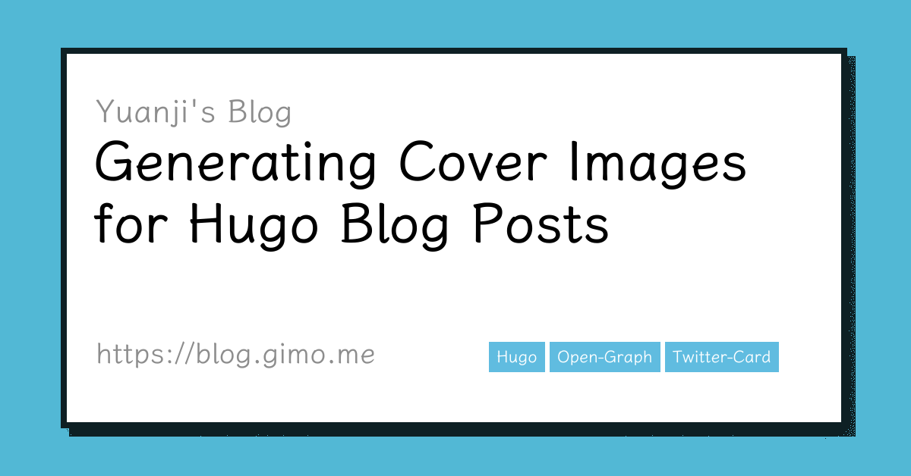

Previously, if you shared a post on this site to a social networking site(Twitter, Facebook, etc) or chat software that crawls content for preview, it would usually show the title and introduction of the post, but it felt a bit bare and boring. If we can add a sharing picture, it should look more beautiful, but for me it is very tedious to find a picture that is not very relevant only for this purpose. So I thought about whether there is a way to automatically generate one? The answer is yes. I will explain the details later on, but you can take a look at the following picture first which was generated for this article you are reading on, and if you share this article to any social media website, the cover image below will appear.



<!--more-->

## Examples

Actually, this feature is not rare, for example, some technical community sites have similar features, such as [dev.to](https://dev.to/), [Qiita](https://qiita.com/) and [Zenn](https://zenn.dev/). If you share articles from these sites to social networks, a lovely cover image will be automatically generated with the title, author and other meta information of the article. For example, the following card is automatically generated by dev.to.


## Existing Tools

In order to avoid reinventing the wheel myself, I did some research, and there are some handy websites that can generate such cards, such as

- [Open Graph Image as a Service](https://og-image.vercel.app/)
- [GitHub Socialify](https://socialify.git.ci/)

The former is a more general solution that can be customized directly via URL parameters, while the latter automatically generates cover images for projects on GitHub.

Vercel's tool looks perfect isn't it? Except it doesn't support CJK characters.

## tcardgen

Since the above online solutions didn't work for me, I then searched for offline tools, and I did find one by luck, the project is called [tcardgen](https://github.com/Ladicle/tcardgen), coincidentally this developer also uses Hugo as a blog generator, the concept of the tool is not complicated, first of all, we need to prepare a template image, then the program reads the meta-information from the [Front Matter](https://gohugo.io/content-management/front-matter/) part of the article, finally draws on the template image according to the specified font and the defined position, color, and other meta information. I slightly [modified the code](https://github.com/masakichi/tcardgen/commit/f97389031d1c2261fad1674d7a92f56448ffda49) and [the default template image](https://github.com/Ladicle/tcardgen/tree/master/example) provided by the author of that project to fit my own use case. Then I got this article's cover image I posted at the beginning.

Below is how I run the command:

```bash
./tcardgen/tcardgen -f tcardgen/font -o ./content/posts/给博客文章自动生成分享图/cover..en.png -t tcardgen/template.png content/posts/给博客文章自动生成分享图/index.en.md
```

By the way, the font I used in the image was an open source font I picked from GitHub, called [LXGW WenKai](https://github.com/lxgw/LxgwWenKai).

## Open Graph

We are almost done, at least for the part of generating part. but how to get social networks or other software to recognize our cover images? it still needs a little extra work. fortunately, it's not that complicated, just add [Open Graph](https://ogp.me/) and [Twitter Card](https://developer.twitter.com/en/docs/twitter-for-websites/cards/overview/summary-card-with-large-image) related meta tags to the head of the HTML.

```html
<meta property="og:image" content="http://blog.gimo.me/posts/auto-generating-cover-for-post/cover.png" />
<meta name="twitter:card" content="summary_large_image" />
<meta name="twitter:image" content="http://blog.gimo.me/posts/auto-generating-cover-for-post/cover.png" />
```

## Hugo Internal Templates

In fact, Hugo already ships internal templates to support Open Graph and Twitter Card, simply by introducing two lines into the theme's template.

```go-html-template
{{ template "_internal/opengraph.html" . }}
{{ template "_internal/twitter_cards.html" . }}
```

For those who are interested, you can directly read Hugo's source code to figure out what happened behind the scenes. In short, the first 6 URLs from the images array defined in Front Matter are used for image metadata. If page bundles are used and the images array is empty or undefined, images with filenames matching _feature_ or _cover_,_thumbnail_ are used for image metadata. So in my case, I just simply name it `cover.png`

- [hugo/opengraph.html at v0.88.1 · gohugoio/hugo](https://github.com/gohugoio/hugo/blob/v0.88.1/tpl/tplimpl/embedded/templates/opengraph.html)
- [hugo/twitter_cards.html at v0.88.1 · gohugoio/hugo](https://github.com/gohugoio/hugo/blob/v0.88.1/tpl/tplimpl/embedded/templates/twitter_cards.html)

## Final

Since I've successfully generated a cover image for a single post, why not apply for all others? I then just planned to write a small script to generate covers for all previous posts, acutally, I finished the task by using iPython shell to write a simple loop with a few built-in modules like glob and subprocess. All the changes are included in the commit: [feat(cover): add cover for all posts · masakichi/nikki@6a03c8e](https://github.com/masakichi/nikki/commit/6a03c8e87c9a0180550c94ed74091b341099d797).
