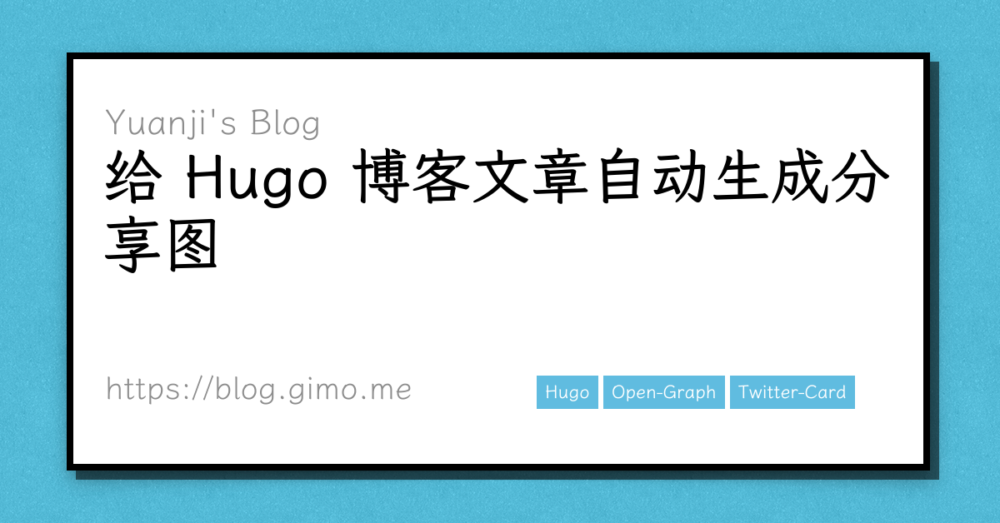

在此之前，如果把本站的文章分享到社交网站或是会抓取内容的聊天软件，通常会显示文章的标题和简介，但多少感觉有点儿光秃秃的，有点儿单调。如果可以加上一张分享图，应该能显得美观一些，但是为此专门找一张关系不大的配图，又觉得很麻烦，而且感觉会对于本身就更新频率一般的本博客而言，更是雪上加霜。于是想了想有没有办法自动生成一张呢？答案是肯定的。这里先把最终的效果放上来，再解释其中的细节，下图就是给本文自动生成的分享图，如果把这篇文章分享出去，想必它就会出现。



<!--more-->

## 示例

说起来，这个功能其实并不罕见，比如一些技术型的社区网站都有类似的功能，英语的有 [DEV Community 👩‍💻👨‍💻](https://dev.to/)，日文的有 [Qiita](https://qiita.com/) 和 [Zenn ｜エンジニアのための情報共有コミュニティ](https://zenn.dev/)，如果把这些网站的文章分享到社交网络，就会以标题，作者等文章的元信息自动生成一张分享的卡片，比如下面这张就是 Zenn 自动生成的。


## 已有方案

为了避免自己造轮子，调查了一番，果然有一些方便的网站可以生成这样的卡片，比如

- [Open Graph Image as a Service](https://og-image.vercel.app/)
- [GitHub Socialify](https://socialify.git.ci/)

前者是一个较为通用的解决方案，可以直接通过 URL 的参数进行定制，后者是给 GitHub 上的项目自动生成分享图片。

那，既然可以用那个通用的网站生成，是不是这篇文章就到此结束了呢？问题没有这么简单，因为它并不支持中文。

## tcardgen

既然在线的不行，又找了找离线的工具，运气不错还真被我找到一个，这个项目叫 [tcardgen](https://github.com/Ladicle/tcardgen)，巧的是这个开发者也是用的 Hugo 作为博客的生成器，原理也不复杂，首先是提供一张模板图片，然后程序读取文章的 [Front Matter](https://gohugo.io/content-management/front-matter/) 部分的元信息，再根据指定的字体和定义的位置、颜色等信息绘制而成。我直接偷懒[魔改一下他的代码](https://github.com/masakichi/tcardgen/commit/f97389031d1c2261fad1674d7a92f56448ffda49)和示例的[模板图片](https://github.com/Ladicle/tcardgen/tree/master/example)就生成了文章最初的本文的分享图。

这个工具用法大致如下：

```bash
./tcardgen/tcardgen -f tcardgen/font -o ./content/posts/给博客文章自动生成分享图/cover.png -t tcardgen/template.png content/posts/给博客文章自动生成分享图/index.md
```

对了，为了让生成的卡片看着轻松一些，特意找了个看着还不错的开源字体，叫作[霞鹜文楷](https://github.com/lxgw/LxgwWenKai)

## Open Graph

到上一部基本就大功告成了，不过我们只是完成了生成图片的部分，如何让社交网络或是其他软件识别还需要稍作调整。主要就是要让它们找到这张图片。实际上也不复杂，就是在 HTML 的 head 里加上 [Open Graph](https://ogp.me/) 和 [Twitter Card](https://developer.twitter.com/en/docs/twitter-for-websites/cards/overview/summary-card-with-large-image) 需要的 meta 标签。

```html
<meta property="og:image" content="http://blog.gimo.me/posts/auto-generating-cover-for-post/cover.png" />
<meta name="twitter:card" content="summary_large_image" />
<meta name="twitter:image" content="http://blog.gimo.me/posts/auto-generating-cover-for-post/cover.png" />
```

## Hugo 的支持

实际上，Hugo 内置的模板里就已经提供了一个示例，用来支持支持 Open Graph 和 Twitter Card 了，只需在主题模板里引入两行即可：

```go-html-template
{{ template "_internal/opengraph.html" . }}
{{ template "_internal/twitter_cards.html" . }}
```

感兴趣的朋友可以查看 Hugo 的代码看具体的逻辑，简单来说如果在文章的 Front Matter 里定义了图片资源，会优先使用，其次匹配图片名称包含 feature，再次是图片名称包含 cover, thumbnail。因为是自动生成的图片，本博客就都统一唤作 cover.png 了。

- [hugo/opengraph.html at v0.88.1 · gohugoio/hugo](https://github.com/gohugoio/hugo/blob/v0.88.1/tpl/tplimpl/embedded/templates/opengraph.html)
- [hugo/twitter_cards.html at v0.88.1 · gohugoio/hugo](https://github.com/gohugoio/hugo/blob/v0.88.1/tpl/tplimpl/embedded/templates/twitter_cards.html)

## 最后

既然成功生成了一篇，干脆一不做二不休写个小脚本把之前所有的文章都一并生成封面图了，甚至谈不上脚本，直接打开 ipython，用 glob、subprocess 等几个内置模块写个循环了事。所有改动都浓缩在了 [feat(cover): add cover for all posts · masakichi/nikki@6a03c8e](https://github.com/masakichi/nikki/commit/6a03c8e87c9a0180550c94ed74091b341099d797) 这个 commit 当中。

以上就是这次给博客增加的一点小功能了。说实话写这篇文章着实比生成分享图这件事本身要耗时，笑。
