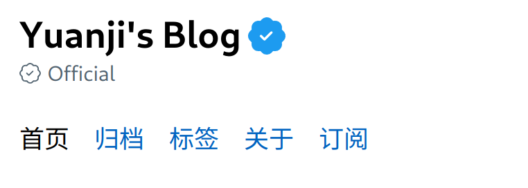

最近读到这篇博客 [Verified Personal Website - Jim Nielsen’s Blog](https://blog.jim-nielsen.com/2022/verified-personal-website/) 感觉很有意思。

<!--more-->

于是我也糊弄上了这么一个认证的徽章，不需任何费用，只需[几行 CSS](https://github.com/masakichi/futu/commit/37d6808dbe85ced5ace3045479a666e20a3ca95b)。

效果如下 👇

