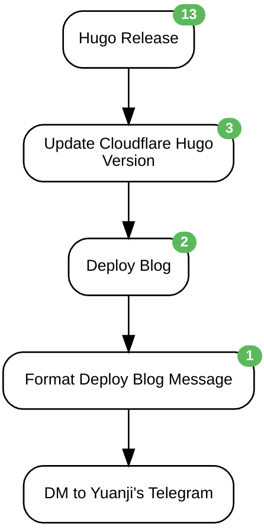

## TL;DR

简单来说，就是三步：

1. 定时解析 Hugo 在 GitHub 上的 Release 记录
2. 一旦有新版本就自动更新 Cloudflare Pages 上的环境变量
3. 然后重新部署本博客



<!--more-->

## 背景

自从几年前开始使用 Arch Linux 起，就总是想把各种日常使用的软件、工具升级到最新版，对于 Arch 来说就是简单的一句命令，对于一些不使用包管理软件管理的软件或是不在本地机器运行的软件来说就相对麻烦一些，我有用 Miniflux 来订阅 GitHub Release 的 RSS，然后再手动更新，其中就包括用来生成本博客的 Hugo 这个软件。

目前（2022 年现在）本博客更新的流程是本地写好文章，提交到 GitLab 的 main 分支，然后触发 Cloudflare Pages 的自动部署。Cloudflare Pages 部署即拉取最新的 Git Repo，配置 Hugo，然后运行 Hugo 编译出静态文件，最后推送到他家的 CDN 上。虽说他家默认的 Hugo 版本较老，不过可以通过环境变量来指定 Hugo 版本，于是每当 Hugo 更新新版本，我通常会去手动更新环境变量再重新部署一下博客，这就是为什么我博客 footer 里显示的版本总是紧跟最新版本的原因了，不过这个手动过程实在没啥意思，于是今天下午花了一个多小时用 Huginn 整了个全自动的版本。

## 获取最新版 Hugo

Hugo 使用 GitHub 托管它的代码，在 [Releases · gohugoio/hugo](https://github.com/gohugoio/hugo/releases) 这个页面发布新版本，对应的订阅地址在 [https://github.com/gohugoio/hugo/releases.atom](https://github.com/gohugoio/hugo/releases.atom)。然后让 Huginn 每个小时去看一下有没有更新即可，新建一个 RSS Agent，配置如下：

```json
{
  "expected_update_period_in_days": "5",
  "clean": "false",
  "url": "https://github.com/gohugoio/hugo/releases.atom"
}
```

## 更新 Cloudflare Pages 的环境变量

这一步可以通过调用 Pages 的 RESTful API 实现，具体可以查看 [Cloudflare API v4 Documentation](https://api.cloudflare.com/#pages-project-update-project)，对应地在 Huginn 里创建一个 Post Agent 即可，配置如下：

```json
{
  "post_url": "https://api.cloudflare.com/client/v4/accounts/:account_identifier/pages/projects/:project_name",
  "expected_receive_period_in_days": "1",
  "method": "patch",
  "content_type": "json",
  "payload": {
    "deployment_configs": {
      "production": {
        "env_vars": {
          "HUGO_VERSION": {
            "value": "{{ title }}"
          }
        }
      },
      "preview": {
        "env_vars": {
          "HUGO_VERSION": {
            "value": "{{ title }}"
          }
        }
      }
    }
  },
  "headers": {
    "X-Auth-Email": ":your_email",
    "X-Auth-Key": ":your_global_api_key"
  },
  "emit_events": "true",
  "no_merge": "true",
  "output_mode": "merge"
}
```

注意：配置里的 `{{ title }}` 使用的是 Huginn 里的模板语言，意思是获取上一步结果中 title 的值，它正好是 Hugo 的版本号。

## 重新部署博客

一旦上一步成功的话，重新执行一次部署博客即可，同样通过 Pages 的 API 实现，在 Huginn 里再新建一个 Post Agent，配置如下：

```json
{
  "post_url": "https://api.cloudflare.com/client/v4/accounts/:account_identifier/pages/projects/:project_name/deployments",
  "expected_receive_period_in_days": "1",
  "method": "post",
  "headers": {
    "X-Auth-Email": ":your_email",
    "X-Auth-Key": ":your_global_api_key"
  },
  "emit_events": "true",
  "no_merge": "true",
  "output_mode": "merge"
}
```

## 最后

调试了几次问题不大，最后甚至加了一个消息提醒，一旦博客用上最新版的 Hugo 编译后我就会收到一条消息提醒。虽然作为读者应该并不能看出博客任何区别（如果有的话可能甚至会是因为新版本引入的 bug 导致的不一致），但对于我而言可以让博客时常用最新版的软件编译，多少对更新博客文章来说也有一定的激励作用。
