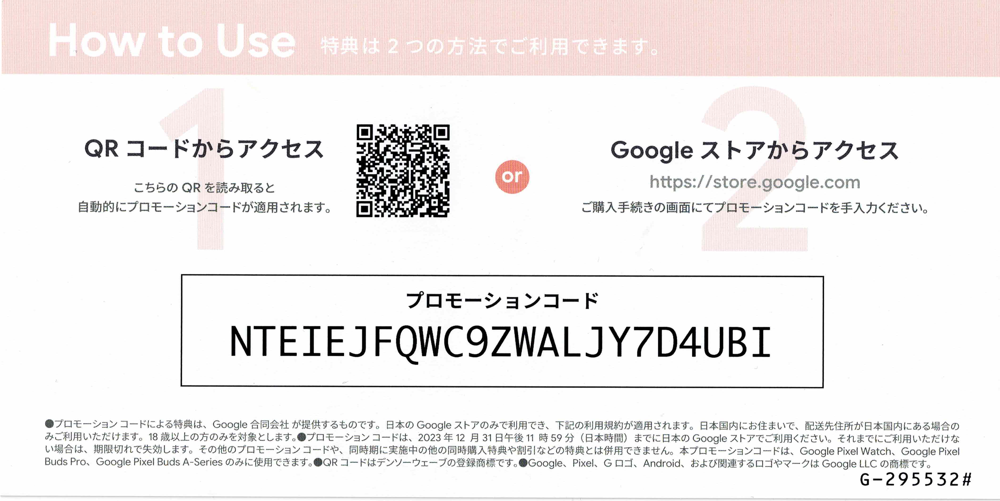

## 购买

上周末趁着最近日本 [Google Store](https://store.google.com/?hl=ja) 做活动下单了一台 [Google Pixel 7](https://store.google.com/product/pixel_7?hl=ja)。目前（2023/03/09）活动还在继续，在日本的朋友想换手机的话可以试试。

<!--more-->

虽说不像 Pixel 6a 官方直接降价出售，7 还是 82500 日元的原价，不过官方自带回收旧手机项目，如果你的旧手机值钱，加上其他方式的优惠，应该还是不错的。我的话最终大概是这样：

- 15000 日元 Google Store 的点数
- 5000 日元 Google Play 的礼品卡
- 15% Off 的优惠码一个，可用于买耳机或者手表
- 回收旧手机 Sony Xperia XZ2 Compact，可得 6000 日元（待定）
- 购买时使用了 Promotion Code，可得 7500 日元的优惠卡（待定）
- 考虑メルカリ出掉我的小米手机估计能换 20000 日元左右（待定）

话说我因为不买耳机和手表，这个 15% Off 的优惠券好像也没啥用，我贴在下面有在日本需要的朋友可以自行使用。

{}

{}

## 使用

因为我的上一部手机是 Xiaomi 11 Lite 5G，这次换上新手机后第一感觉就是快，尤其是相机打开速度相比小米简直云泥之别。

其次感觉系统干净了很多，除了日常用的 Google 全家桶之外，没有其他不必要的软件，看着挺舒服。

再有就是 Google 自家手机特有的功能了，比如可以根据声音自动生成字幕，比如自动提示附近背景音乐是什么曲目等等，以及一些厉害的拍照功能等。还有一项特有福利，Pixel 7 / 7 Pro 可以免费使用 Google One 的 VPN。

当然除了这些好的地方，也有一些不太方便的地方：

- 屏下指纹的识别率不太高，在家有人脸识别配合的话还不错
- 音量键和电源键的位置和之前的手机正好相反
- 手机有点厚，加上外壳就更厚了。印象中 10 年前用的 Nexus 4 都比这薄
- 迁移手机需要挨个转移西瓜卡等稍微有点儿麻烦。虽然这和 Pixel 没太大关系

目前大概就是这样了。

{}

{}
