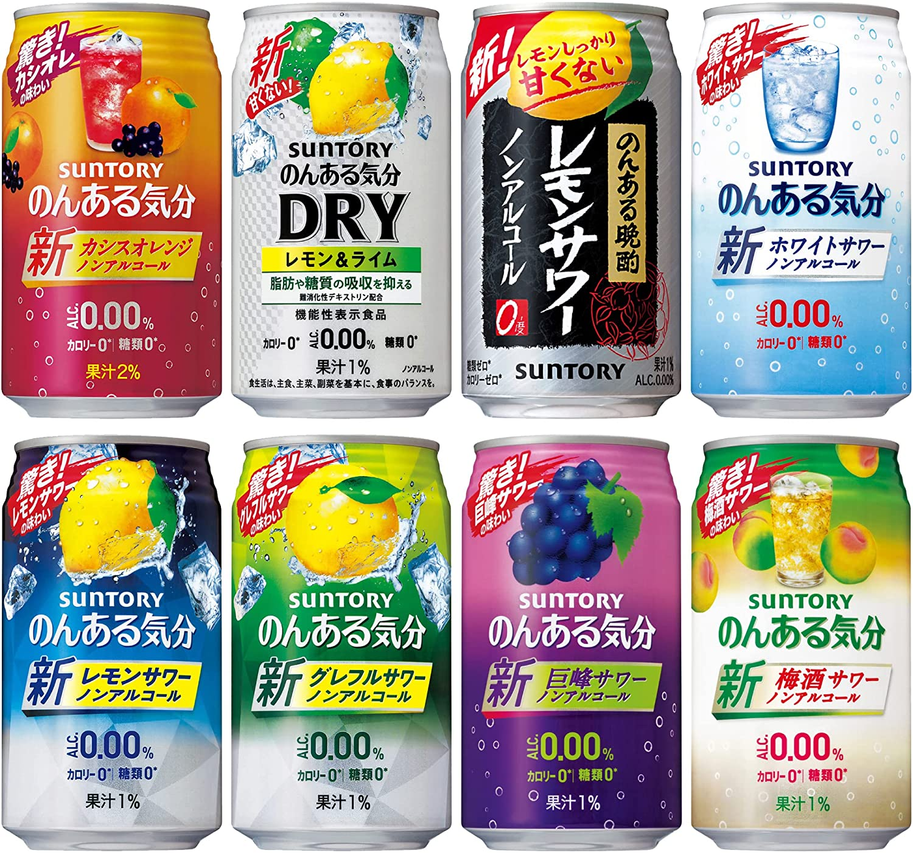

东京下了几次雨后，天气终于不这么热了，趁此机会赶紧抓住夏天的尾巴记录下这个夏天经常喝的饮料。

回想起之前的夏天，有酸梅汤味的、有乌龙茶味的，而今年夏天尝试了一种叫作「ノンアルコール」的饮料，又因为其中以三得利家的「のんある気分」喝的最多，就以此为标题了。

基本上我日常的饮料在乌龙茶和可乐之间摇摆，因为本身体质的原因喝不了牛奶、酒之类常见的饮料，所以每当超市出现新的我都会尝试一下，不过有一说一还是可乐来得好喝。然而今年偶然在超市酒水区的旁边发现了还有「ノンアルコール」这么一个分类存在，简单来说相当于不含酒精的酒，但是又区别于普通的碳酸饮料，通常除了酒精一般也都不含糖类。

很快我基本把附近超市、便利店的这类饮料尝了个遍，基本上有两类：

1. 啤酒（我个人不喜欢喝，感觉每家都有出）
2. 果汁类（三得利的のんある気分，可口可乐的柠檬堂等）

得知我找到一款比较适合我的饮料后，妻子速度在[日亚](https://www.amazon.co.jp/dp/B01KLQBX1W)上给我下单了一箱 24 瓶的套装。目前正在以每天两瓶的速度消化中:joy:

 

附: [のんある気分に関するQ&A　サントリーお客様センター](https://www.suntory.co.jp/customer/faq/non-al/kibun/)
