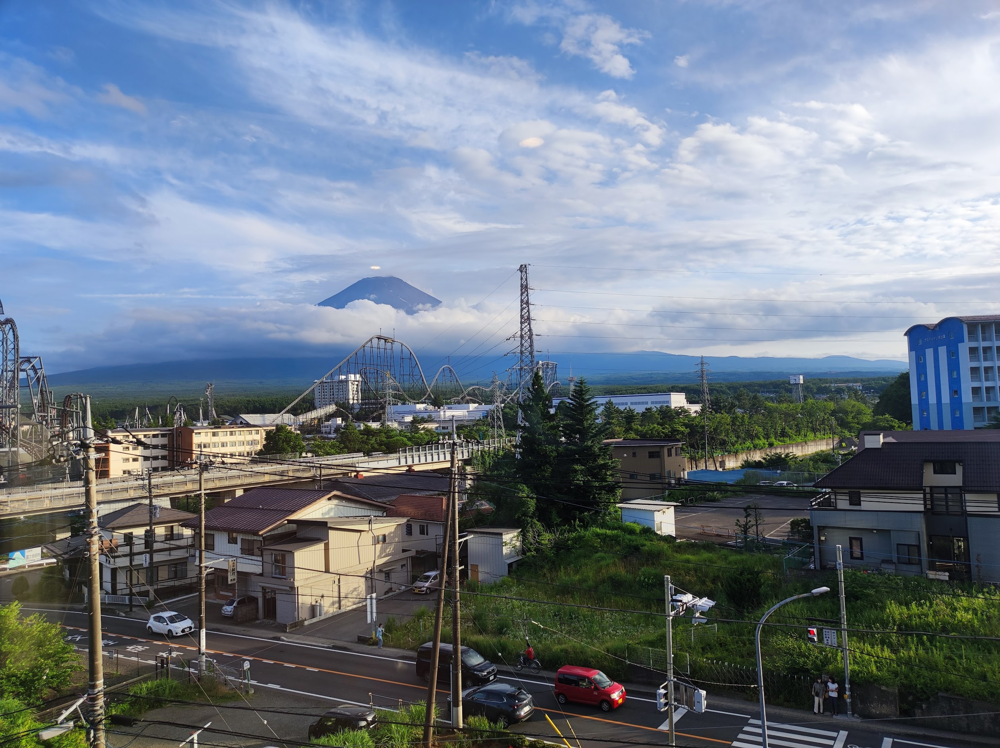
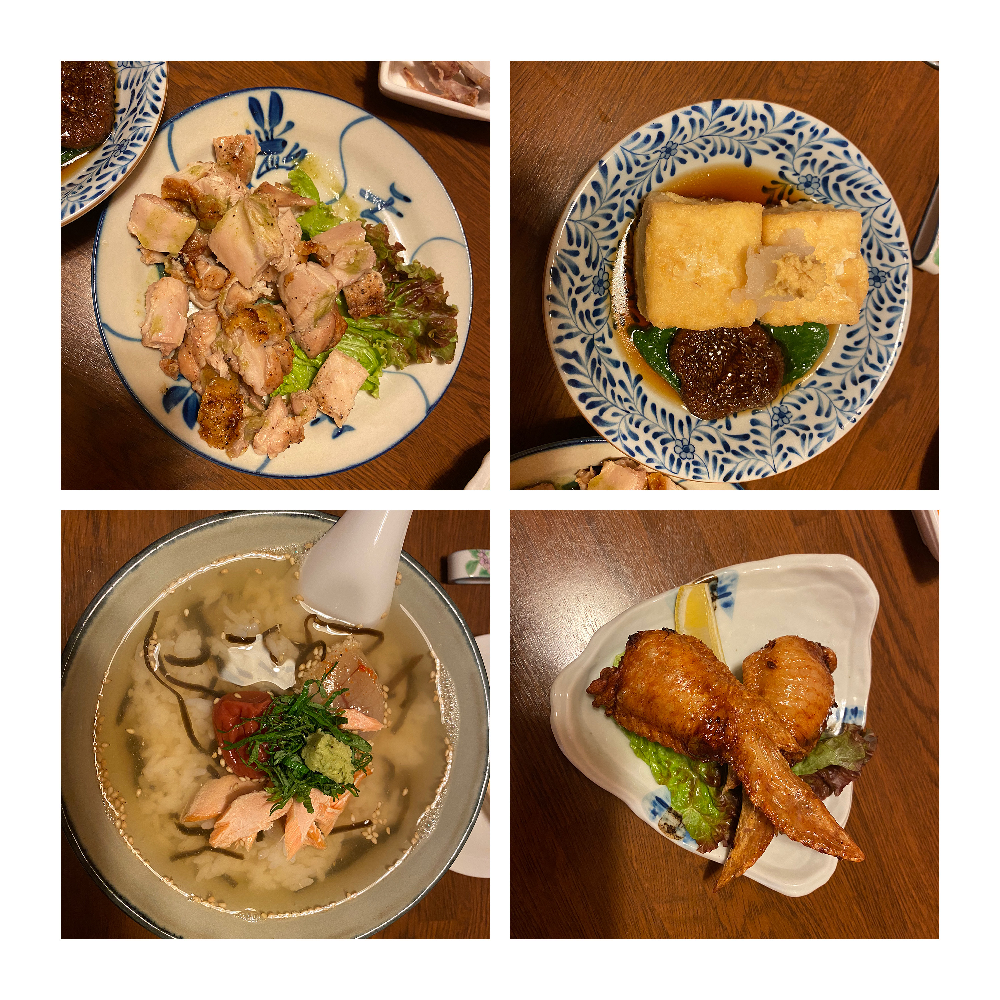
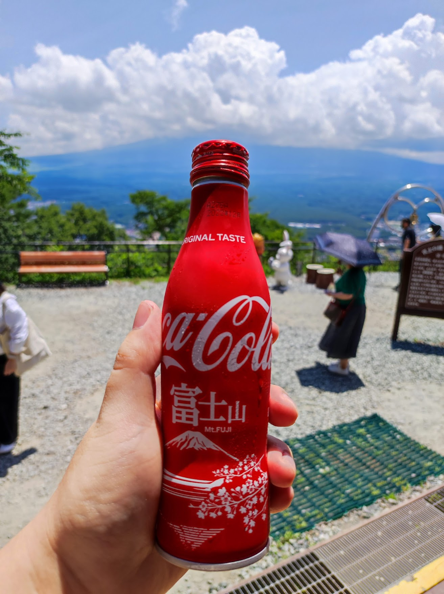
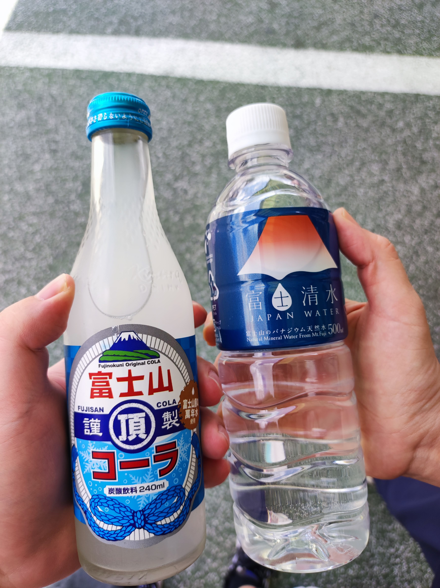

经过上周的简单安排，终于在这周初的时候来了趟旅行，和妻子去离富士山不远的游玩了一次。

<!--more-->

因为疫情的原因我来了东京两年多，妻子也来了有一年多了，我们甚至没有组织一次像样的旅行，这次抓住机会加上避开连休假期出行，旅程轻松愉快。现在回头来看出行的那两天的天气甚至也是最近一段时间最好的了，运气不错。

我们一直想较近距离地看看富士山，也因为身处东京去富士山所在的山梨、静冈也不是太麻烦，加上妻子最近在上日语课的老师推荐了河口湖这个地方，查了一下从东京出发坐大巴两小时就到了，于是我们就规划了这一次两天一夜（周日+周一）的旅行。我们在出发的三天前订了旅馆和车票，无论是住宿还是交通感觉都处于淡季，旅馆可选择的非常多，我们挑了一个可以看到富士山的山景房，加上可以泡澡和两人的早餐大概一晚 13000 日元左右，算上两人来回车票大概在 20000 日元出头，应该算是非常划算了。

出发当日我们早上八点半左右上大巴，差不多十点半到达河口湖站，之后在车站最近的饭馆吃了顿饭，妻子点了个当地的料理[ほうとう](https://ja.wikipedia.org/wiki/ほうとう)由于分量过大我吃了大部分。

之后因为离旅馆签到还有一段时间我们坐电车去了附近[新倉富士浅間神社](https://ja.wikipedia.org/wiki/三國第一山新倉富士浅間神社)瞭望富士山，尽管当日天气不错不过由于多云遮挡了富士山，我们虽然爬了不少台阶，但并未见到富士山全貌。

下山后时间差不多我们准备去旅馆签到，不过当地的电车发车频率较低我们等了差不多近一个小时，到了旅馆休息的间隙终于等到云层消散的片刻拍到了富士山。

晚饭时间，我们出门觅食，运气不错找到一家非常好吃的居酒屋，服务也非常棒，而且由于游客非常少，偌大一个和室就我们两个人感觉非常超值。

回到旅馆，到了晚上的富士山则又是另一番景象，甚至有点儿吓人，毕竟这么一个庞然大物就在附近。

第二天一早，去泡了个旅馆提供的温泉，可以边看富士山边泡澡，不过还是因为云层较厚只能看到一个山尖儿，随后吃个早饭休息会等出了旅馆我们就开始了第二天的旅程，主要是在河口湖附近。从河口湖站步行大约十几分钟到一个叫作[富士山パノラマロープウェイ](https://www.mtfujiropeway.jp/)的地方可以坐缆车，一览河口湖及周边的全貌。

缆车终点稍走几步就是一个展望台，据说也是一个非常好的富士山眺望点。

再坐缆车下山，还可以去划船或是坐快艇。

我们这次就沿着湖走一走，去周边的超市看了看有什么地方特色的商品，最后一人买了瓶饮料准备结束旅程返回东京。

2022/07/17 更新：

点击查看河口湖观测富士山实时画面



