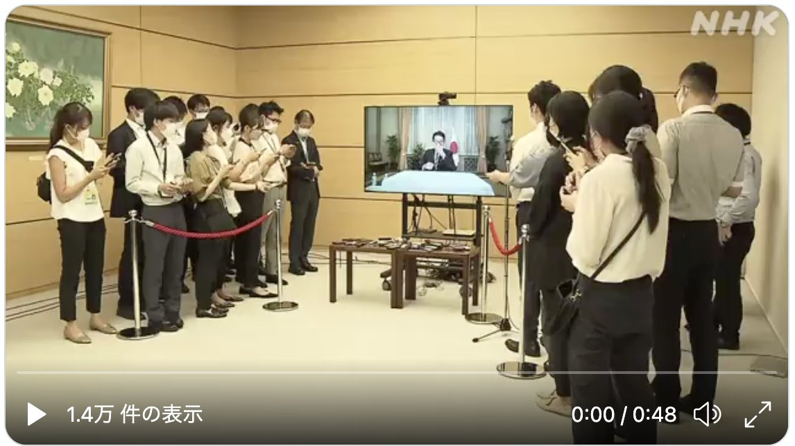

今天日常刷新闻看到这么一件报道：[岸田総理をリモート取材するために官邸に集まるぶら下がり記者団 | スラド IT](https://it.srad.jp/story/22/08/23/1456229/)，背景是日本首相岸田文雄前几天因为感染了新冠病毒，开始远程办公，然后接受接着采访的时候[光景](https://twitter.com/natfukue/status/1561687361100034049)大概像是这样

看到这个情景总让我觉得哪里不对，尽管这不是第一次出现在日本的报道里，实际上我所属的日本企业里很多远程会议也是这样举行的，但似乎这并非正确的远程采访、开会方式。不太清楚其他地方这样的情况是如何处理的，也许全员远程连线才是正确的方式，这让我感觉我似乎处在某个历史的转折点，夹杂在新旧两股潮流之中。
